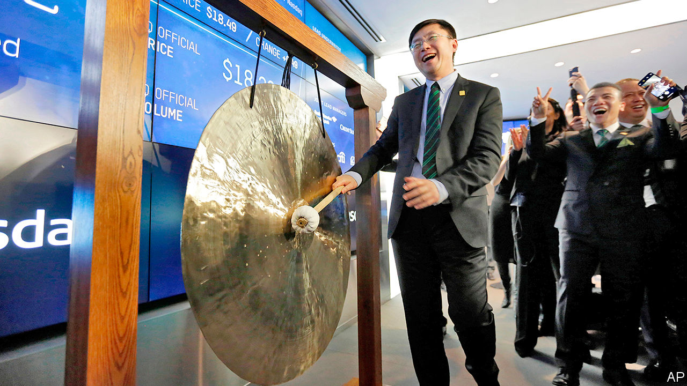
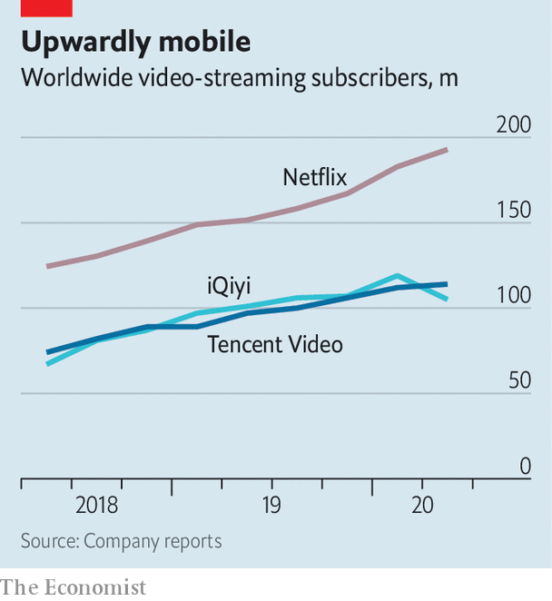

## A big-sum game

# Tencent Video battles iQiyi in China’s streaming wars

> But the two big Chinese streaming platform may onc day settle into a cosy duopoly

> Aug 22nd 2020

LAUNCHED IN 2010, iQiyi has grown used to the foreign press calling it “the Netflix of China”. Not the worst nickname, given the videostreaming pioneer’s success. But Gong Yu, iQiyi’s founder and boss, insists that his firm is more accurately described as “Netflix plus”. A bold claim for a loss-making business worth one-fifteenth as much as America’s (cash-generating) entertainment powerhouse with a market value of $214bn. Still, Mr Gong has a point.

Like Netflix, iQiyi offers customers a deep catalogue of licensed and original content. Unlike Netflix, which relies almost entirely on subscription fees, iQiyi has multiple revenue streams. “Membership fees”, which start from 19.8 yuan ($2.87) a month, accounted for just over half of iQiyi’s 7.4bn yuan in revenues in the second quarter. The rest came mainly from an online store (which sells “entertainment-related merchandise”), a nascent mobile-gaming arm, an e-book business and advertisements; iQiyi operates a “freemium” model which allows stingier users to stream some content free of charge provided they agree to watch ads.

Conveniently for iQiyi, which does little business outside its home market, Netflix is blocked in China, under laws that ban a lot of foreign content. But that is not to say that China is free from the streaming wars of the sort that pits Netflix against rivals like Disney, HBO (owned by AT&T) and NBCUniversal (belonging to Comcast). Far from it. Mr Gong is battling Tencent Video, part of the eponymous technology conglomerate. It overtook iQiyi at the end of June with 114m video subscribers to iQiyi’s 105m (see chart). Mr Gong’s firm shed 14m subscribers in the most recent quarter while Tencent Video, which also runs a freemium model and charges subscribers 20 yuan a month, added 2m.

IQiyi insists the setback was down to one-off factors, such as virus-induced disruption to film production, which temporarily emptied the content pipeline. Perhaps. But Tencent Video offers a richer selection of English-language content, including hit television series like “Chernobyl” and “Silicon Valley”. More important, the rivalry between Tencent Video and iQiyi is a proxy war between mighty Tencent and fading Baidu, a search firm that is iQiyi’s majority owner. Indeed, iQiyi seemed to concede as much in its latest annual report, writing that “competitors include well-capitalised companies that are capable of offering compensation packages more attractive to talents.”

Still, as Westerners who pay for a few video subscriptions can attest, streaming is not a zero-sum game. Gigi Zhou of BOCOM International, a broker, reckons the Chinese market will soon be big enough to sustain both iQiyi and Tencent Video, which also has yet to make money. Ms Zhou expects 400m Chinese to subscribe to video-streaming platforms by 2023, up from some 300m in 2019. So long as no new rival emerges, each firm could capture around 150m, helping them spread costs over more subscribers and so turn a profit.

Before streaming peace can break out, iQiyi faces another fight. On August 13th it said it was under investigation by America’s Securities and Exchange Commission after a short-seller accused it of inflating sales data, a charge it denies. If found guilty, it may have to delist from New York’s Nasdaq exchange. The firm’s stable share price implies investors’ faith in battle-hardened Mr Gong is unshaken. ■

## URL

https://www.economist.com/business/2020/08/22/tencent-video-battles-iqiyi-in-chinas-streaming-wars
