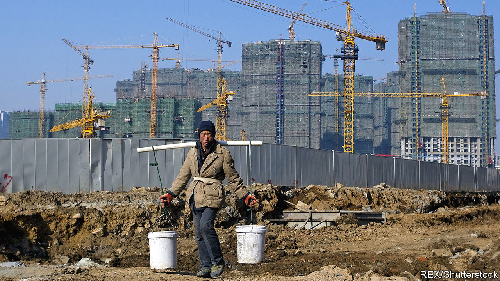
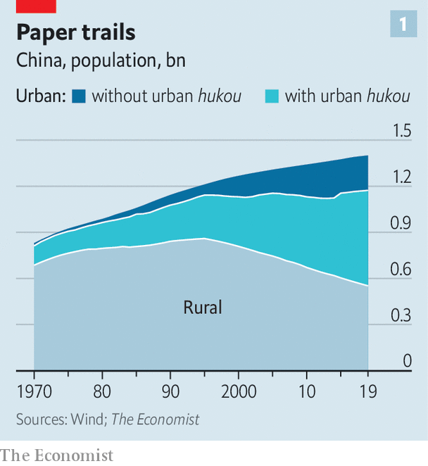
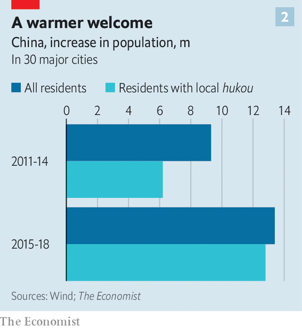

## Worlds apart

# Changes to China’s hukou system are creating new divides

> The rich find it easier to move to big cities; the poor are being pushed towards small ones

> Aug 19th 2020WUWEI, ANHUI

CHEN JUN had a good job in Shanghai making eyeglasses. Last year he gave it up and went back to his home village in Anhui, an inland province. He dug out a basin, filled it with water and stocked it with crayfish. He went not for the work—there is less money in crayfish farming than in lens crafting—but for his family. Mr Chen could not afford to bring his children to the city, so had left them at home to be raised by his parents. But his parents were ageing and his children needed attention. “It could not go on like that,” he says, still wearing his blue factory jacket from Shanghai.

Mr Chen’s story is wearily familiar. Millions of Chinese rural migrants work in cities for years, often apart from their families, before returning to their homes in the countryside. This unhappy circulation is a result of the hukou system, a household registry that prevents most migrants from moving to cities on a permanent basis. Because he did not have a Shanghai hukou, Mr Chen could not get his children into a local state school. He could not get a housing subsidy or collect unemployment insurance. He was only ever passing through.

The hukou system has long divided rural Chinese from their urban peers. During the Maoist era it determined whether people worked in industry or agriculture. Its grip on daily life has since faded, but it still determines which village, town or city each Chinese person truly calls home: where they may access the full range of welfare benefits and government services, from pensions to public education. In recent years officials have vowed to relax the system further in order to promote urbanisation, which is needed to drive economic growth. Many observers are sceptical; the Communist Party has promised reform for decades. Yet the system is gradually changing, albeit in ways that are creating new fractures between rich and poor.

In absolute terms China’s urbanisation is an astonishing success. The population of its cities has risen to nearly 850m, five times larger than four decades ago, when people started moving around more freely. Some 61% of Chinese now live in cities, and a further 1%—more than 15m people—join them each year. Yet about 230m people reside in cities without holding a local hukou, as did Mr Chen when he was in Shanghai (see chart 1). They are treated much like second-class citizens. Officials insist that they want to change this. In 2014 the government published a “new urbanisation plan”; it promised that by the end of this year it would help 100m people to swap their rural hukou for an urban one.

In practice this push has played out in two contrasting ways. The central government’s focus has been on boosting smaller cities. Officials fear that big cities would be overwhelmed if they were to offer residency rights to low-skilled workers. Better to direct them to places that would benefit from new arrivals. Six years ago it instructed cities with populations of less than 1m to offer a local hukou to anyone who applied. Last year, it called on cities with populations of less than 3m to do the same.

At the same time, many of China’s big cities—with the notable exceptions of Beijing and Shanghai—are trying to attract higher-skilled, wealthier residents. They generally offer four routes to a local hukou, much like the pathways to immigration in Western countries: investing in a local business; buying a home; having a degree; or holding a qualified job. In a study reviewing 120 cities’ policies, Zhang Jipeng, an economist, found that prosperous coastal cities had raised their standards for obtaining a local hukou in recent years, whereas inland cities had lowered them. Chinese media frequently refer to a “talent war” being waged among municipal governments eager to lure young professionals. By attracting home buyers, they also hope to boost their property markets.

The Economist looked at data from 30 major cities to assess what effect these tweaks are having. Between 2011 and 2014, the increase in their overall population was 50% larger than the increase in their hukou-holding population. That suggests that roughly one out of every three new residents had to get by without a local hukou. But from 2015 to 2018, the increase in local hukou holders was almost identical to the increase in their total populations (see chart 2). In booming inland cities such as Chengdu and Xi’an, hukou issuance actually outstripped new arrivals (that can happen when existing residents, often recent graduates, obtain local hukou).

Hukou reforms carried out by small cities have had much less of an effect. These places have opened their doors to poorer migrants, but few are choosing to walk through them. A new study of 337 cities by Ren Zeping, an economist with Evergrande, a property developer, found that those with smaller populations had generally suffered outmigration over the past two decades, and that the recent reforms had not stemmed the tide.

Instead, these smaller cities are encountering a phenomenon that had once seemed implausible: rural migrants are not much interested in moving to them and, when they do, would rather remain registered for official purposes in the villages that they have come from. Government surveys of rural migrants have found that only about a fifth of respondents are willing to acquire a hukou in their adopted cities. Lu Ming of Shanghai Jiaotong University says the logic is simple: if big cities, with abundant resources and job opportunities, were to offer residency to migrants, they would leap at the offer, but smaller cities do not have the same appeal.

One reason rural migrants hesitate to transfer their hukou to a city is that doing so typically requires them to give up the use of their land in the countryside. They consider farmland a resource to fall back on in hard times—as millions did earlier this year when growth cratered because of lockdowns imposed to control covid-19. Giving up land feels especially risky when many of the small cities that are open to receiving poor rural migrants can afford to provide only limited social benefits in return. Migrants with land near expanding cities also anticipate that officials may some day offer them compensation in order to build on it.

Officials are aware of the problem and discuss two possible solutions. One is to sever land rights from hukou, allowing migrants to register in small cities while also hanging on to their fields. But that is fraught because rural land is formally owned by villages, not individuals—something that the party has little appetite to change. The other solution is to provide better funding for social-security systems in cities around the country, ensuring that urban residents can get good services wherever they are. But that would require the central government to stump up much more cash—something that it has also shown little appetite to do.

Instead, a gap is opening between the benefits offered by rich, mostly coastal cities and those in struggling regions such as China’s north-east. Whereas the hukou system has historically cemented inequalities between urbanites and country-dwellers, it now enforces a divide between people born into wealthy cities and those who must scrape by in poor ones. “The rising issue is where you are actually registered, and what that registration means for your entitlements,” says Samantha Vortherms of University of California, Irvine.

Thus the hukou system remains a drag on China’s development, even in its semi-relaxed form. The biggest cities are engines of productivity and innovation. They should be still bigger and fewer people should toil in the countryside. Wen-Tai Hsu of Singapore Management University estimates that letting people settle wherever they want would boost the Chinese economy by roughly as much as did its entry into the World Trade Organisation two decades ago. It would also help cope with the grim demographic trends that afflict some cities with very strict hukou rules. Kam Wing Chan of the University of Washington notes that, without lots of newcomers, the proportion of Beijing’s population over the age of 65 will double to 22% in a decade and reach 47% by 2050. Unless China wants its capital to be known as the world’s nursing-home powerhouse, it will need to loosen hukou restrictions well before then.

Despite the limited relaxation so far, the government looks likely to meet its target of creating 100m new urban hukou holders by the end of this year. Indeed, it is on track to exceed that target. Sleight of hand has helped. Officials have been rushing to draw new city boundaries, declaring that areas previously considered rural are in fact urban districts. At a stroke, people registered there become urbanites.

That has happened to Chen Jun, the crayfish farmer in Anhui. He returned to a village that was part of Wuwei county; in December Wuwei was rebranded as a city. This is not a new trick, though it appears to be getting more common. One third of all of those who became urban residents between 2010 and 2015 earned that status when their formerly rural communities were reclassified as urban, according to a recent study led by Gan Li of the Southwestern University of Finance and Economics.

This redistricting is not entirely meaningless. The reclassification gives local governments greater taxation and spending powers. And many of the areas newly defined as urban were clearly heading in that direction. At the heart of Wuwei, high-rise housing and a glossy white shopping centre sit next to dilapidated alleys where farmers sell live chickens. With its upgraded status, the local government says it will “build a high-quality city”, investing in car parks, landscaping and public housing. But for Mr Chen the life on offer in Wuwei City will still be far inferior to what he could have had in Shanghai. The medical care is worse, the schools shabbier and the pension smaller. He may be a denizen of one of China’s newest cities, but a truly urban life remains a distant dream.■

## URL

https://www.economist.com/china/2020/08/19/changes-to-chinas-hukou-system-are-creating-new-divides
