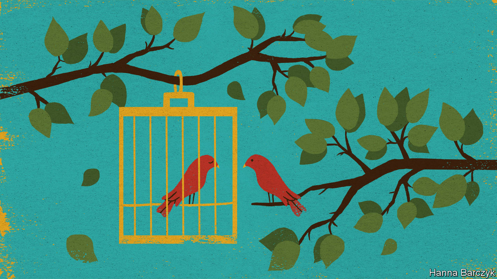

## Chaguan

# China’s rulers will pay a high price for repression in Hong Kong

> It will have an outsize impact on whether foreigners trust China

> Aug 22nd 2020

THE WORLD has a right to be shocked by China’s rapid crushing of civic freedoms in Hong Kong. But outsiders should not be surprised. Western politicians spent years arguing that China, out of pure self-interest, should grant Hong Kong greater autonomy, or at least preserve liberties promised by the slogan “One Country, Two Systems”. That was always a doomed effort. In part, pleas to grant Hong Kong more freedoms reflected a misjudgment about the incentives that guide the swaggering-yet-paranoid hard men who lead China’s Communist Party today. In part, Western arguments were a bluff, based on half-veiled threats that multinational companies, foreign investors and banks might walk away from Hong Kong’s lucrative financial markets if the territory’s political freedoms were too brutally curbed. China is now calling that bluff.

There is a self-reinforcing logic to China’s actions. A sweeping national-security law imposed on Hong Kong in July has, by the mere fact of its existence, created a new test of patriotism that citizens must pass. Hong Kong’s election officers recently disqualified a dozen pro-democracy politicians from seeking seats in the city’s Legislative Council at elections scheduled for September. The candidates’ purported misdeeds included questioning the need for a national-security law. Circular logic even saw opposition politicians disqualified for pledging to vote against the government. Just in case some missed the message, a day later the election, during which opposition parties expected to make big gains, was postponed for a year, ostensibly as a pandemic-fighting precaution.

Chinese officials do not much care if Westerners are outraged. Casting Hong Kong protesters as dupes, officials claim (and may even believe) that the Trump administration is using the city’s openness to attempt a “colour revolution”, in cahoots with such democracy supporters as Jimmy Lai, a Hong Kong newspaper owner arrested and paraded through his newsroom in handcuffs by 200 policemen. Other officials are coldly cynical. They think that lots of foreign governments and businesses mostly want to make money in Hong Kong. Cynics also think that many expatriates quietly opposed last year’s anti-government protests, some of which were violent, and will welcome the silencing of troublemakers.

Nor do Chinese leaders seem scared that repression in Hong Kong will cost them hearts and minds in Taiwan, though that democratic island was once promised that, if it agrees to rule by Beijing, it will have its own version of “One Country, Two Systems”. On the mainland, senior figures have told Westerners that the Taiwanese will soon envy Hong Kong’s renewed prosperity. Chinese leaders “are feeling quite triumphant over Hong Kong”, says a diplomat. “They think it’s theirs and this is what they have to do.”

China’s rulers are half-right. Hong Kong is theirs. It also matters more to them than it does to any foreign government (especially with covid-19 battering economies). That includes the government of Britain, the city’s former colonial master. Britain has offered a path to citizenship for up to 3m Hong Kongers, drawing Chinese rebukes. However, it is also anxious to promote trade with China, especially after Brexit. On July 28th European Union foreign ministers expressed “grave concern” about the national-security law, but could not agree on concrete, joint actions. Indeed, in Beijing, some European diplomats privately call Hong Kong an obsession of the Anglophone world. Japan is both unhappy about Hong Kong, a close partner, and unwilling to do much about it.

Narrowly, China’s rulers will get away with crushing Hong Kong’s freedoms. But in myriad, hard-to-quantify ways, they will pay a price. Chinese officials are quick to allege impure motives when outsiders express concern for Hong Kong. Britain is called nostalgic for its empire. The Global Times, a party tabloid, calls Mr Lai a “traitor to the Chinese race” for his past appeals for foreign support. But it is not race treachery if Hong Kongers make common cause with democrats overseas. Nor is it racism if Westerners find Hong Kong the most comprehensible place in China.

Party bosses and their apologists love to play up China’s exceptionalism. They call authoritarianism a reflection of China’s vast size, its poverty, its history or even its collectivist, Confucian culture. Such excuses do not work as well in Hong Kong. A modern, remarkably open world city, its hybrid culture includes many familiar, Western-style freedoms. That legibility makes its fate unusually important in shaping foreign perceptions of China.

Chinese officials insist that last year’s protests were a bid to split the motherland and seek Hong Kong’s secession. In truth, only a small minority of Hong Kongers support independence, a hopeless dream. Protesters last year talked more about democracy as a way to preserve liberties meant to last until 2047. Those include a raucous free press to hold the powerful to account, schools and universities with a mandate to inculcate critical thinking in the young, and a rule of law in which individuals have inalienable rights. British colonial rulers denied Hong Kong real democracy. But when given the chance to cast meaningful ballots, most voters have consistently supported more direct elections. Now China’s rulers have made their preference clear. They hate to be defied and loathe losing elections, so are rolling Hong Kong’s freedoms back.

Western governments and people cannot alter China’s choices in Hong Kong. But they are entitled to draw conclusions from those decisions. China wants to become a high-technology superpower, selling the world 5G networks, nuclear-power stations or—who knows—a covid-19 vaccine. China’s diplomats want a seat at the top table in global forums where standards and norms are agreed upon. Its universities want to strike partnerships with academic institutions around the world. Those are all reasonable ambitions, but they depend heavily on trust. Repression in Hong Kong will have an outsize impact on whether foreigners trust China. That may anger party bosses. It should not be a surprise.■

## URL

https://www.economist.com/china/2020/08/22/chinas-rulers-will-pay-a-high-price-for-repression-in-hong-kong
