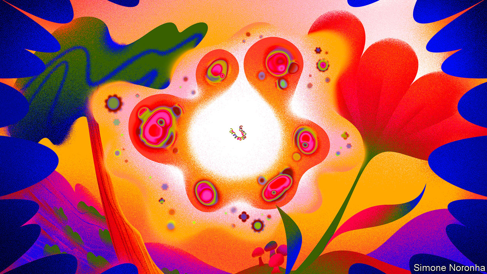
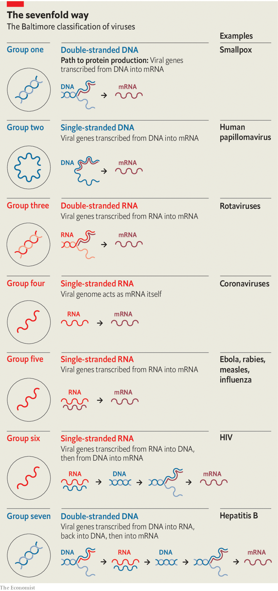
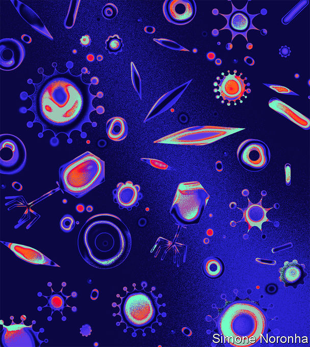
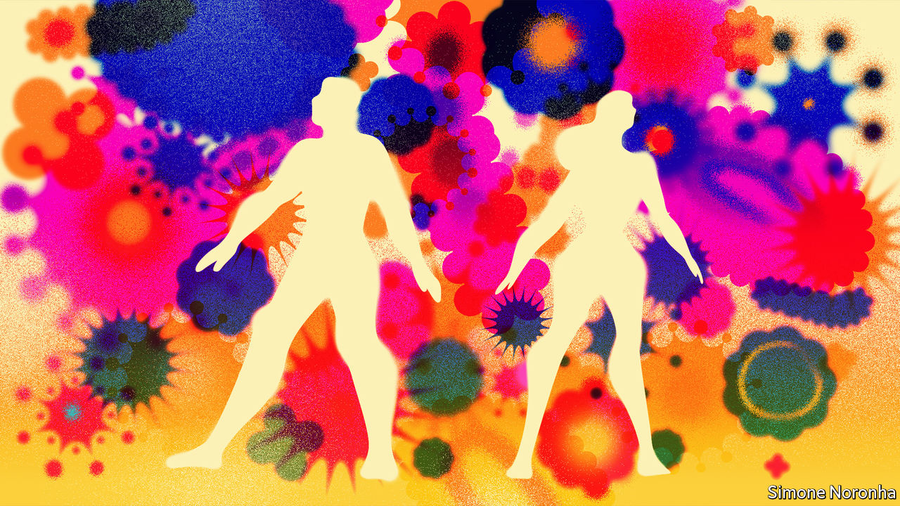

## The viral universe

# Viruses have big impacts on ecology and evolution as well as human health

> They are ubiquitous, diverse and very powerful

> Aug 20th 2020

IThe outsiders inside

HUMANS ARE lucky to live a hundred years. Oak trees may live a thousand; mayflies, in their adult form, a single day. But they are all alive in the same way. They are made up of cells which embody flows of energy and stores of information. Their metabolisms make use of that energy, be it from sunlight or food, to build new molecules and break down old ones, using mechanisms described in the genes they inherited and may, or may not, pass on.

It is this endlessly repeated, never quite perfect reproduction which explains why oak trees, humans, and every other plant, fungus or single-celled organism you have ever seen or felt the presence of are all alive in the same way. It is the most fundamental of all family resemblances. Go far enough up any creature’s family tree and you will find an ancestor that sits in your family tree, too. Travel further and you will find what scientists call the last universal common ancestor, LUCA. It was not the first living thing. But it was the one which set the template for the life that exists today.

And then there are viruses. In viruses the link between metabolism and genes that binds together all life to which you are related, from bacteria to blue whales, is broken. Viral genes have no cells, no bodies, no metabolism of their own. The tiny particles, “virions”, in which those genes come packaged—the dot-studded disks of coronaviruses, the sinister, sinuous windings of Ebola, the bacteriophages with their science-fiction landing-legs that prey on microbes—are entirely inanimate. An individual animal, or plant, embodies and maintains the restless metabolism that made it. A virion is just an arrangement of matter.

The virus is not the virion. The virus is a process, not a thing. It is truly alive only in the cells of others, a virtual organism running on borrowed hardware to produce more copies of its genome. Some bide their time, letting the cell they share the life of live on. Others immediately set about producing enough virions to split their hosts from stem to stern.

The virus has no plan or desire. The simplest purposes of the simplest life—to maintain the difference between what is inside the cell and what is outside, to move towards one chemical or away from another—are entirely beyond it. It copies itself in whatever way it does simply because it has copied itself that way before, in other cells, in other hosts.

That is why, asked whether viruses are alive, Eckard Wimmer, a chemist and biologist who works at the State University of New York, Stony Brook, offers a yes-and-no. Viruses, he says, “alternate between nonliving and living phases”. He should know. In 2002 he became the first person in the world to take an array of nonliving chemicals and build a virion from scratch—a virion which was then able to get itself reproduced by infecting cells.

The fact that viruses have only a tenuous claim to being alive, though, hardly reduces their impact on things which are indubitably so. No other biological entities are as ubiquitous, and few as consequential. The number of copies of their genes to be found on Earth is beyond astronomical. There are hundreds of billions of stars in the Milky Way galaxy and a couple of trillion galaxies in the observable universe. The virions in the surface waters of any smallish sea handily outnumber all the stars in all the skies that science could ever speak of.

Back on Earth, viruses kill more living things than any other type of predator. They shape the balance of species in ecosystems ranging from those of the open ocean to that of the human bowel. They spur evolution, driving natural selection and allowing the swapping of genes.

They may have been responsible for some of the most important events in the history of life, from the appearance of complex multicellular organisms to the emergence of DNA as a preferred genetic material. The legacy they have left in the human genome helps produce placentas and may shape the development of the brain. For scientists seeking to understand life’s origin, they offer a route into the past separate from the one mapped by humans, oak trees and their kin. For scientists wanting to reprogram cells and mend metabolisms they offer inspiration—and powerful tools.

IIA lifestyle for genes

THE IDEA of a last universal common ancestor provides a plausible and helpful, if incomplete, answer to where humans, oak trees and their ilk come from. There is no such answer for viruses. Being a virus is not something which provides you with a place in a vast, coherent family tree. It is more like a lifestyle—a way of being which different genes have discovered independently at different times. Some viral lineages seem to have begun quite recently. Others have roots that comfortably predate LUCA itself.

Disparate origins are matched by disparate architectures for information storage and retrieval. In eukaryotes—creatures, like humans, mushrooms and kelp, with complex cells—as in their simpler relatives, the bacteria and archaea, the genes that describe proteins are written in double-stranded DNA. When a particular protein is to be made, the DNA sequence of the relevant gene acts as a template for the creation of a complementary molecule made from another nucleic acid, RNA. This messenger RNA (mRNA) is what the cellular machinery tasked with translating genetic information into proteins uses in order to do so.

Because they, too, need to have proteins made to their specifications, viruses also need to produce mRNAs. But they are not restricted to using double-stranded DNA as a template. Viruses store their genes in a number of different ways, all of which require a different mechanism to produce mRNAs. In the early 1970s David Baltimore, one of the great figures of molecular biology, used these different approaches to divide the realm of viruses into seven separate classes (see diagram).

In four of these seven classes the viruses store their genes not in DNA but in RNA. Those of Baltimore group three use double strands of RNA. In Baltimore groups four and five the RNA is single-stranded; in group four the genome can be used directly as an mRNA; in group five it is the template from which mRNA must be made. In group six—the retroviruses, which include HIV—the viral RNA is copied into DNA, which then provides a template for mRNAs.

Because uninfected cells only ever make RNA on the basis of a DNA template, RNA-based viruses need distinctive molecular mechanisms those cells lack. Those mechanisms provide medicine with targets for antiviral attacks. Many drugs against HIV take aim at the system that makes DNA copies of RNA templates. Remdesivir (Veklury), a drug which stymies the mechanism that the simpler RNA viruses use to recreate their RNA genomes, was originally developed to treat hepatitis C (group four) and subsequently tried against the Ebola virus (group five). It is now being used against SARS-CoV-2 (group four), the covid-19 virus.

Studies of the gene for that RNA-copying mechanism, RdRp, reveal just how confusing virus genealogy can be. Some viruses in groups three, four and five seem, on the basis of their RdRp-gene sequence, more closely related to members of one of the other groups than they are to all the other members of their own group. This may mean that quite closely related viruses can differ in the way they store their genomes; it may mean that the viruses concerned have swapped their RdRp genes. When two viruses infect the same cell at the same time such swaps are more or less compulsory. They are, among other things, one of the mechanisms by which viruses native to one species become able to infect another.

How do genes take on the viral lifestyle in the first place? There are two plausible mechanisms. Previously free-living creatures could give up metabolising and become parasitic, using other creatures’ cells as their reproductive stage. Alternatively genes allowed a certain amount of independence within one creature could have evolved the means to get into other creatures.

Living creatures contain various apparently independent bits of nucleic acid with an interest in reproducing themselves. The smallest, found exclusively in plants, are tiny rings of RNA called viroids, just a few hundred genetic letters long. Viroids replicate by hijacking a host enzyme that normally makes mRNAs. Once attached to a viroid ring, the enzyme whizzes round and round it, unable to stop, turning out a new copy of the viroid with each lap.

Viroids describe no proteins and do no good. Plasmids—somewhat larger loops of nucleic acid found in bacteria—do contain genes, and the proteins they describe can be useful to their hosts. Plasmids are sometimes, therefore, regarded as detached parts of a bacteria’s genome. But that detachment provides a degree of autonomy. Plasmids can migrate between bacterial cells, not always of the same species. When they do so they can take genetic traits such as antibiotic resistance from their old host to their new one.

Recently, some plasmids have been implicated in what looks like a progression to true virus-hood. A genetic analysis by Mart Krupovic of the Pasteur Institute suggests that the Circular Rep-Encoding Single-Strand-DNA (CRESS-DNA) viruses, which infect bacteria, evolved from plasmids. He thinks that a DNA copy of the genes that another virus uses to create its virions, copied into a plasmid by chance, provided it with a way out of the cell. The analysis strongly suggests that CRESS-DNA viruses, previously seen as a pretty closely related group, have arisen from plasmids this way on three different occasions.

Such jailbreaks have probably been going on since very early on in the history of life. As soon as they began to metabolise, the first proto-organisms would have constituted a niche in which other parasitic creatures could have lived. And biology abhors a vacuum. No niche goes unfilled if it is fillable.

It is widely believed that much of the evolutionary period between the origin of life and the advent of LUCA was spent in an “RNA world”—one in which that versatile substance both stored information, as DNA now does, and catalysed chemical reactions, as proteins now do. Set alongside the fact that some viruses use RNA as a storage medium today, this strongly suggests that the first to adopt the viral lifestyle did so too. Patrick Forterre, an evolutionary biologist at the Pasteur Institute with a particular interest in viruses (and the man who first popularised the term LUCA) thinks that the “RNA world” was not just rife with viruses. He also thinks they may have brought about its end.

The difference between DNA and RNA is not large: just a small change to one of the “letters” used to store genetic information and a minor modification to the backbone to which these letters are stuck. And DNA is a more stable molecule in which to store lots of information. But that is in part because DNA is inert. An RNA-world organism which rewrote its genes into DNA would cripple its metabolism, because to do so would be to lose the catalytic properties its RNA provided.

An RNA-world virus, having no metabolism of its own to undermine, would have had no such constraints if shifting to DNA offered an advantage. Dr Forterre suggests that this advantage may have lain in DNA’s imperviousness to attack. Host organisms today have all sorts of mechanisms for cutting up viral nucleic acids they don’t like the look of—mechanisms which biotechnologists have been borrowing since the 1970s, most recently in the form of tools based on a bacterial defence called CRISPR. There is no reason to imagine that the RNA-world predecessors of today’s cells did not have similar shears at their disposal. And a virus that made the leap to DNA would have been impervious to their blades.

Genes and the mechanisms they describe pass between viruses and hosts, as between viruses and viruses, all the time. Once some viruses had evolved ways of writing and copying DNA, their hosts would have been able to purloin them in order to make back-up copies of their RNA molecules. And so what began as a way of protecting viral genomes would have become the way life stores all its genes—except for those of some recalcitrant, contrary viruses.

IIIThe scythes of the seas

IT IS A general principle in biology that, although in terms of individual numbers herbivores outnumber carnivores, in terms of the number of species carnivores outnumber herbivores. Viruses, however, outnumber everything else in every way possible.

This makes sense. Though viruses can induce host behaviours that help them spread—such as coughing—an inert virion boasts no behaviour of its own that helps it stalk its prey. It infects only that which it comes into contact with. This is a clear invitation to flood the zone. In 1999 Roger Hendrix, a virologist, suggested that a good rule of thumb might be ten virions for every living individual creature (the overwhelming majority of which are single-celled bacteria and archaea). Estimates of the number of such creatures on the planet come out in the region of 1029-1030. If the whole Earth were broken up into pebbles, and each of those pebbles smashed into tens of thousands of specks of grit, you would still have fewer pieces of grit than the world has virions. Measurements, as opposed to estimates, produce numbers almost as arresting. A litre of seawater may contain more than 100bn virions; a kilogram of dried soil perhaps a trillion.

Metagenomics, a part of biology that looks at all the nucleic acid in a given sample to get a sense of the range of life forms within it, reveals that these tiny throngs are highly diverse. A metagenomic analysis of two surveys of ocean life, the Tara Oceans and Malaspina missions, by Ahmed Zayed of Ohio State University, found evidence of 200,000 different species of virus. These diverse species play an enormous role in the ecology of the oceans.

On land, most of the photosynthesis which provides the biomass and energy needed for life takes place in plants. In the oceans, it is overwhelmingly the business of various sorts of bacteria and algae collectively known as phytoplankton. These creatures reproduce at a terrific rate, and viruses kill them at a terrific rate, too. According to work by Curtis Suttle of the University of British Columbia, bacterial phytoplankton typically last less than a week before being killed by viruses.

This increases the overall productivity of the oceans by helping bacteria recycle organic matter (it is easier for one cell to use the contents of another if a virus helpfully lets them free). It also goes some way towards explaining what the great mid-20th-century ecologist G. Evelyn Hutchinson called “the paradox of the plankton”. Given the limited nature of the resources that single-celled plankton need, you would expect a few species particularly well adapted to their use to dominate the ecosystem. Instead, the plankton display great variety. This may well be because whenever a particular form of plankton becomes dominant, its viruses expand with it, gnawing away at its comparative success.

It is also possible that this endless dance of death between viruses and microbes sets the stage for one of evolution’s great leaps forward. Many forms of single-celled plankton have molecular mechanisms that allow them to kill themselves. They are presumably used when one cell’s sacrifice allows its sister cells—which are genetically identical—to survive. One circumstance in which such sacrifice seems to make sense is when a cell is attacked by a virus. If the infected cell can kill itself quickly (a process called apoptosis) it can limit the number of virions the virus is able to make. This lessens the chances that other related cells nearby will die. Some bacteria have been shown to use this strategy; many other microbes are suspected of it.

There is another situation where self-sacrifice is becoming conduct for a cell: when it is part of a multicellular organism. As such organisms grow, cells that were once useful to them become redundant; they have to be got rid of. Eugene Koonin of America’s National Institutes of Health and his colleagues have explored the idea that virus-thwarting self-sacrifice and complexity-permitting self-sacrifice may be related, with the latter descended from the former. Dr Koonin’s model also suggests that the closer the cells are clustered together, the more likely this act of self-sacrifice is to have beneficial consequences.

For such profound propinquity, move from the free-flowing oceans to the more structured world of soil, where potential self-sacrificers can nestle next to each other. Its structure makes soil harder to sift for genes than water is. But last year Mary Firestone of the University of California, Berkeley, and her colleagues used metagenomics to count 3,884 new viral species in a patch of Californian grassland. That is undoubtedly an underestimate of the total diversity; their technique could see only viruses with RNA genomes, thus missing, among other things, most bacteriophages.

Metagenomics can also be applied to biological samples, such as bat guano in which it picks up viruses from both the bats and their food. But for the most part the finding of animal viruses requires more specific sampling. Over the course of the 2010s PREDICT, an American-government project aimed at finding animal viruses, gathered over 160,000 animal and human tissue samples from 35 countries and discovered 949 novel viruses.

The people who put together PREDICT now have grander plans. They want a Global Virome Project to track down all the viruses native to the world’s 7,400 species of mammals and waterfowl—the reservoirs most likely to harbour viruses capable of making the leap into human beings. In accordance with the more-predator-species-than-prey rule they expect such an effort would find about 1.5m viruses, of which around 700,000 might be able to infect humans. A planning meeting in 2018 suggested that such an undertaking might take ten years and cost $4bn. It looked like a lot of money then. Today those arguing for a system that can provide advance warning of the next pandemic make it sound pretty cheap.

IVLeaving their mark

THE TOLL which viruses have exacted throughout history suggests that they have left their mark on the human genome: things that kill people off in large numbers are powerful agents of natural selection. In 2016 David Enard, then at Stanford University and now at the University of Arizona, made a stab at showing just how much of the genome had been thus affected.

He and his colleagues started by identifying almost 10,000 proteins that seemed to be produced in all the mammals that had had their genomes sequenced up to that point. They then made a painstaking search of the scientific literature looking for proteins that had been shown to interact with viruses in some way or other. About 1,300 of the 10,000 turned up. About one in five of these proteins was connected to the immune system, and thus could be seen as having a professional interest in viral interaction. The others appeared to be proteins which the virus made use of in its attack on the host. The two cell-surface proteins that SARS-CoV-2 uses to make contact with its target cells and inveigle its way into them would fit into this category.

The researchers then compared the human versions of the genes for their 10,000 proteins with those in other mammals, and applied a statistical technique that distinguishes changes that have no real impact from the sort of changes which natural selection finds helpful and thus tries to keep. Genes for virus-associated proteins turned out to be evolutionary hotspots: 30% of all the adaptive change was seen in the genes for the 13% of the proteins which interacted with viruses. As quickly as viruses learn to recognise and subvert such proteins, hosts must learn to modify them.

A couple of years later, working with Dmitri Petrov at Stanford, Dr Enard showed that modern humans have borrowed some of these evolutionary responses to viruses from their nearest relatives. Around 2-3% of the DNA in an average European genome has Neanderthal origins, a result of interbreeding 50,000 to 30,000 years ago. For these genes to have persisted they must be doing something useful—otherwise natural selection would have removed them. Dr Enard and Dr Petrov found that a disproportionate number described virus-interacting proteins; of the bequests humans received from their now vanished relatives, ways to stay ahead of viruses seem to have been among the most important.

Viruses do not just shape the human genome through natural selection, though. They also insert themselves into it. At least a twelfth of the DNA in the human genome is derived from viruses; by some measures the total could be as high as a quarter.

Retroviruses like HIV are called retro because they do things backwards. Where cellular organisms make their RNA from DNA templates, retroviruses do the reverse, making DNA copies of their RNA genomes. The host cell obligingly makes these copies into double-stranded DNA which can be stitched into its own genome. If this happens in a cell destined to give rise to eggs or sperm, the viral genes are passed from parent to offspring, and on down the generations. Such integrated viral sequences, known as endogenous retroviruses (ERVs), account for 8% of the human genome.

This is another example of the way the same viral trick can be discovered a number of times. Many bacteriophages are also able to stitch copies of their genome into their host’s DNA, staying dormant, or “temperate”, for generations. If the cell is doing well and reproducing regularly, this quiescence is a good way for the viral genes to make more copies of themselves. When a virus senses that its easy ride may be coming to an end, though—for example, if the cell it is in shows signs of stress—it will abandon ship. What was latent becomes “lytic” as the viral genes produce a sufficient number of virions to tear the host apart.

Though some of their genes are associated with cancers, in humans ERVs do not burst back into action in later generations. Instead they have proved useful resources of genetic novelty. In the most celebrated example, at least ten different mammalian lineages make use of a retroviral gene for one of their most distinctively mammalian activities: building a placenta.

The placenta is a unique organ because it requires cells from the mother and the fetus to work together in order to pass oxygen and sustenance in one direction and carbon dioxide and waste in the other. One way this intimacy is achieved safely is through the creation of a tissue in which the membranes between cells are broken down to form a continuous sheet of cellular material.

The protein that allows new cells to merge themselves with this layer, syncytin-1, was originally used by retroviruses to join the external membranes of their virions to the external membranes of cells, thus gaining entry for the viral proteins and nucleic acids. Not only have different sorts of mammals co-opted this membrane-merging trick—other creatures have made use of it, too. The mabuya, a long-tailed skink which unusually for a lizard nurtures its young within its body, employs a retroviral syncytin protein to produce a mammalian-looking placenta. The most recent shared ancestor of mabuyas and mammals died out 80m years before the first dinosaur saw the light of day, but both have found the same way to make use of the viral gene.

This is not the only way that animals make use of their ERVs. Evidence has begun to accumulate that genetic sequences derived from ERVs are quite frequently used to regulate the activity of genes of more conventional origin. In particular, RNA molecules transcribed from an ERV called HERV-K play a crucial role in providing the stem cells found in embryos with their “pluripotency”—the ability to create specialised daughter cells of various different types. Unfortunately, when expressed in adults HERV-K can also be responsible for cancers of the testes.

As well as containing lots of semi-decrepit retroviruses that can be stripped for parts, the human genome also holds a great many copies of a “retrotransposon” called LINE-1. This a piece of DNA with a surprisingly virus-like way of life; it is thought by some biologists to have, like ERVs, a viral origin. In its full form, LINE-1 is a 6,000-letter sequence of DNA which describes a “reverse transcriptase” of the sort that retroviruses use to make DNA from their RNA genomes. When LINE-1 is transcribed into an mRNA and that mRNA subsequently translated to make proteins, the reverse transcriptase thus created immediately sets to work on the mRNA used to create it, using it as the template for a new piece of DNA which is then inserted back into the genome. That new piece of DNA is in principle identical to the piece that acted as the mRNA’s original template. The LINE-1 element has made a copy of itself.

In the 100m years or so that this has been going on in humans and the species from which they are descended the LINE-1 element has managed to pepper the genome with a staggering 500,000 copies of itself. All told, 17% of the human genome is taken up by these copies—twice as much as by the ERVs.

Most of the copies are severely truncated and incapable of copying themselves further. But some still have the knack, and this capability may be being put to good use. Fred Gage and his colleagues at the Salk Institute for Biological Studies, in San Diego, argue that LINE-1 elements have an important role in the development of the brain. In 2005 Dr Gage discovered that in mouse embryos—specifically, in the brains of those embryos—about 3,000 LINE-1 elements are still able to operate as retrotransposons, putting new copies of themselves into the genome of a cell and thus of all its descendants.

Brains develop through proliferation followed by pruning. First, nerve cells multiply pell-mell; then the cell-suicide process that makes complex life possible prunes them back in a way that looks a lot like natural selection. Dr Gage suspects that the movement of LINE-1 transposons provides the variety in the cell population needed for this selection process. Choosing between cells with LINE-1 in different places, he thinks, could be a key part of the process from which the eventual neural architecture emerges. What is true in mice is, as he showed in 2009, true in humans, too. He is currently developing a technique for looking at the process in detail by comparing, post mortem, the genomes of different brain cells from single individuals to see if their LINE-1 patterns vary in the ways that his theory would predict.

VPromised lands

HUMAN EVOLUTION may have used viral genes to make big-brained live-born life possible; but viral evolution has used them to kill off those big brains on a scale that is easily forgotten. Compare the toll to that of war. In the 20th century, the bloodiest in human history, somewhere between 100m and 200m people died as a result of warfare. The number killed by measles was somewhere in the same range; the number who died of influenza probably towards the top of it; and the number killed by smallpox—300m-500m—well beyond it. That is why the eradication of smallpox from the wild, achieved in 1979 by a globally co-ordinated set of vaccination campaigns, stands as one of the all-time-great humanitarian triumphs.

Other eradications should eventually follow. Even in their absence, vaccination has led to a steep decline in viral deaths. But viruses against which there is no vaccine, either because they are very new, like SARS-CoV-2, or peculiarly sneaky, like HIV, can still kill millions.

Reducing those tolls is a vital aim both for research and for public-health policy. Understandably, a far lower priority is put on the benefits that viruses can bring. This is mostly because they are as yet much less dramatic. They are also much less well understood.

The viruses most prevalent in the human body are not those which infect human cells. They are those which infect the bacteria that live on the body’s surfaces, internal and external. The average human “microbiome” harbours perhaps 100trn of these bacteria. And where there are bacteria, there are bacteriophages shaping their population.

The microbiome is vital for good health; when it goes wrong it can mess up a lot else. Gut bacteria seem to have a role in maintaining, and possibly also causing, obesity in the well-fed and, conversely, in tipping the poorly fed into a form of malnutrition called kwashiorkor. Ill-regulated gut bacteria have also been linked, if not always conclusively, with diabetes, heart disease, cancers, depression and autism. In light of all this, the question “who guards the bacterial guardians?” is starting to be asked.

The viruses that prey on the bacteria are an obvious answer. Because the health of their host’s host—the possessor of the gut they find themselves in—matters to these phages, they have an interest in keeping the microbiome balanced. Unbalanced microbiomes allow pathogens to get a foothold. This may explain a curious detail of a therapy now being used as a treatment of last resort against Clostridium difficile, a bacterium that causes life-threatening dysentery. The therapy in question uses a transfusion of faecal matter, with its attendant microbes, from a healthy individual to reboot the patient’s microbiome. Such transplants, it appears, are more likely to succeed if their phage population is particularly diverse.

Medicine is a very long way from being able to use phages to fine-tune the microbiome. But if a way of doing so is found, it will not in itself be a revolution. Attempts to use phages to promote human health go back to their discovery in 1917, by Félix d’Hérelle, a French microbiologist, though those early attempts at therapy were not looking to restore balance and harmony. On the basis that the enemy of my enemy is my friend, doctors simply treated bacterial infections with phages thought likely to kill the bacteria.

The arrival of antibiotics saw phage therapy abandoned in most places, though it persisted in the Soviet Union and its satellites. Various biotechnology companies think they may now be able to revive the tradition—and make it more effective. One option is to remove the bits of the viral genome that let phages settle down to a temperate life in a bacterial genome, leaving them no option but to keep on killing. Another is to write their genes in ways that avoid the defences with which bacteria slice up foreign DNA.

The hope is that phage therapy will become a backup in difficult cases, such as infection with antibiotic-resistant bugs. There have been a couple of well-publicised one-off successes outside phage therapy’s post-Soviet homelands. In 2016 Tom Patterson, a researcher at the University of California, San Diego, was successfully treated for an antibiotic-resistant bacterial infection with specially selected (but un-engineered) phages. In 2018 Graham Hatfull of the University of Pittsburgh used a mixture of phages, some engineered so as to be incapable of temperance, to treat a 16-year-old British girl who had a bad bacterial infection after a lung transplant. Clinical trials are now getting under way for phage treatments aimed at urinary-tract infections caused by Escherichia coli, Staphylococcus aureus infections that can lead to sepsis and Pseudomonas aeruginosa infections that cause complications in people who have cystic fibrosis.

Viruses which attack bacteria are not the only ones genetic engineers have their eyes on. Engineered viruses are of increasing interest to vaccine-makers, to cancer researchers and to those who want to treat diseases by either adding new genes to the genome or disabling faulty ones. If you want to get a gene into a specific type of cell, a virion that recognises something about such cells may often prove a good tool.

The vaccine used to contain the Ebola outbreak in the Democratic Republic of Congo over the past two years was made by engineering Indiana vesiculovirus, which infects humans but cannot reproduce in them, so that it expresses a protein found on the surface of the Ebola virus; thus primed, the immune system responds to Ebola much more effectively. The World Health Organisation’s current list of 29 covid-19 vaccines in clinical trials features six versions of other viruses engineered to look a bit like SARS-CoV-2. One is based on a strain of measles that has long been used as a vaccine against that disease.

Viruses engineered to engender immunity against pathogens, to kill cancer cells or to encourage the immune system to attack them, or to deliver needed genes to faulty cells all seem likely to find their way into health care. Other engineered viruses are more worrying. One way to understand how viruses spread and kill is to try and make particularly virulent ones. In 2005, for example, Terrence Tumpey of America’s Centres for Disease Control and Prevention and his colleagues tried to understand the deadliness of the influenza virus responsible for the pandemic of 1918-20 by taking a more benign strain, adding what seemed to be distinctive about the deadlier one and trying out the result on mice. It was every bit as deadly as the original, wholly natural version had been.

Because such “gain of function” research could, if ill-conceived or poorly implemented, do terrible damage, it requires careful monitoring. And although the use of engineered pathogens as weapons of war is of dubious utility—such weapons are hard to aim and hard to stand down, and it is not easy to know how much damage they have done—as well as being completely illegal and repugnant to almost all, such possibilities will and should remain a matter of global concern.

Information which, for billions of years, has only ever come into its own within infected cells can now be inspected on computer screens and rewritten at will. The power that brings is sobering. It marks a change in the history of both viruses and people—a change which is perhaps as important as any of those made by modern biology. It is constraining a small part of the viral world in a way which, so far, has been to people’s benefit. It is revealing that world’s further reaches in a way which cannot but engender awe. ■

Editor’s note: Some of our covid-19 coverage is free for readers of The Economist Today, our daily [newsletter](https://www.economist.com/https://my.economist.com/user#newsletter). For more stories and our pandemic tracker, see our [hub](https://www.economist.com//news/2020/03/11/the-economists-coverage-of-the-coronavirus)

## URL

https://www.economist.com/essay/2020/08/20/viruses-have-big-impacts-on-ecology-and-evolution-as-well-as-human-health
