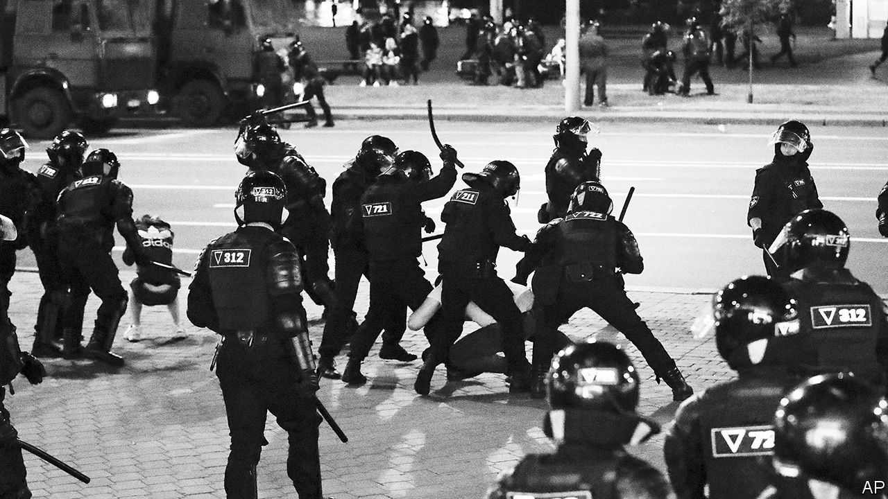

## Hanging on, for now

# Aleksandr Lukashenko is trying to beat protesters into submission

> Belarus’s dictator hopes for Russian support and European indifference

> Aug 22nd 2020MINSK

THE MENACING concrete-walled jail on Minsk’s Okrestina Street played a central role in the reign of terror unleashed last week by Alexander Lukashenko, the dictator who has ruled Belarus for the past quarter century, to put down an uprising that has come close to overthrowing him. Prison guards worked overtime on those who dared to protest against Mr Lukashenko’s theft of the presidential election on August 9th. Prisoners were forced to kneel with their hands behind their backs for hours in overcrowded cells. Men and women were stripped, beaten and raped with truncheons. “You wanted change, how’s that for change,” went a widely reported refrain. An admirer of Joseph Stalin, Mr Lukashenko has proved a worthy disciple.

The repression was ostentatious: some victims were paraded on state television. By August 19th, at least four people had been killed. The aim was both to terrorise citizens and to bind the regime’s officers by having them commit atrocities together, a tactic used by dictators and mafiosi to prevent defections. But the violence led to yet bigger protests, forcing Mr Lukashenko to restrain his goons and release most of those who had been unlawfully detained.

On August 17th a crowd of protesters approached the prison, demanding the release of those still inside. They appeared ready to storm the building, but were stopped by a human chain of about 150 activists and priests. “There are snipers on the roof, and they are nervous. The last thing we need are more victims,” shouted one activist, a celebrity bodybuilder named Anatoly Gavrilov. Storming the prison might have broken the protests’ code of non-violence, and given Mr Lukashenko—and his backers in Moscow—an excuse for harsher repression.

So far the protests against Mr Lukashenko have been almost entirely non-violent. Marchers obey traffic signals, remove their shoes before standing on benches, pick up rubbish and go home at an agreed time. Demonstrations have engulfed the entire country, not just Minsk, co-ordinated by activists through a Telegram messenger channel called Nekhta (“someone”).

They have also touched off strikes at state factories whose workers once formed the core of Mr Lukashenko’s support. On August 16th, factory workers joined an estimated 200,000 demonstrators in Minsk, the largest protest in the country’s history. The next day Mr Lukashenko flew by helicopter to the MZKT factory, which makes military vehicles, hoping to shore up his support. Instead, workers began chanting for him to resign. “As long as you don’t kill me, there won’t be any other elections,” Mr Lukashenko snapped back.

Yet there are signs that some strikes are coming unstuck. Sergei Dylevsky, a worker at the Minsk Tractor Factory who this week was elected head of its strike committee, admitted that arrests and threats to sack strikers had undermined resolve. Only 200 men out of 17,000 at the factory were ready to “go to the end”, he said.

The protests’ lack of political organisation has been both a strength and a limitation. Svetlana Tikhanovskaya, the ex-schoolteacher who most likely won the election (running in place of her husband, a jailed vlogger), has been a symbol of the revolution rather than its leader. Forced into exile in Lithuania, she has launched a national co-ordination council including workers and intellectuals to negotiate a peaceful transition of power. Mr Lukashenko ominously promised to “cool the heads” of its members.

Having lost all semblance of legitimacy, Mr Lukashenko is dependent on his security services. Yevgeny Yuskevich, a former prosecutor, says the dictator has invested heavily in them. His officers are “bound together by a sense of mutual responsibility, often criminal, and the ideology of a brotherhood standing alone against the enemy.” Riot policemen have been rewarded with money and medals. There have been no high-profile defections in the army or security services. Mid-level bureaucrats are “ready to switch” given the right signal, Mr Yuskevich says, but the risk would be high.

Their loyalty, and Mr Lukashenko’s fate, ultimately depend on the Kremlin—something both Mr Lukashenko and the West recognise. Belarus’s president used to play Russia and the West against each other. Now he has dropped that gambit. Mr Lukashenko has spoken at least four times to Vladimir Putin in the past week to ensure his backing. He refused to take a call from Angela Merkel, Germany’s chancellor. Mrs Merkel and Emmanuel Macron, the French president, have also spoken to Mr Putin, warning him against a military incursion. Mr Putin has told Western powers not to meddle in his backyard.

Mr Putin has no need to invade. He may even be pleased to watch Mr Lukashenko suffer: last year the Belarusian leader rejected his plan for deeper political integration between their countries. But he cannot afford to let a repressive regime that has rigged elections be overthrown by a popular revolution, lest it give his own people the wrong idea. Seeing the uprising choked off, and the EU recognise his dominance, would be sufficient.

At an emergency video summit on August 19th, EU leaders promised sanctions against Mr Lukashenko’s regime but in effect ruled out mediating in the conflict. “We will be very, very careful to ensure that it is not us telling Belarus what to do,” said Mrs Merkel. Thierry Breton, France’s EU commissioner, went so far as to declare that “Belarus is not Europe.”

Meanwhile, the gates of the Okrestina Street jail remain locked. Nationwide, about 40 people are missing since the protests started. Alexei Kazlyuk, an activist for Human Constanta, a Belarusian human-rights organisation, says that, given the extremes of the documented violence, it would be “surprising” were the number of deaths not to increase. ■

## URL

https://www.economist.com/europe/2020/08/22/aleksandr-lukashenko-is-trying-to-beat-protesters-into-submission
