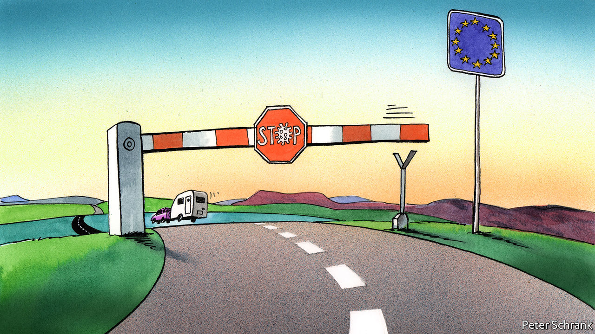

## Charlemagne

# Covid-19 is threatening Europe’s Schengen passport-free zone

> The real value of the Schengen zone is not economic but political

> Aug 22nd 2020

Editor’s note: Some of our covid-19 coverage is free for readers of The Economist Today, our daily [newsletter](https://www.economist.com/https://my.economist.com/user#newsletter). For more stories and our pandemic tracker, see our [hub](https://www.economist.com//news/2020/03/11/the-economists-coverage-of-the-coronavirus)

IN SUMMER MONTHS a common enemy stalks Europe’s motorways: the Dutch caravan. With four times more caravans per head than the European average, the Netherlands’ holidaying families are the nemeses of other vacation-bound drivers. But this year there are fewer of them. Normally 9m Dutch—slightly over half the population—head abroad for a holiday, mostly to southern Europe. Barely half that number said they would bother this time round, as covid-19 scuppered their usual plans. (In an unscientific poll earlier this month, Charlemagne spotted one lonely Dutch caravan during a five-hour drive from the Dordogne to Paris.)

Staying home for the summer is part of a new reality for Europeans used to zipping across borders as they please. In normal times, the EU’s Schengen area extends across 26 countries both inside and outside the EU, allowing people to go from Lisbon to Tallinn without showing a passport. In pandemic times, however, the EU’s cherished passport-free zone is under threat.

The absence of border checks across much of Europe is among the most tangible effects of EU integration. The Schengen agreement was reached 35 years ago between Belgium, France, Germany, Luxembourg and the Netherlands. It now stretches across the continent—or at least it did. As soon as the covid-19 crisis struck, borders slammed shut. Checks are still in force in a handful of countries. Emmanuel Macron, the president of France, put the situation bluntly during a crisis meeting in spring: “The risk we are facing is the death of Schengen.” He was right to worry, but not so much because of the obvious benefits of passport-free travel as because of the zone’s deeper significance.

Schengen may be one of the EU’s greatest achievements, but only a minority of Europeans use it. Just a third of EU citizens take a foreign holiday in a given year, by far the most common reason for travel abroad. Domestic travel feels like an imposition for vitamin D-deprived Dutch, but it is the norm for most Europeans. Indeed, 40% say they never leave their own country at all. Those who cross borders daily make up an even smaller proportion. Only a tiny minority—about 2m out of 440m, clustered in a few places, such as Slovakia and Luxembourg—cross a border to go to work. For most people, Schengen is either rarely used or irrelevant.

For a project often referred to as the “jewel in the crown” by proud EU politicians, Schengen is rather cheap. Economically, the absence of passport checks within the bloc is not worth much. Wonks suggest the reintroduction of border controls within the EU would cost €5bn-18bn ($6bn-21.5bn), a small slice of the union’s €15trn economy. By contrast, the single market is estimated to have added 9% to EU GDP since its inception. Complicated just-in-time supply chains can survive passport checks, as Britain demonstrated when it was within the club but outside the Schengen area. It is Britain’s departure from the EU’s single market and customs union that will provide business with a logistical nightmare.

Perhaps passport-free travel looms large in the minds of Eurocrats because they are the ones who benefit most from it. The EU is about making it easier for people to move, even if most people do not bother. By contrast, in Brussels they generally do: the capital’s well-paid polyglots flit across the continent constantly, for work and pleasure. Borders have always had an outsized significance for the EU’s movers and shakers, going back to its founding fathers. Alcide De Gasperi, Konrad Adenauer and Robert Schuman, the crucial Italian, German and French statesmen during the club’s creation, all hailed from their country’s borderlands, which had meandered with history. But that leads to a distorted picture of everyday life for most Europeans.

Schengen’s actual significance stems not so much from what it offers as from what it requires. It is the obligations of Schengen that are forging the EU into something resembling a state. This is most obvious at the union’s external borders. When covid-19 hit, member states had to come up with a common list of which non-EU citizens were allowed in. There is little point in one country banning, say, Brazilians, if an arrival from Rio de Janeiro can simply fly into a neighbouring country and nip over the border. An absence of internal checks requires stringent checks at the frontier. This lesson was learned painfully during the migration crisis that began in 2015, when 1m refugees streamed in from the Middle East and north Africa. In response, Europe established a standing corps of EU border and coast guards—officers with guns and EU flags determining who can come into a member country. It should be ready by next year. As EU wallahs debate whether the recent move to issue common debt constitutes a “Hamiltonian moment”, it is helpful to recall that the former Treasury secretary founded America’s coast guard, too.

Even if few people use it on a day-to-day basis, the symbolic power of passport-free travel is unmatched. Half the countries in the EU have experienced authoritarian regimes within living memory. For citizens threatened by dictatorships, the freedom to move also means the precious freedom to leave. If that right is at the mercy of a man in a uniform at a border post, it feels diluted.

Yet ultimately, Schengen is a symptom. When the EU struggles, so does Schengen. Borders stay open only when countries trust fellow EU members to deal with internal problems, be they terrorism or disease. Other pieces of European integration are not so flexible. (It is easy to install temporary checks on the Italian-French border; it would be impossible to reintroduce the lira temporarily.) The re-emergence of borders within the Schengen area would not be disastrous, but it would be annoying. More important, when EU countries let people cross their borders freely, they are displaying a fundamental confidence in their neighbours. A convoy of Dutch caravans slowly winding their way to southern France would be a sign of a union in fine fettle. Cheer before you honk. ■

## URL

https://www.economist.com/europe/2020/08/22/covid-19-is-threatening-europes-schengen-passport-free-zone
