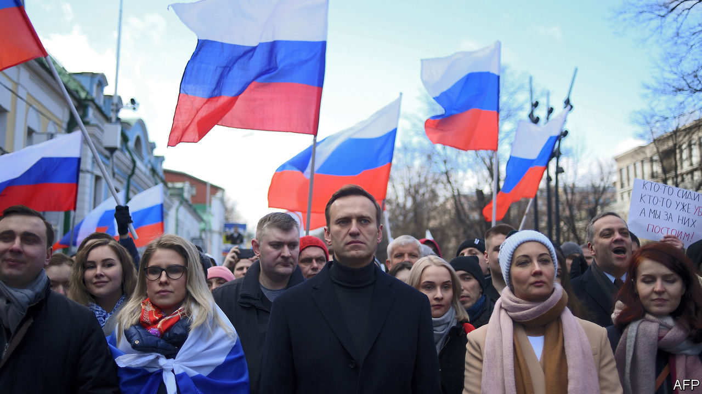

## Alexei Navalny in peril

# Russia’s opposition leader is in a coma, seemingly poisoned

> Aug 22nd 2020

AS The Economist went to press, Alexei Navalny, the Russian opposition leader, was in a coma with symptoms of poisoning. He fell unconscious on a flight from the Siberian city of Tomsk to Moscow after drinking tea at the airport. The plane made an emergency landing in Omsk, where Mr Navalny was put in intensive care. His condition is worse than it was last year, when he appeared to have been poisoned while in custody.

## URL

https://www.economist.com/europe/2020/08/22/russias-opposition-leader-is-in-a-coma-seemingly-poisoned
