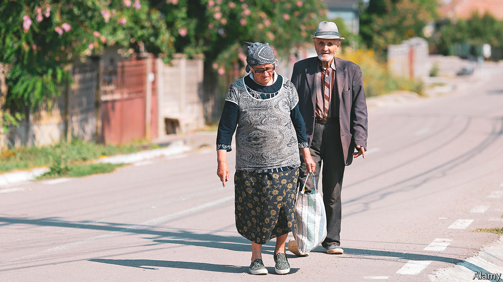
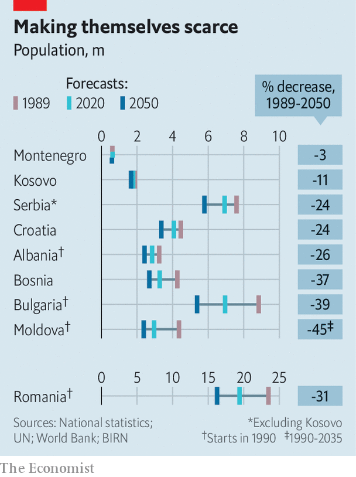

## Balking at Balkan babies

# The Balkans are getting short of people

> The demography of south-eastern Europe threatens its hopes of prosperity

> Aug 22nd 2020BELGRADE

SOUTH EASTERN EUROPE is in a Catch-22. The region’s many problems prompt young, talented people to leave in droves. But it will not catch up with the rest of Europe without young, talented people to generate prosperity. Across the Balkans, populations are shrinking and ageing, and unless that changes even more will leave.

Measuring demography in the Balkans is difficult: apart from those for births and deaths, data are hard to come by. A lorrydriver who leaves Belgrade to take a job in Germany does not have to tell the Serbian authorities. Because of the region’s complicated history, millions of its citizens can get passports from neighbouring “mother countries”. These are especially attractive if the mother country belongs to the EU, since EU citizenship includes the right to work anywhere in the union. A fifth of Croatian passport-holders working abroad are probably from Bosnia, and almost all Moldovans working in the West have Romanian documents. All this makes it hard to tell who is where.

Yet the data that are available paint a clear picture. The population of every Balkan country is shrinking because of emigration and low fertility. In the past, populations grew back after waves of emigration, since many women had six children. Now few have more than one. Serbia may have more pensioners than working-age people by next year.

In the short run governments do not mind emigration because it lowers unemployment and increases remittances from abroad. But in the long run, says Vladimir Nikitovic, a Serbian demographer, it is “catastrophic”. About 50,000 people leave Serbia every year. Of those who return, around 10,000 are pensioners who have spent their working lives in the West. Their children will not follow them back.

On current projections Bulgaria will have 39% fewer people by 2050 than it did in 1990 (see chart). The region has some of the world’s lowest fertility rates. Bosnian women have an average of 1.3 children and Croatians 1.4. Kosovo, with a median age of 29, has the region’s youngest population, but its fertility rate of 2.0 (just under the replacement rate) has been falling for years too. Elsewhere, rates are similar to those of western European countries. But because the Balkans host hardly any taxpaying immigrants, money for pensioners is scarce.

The effects of population shrinkage are stark. At the height of the summer holidays Rasnov, a pretty town in Romania’s Transylvanian hills which once had a bustling marketplace, is eerily empty, with barely a café open. A generation ago its ethnic Saxon population, which traced its roots to the Middle Ages, left for Germany. Its ethnic Romanians seek work elsewhere. They send money home to ageing parents, but few come back except to retire. Why work in a café in Rasnov when you can do the same for far more money abroad?

A few of the region’s cities have grown. Cluj, another town in Transylvania, is booming. Albania’s capital, Tirana, is also drawing people in. Its mayor, Erion Veliaj, says it faces an influx of 25,000 people every year. But those are exceptions.

This combination of rapid emigration, low fertility and sparse immigration produces the worst imaginable result, says Kresimir Ivanda, a Croatian demographer. Greece, Italy and Spain have low birth rates, but attract lots of immigrants. In Poland, more than 1m Ukrainians have filled gaps in the labour market left by emigration.

Mr Nikitovic worked for a national commission on solving Serbia’s demographic crisis, but the government, he says, did not act on enough of its ideas to make much difference. As in many Balkan countries, the problems are legion. Women are discouraged from having more children by the lack of protection against being fired when they become pregnant. Cheap air travel makes seeking work abroad easy (or did before covid-19 struck). In normal times, Croatian carers in Britain or Romanians in German slaughterhouses can commute to short-term jobs. This worsens labour shortages at home, which in turn pushes up wages. Ivan Vejvoda, of the Institute for Human Sciences in Vienna, thinks meeting western Europe’s needs without draining the Balkan countries of their people requires concerted action by the EU and the states of the region.

Of course, for citizens of Balkan countries, earning higher wages abroad is a boon. Remus Gabriel Anghel, a Romanian demographer, says the migration experiences of the past 15 years have also been a motor of social change. Before, people just wanted to make ends meet; now those who have lived in western Europe demand better schools, hospitals and services. This, Mr Anghel says, is something the government “does not really understand”. ■

## URL

https://www.economist.com/europe/2020/08/22/the-balkans-are-getting-short-of-people
