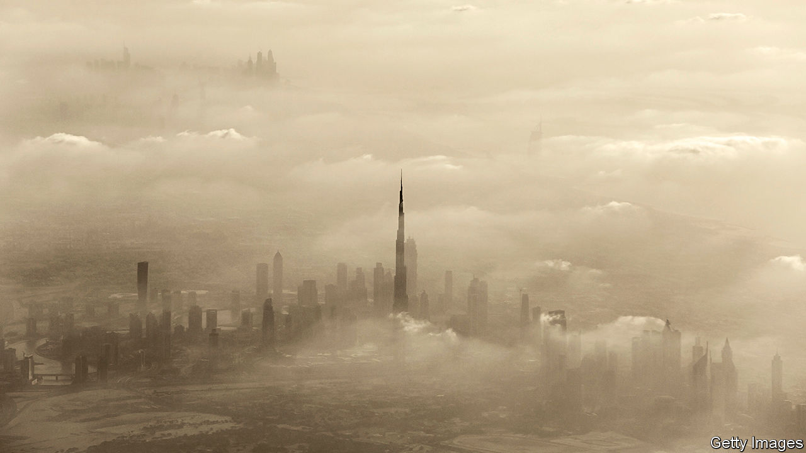
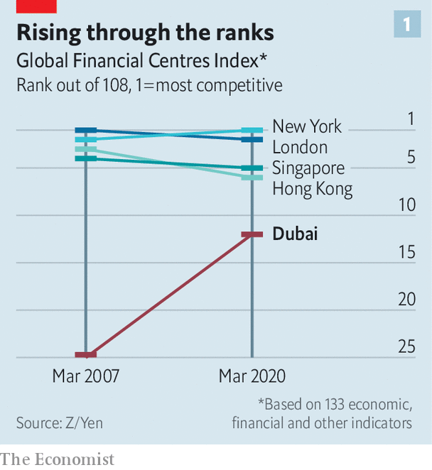
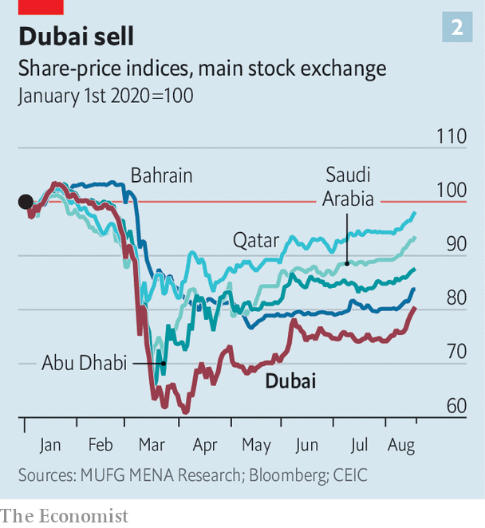
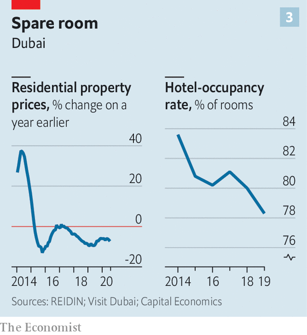
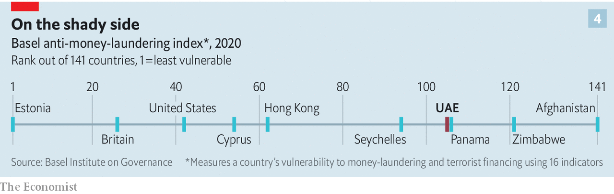
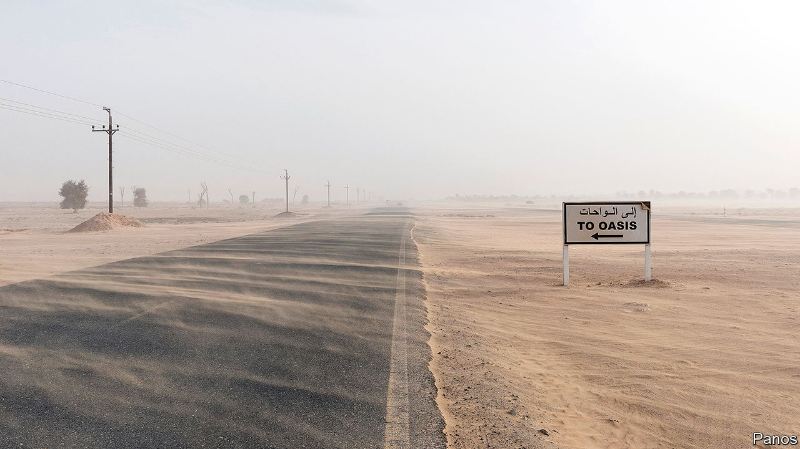

## Navigating the storm

# Can Dubai enter the premier league of financial centres?

> It will need to adapt to a less globalised world, and clean up its act

> Aug 22nd 2020

Editor’s note: Some of our covid-19 coverage is free for readers of The Economist Today, our daily [newsletter](https://www.economist.com/https://my.economist.com/user#newsletter). For more stories and our pandemic tracker, see our [hub](https://www.economist.com//news/2020/03/11/the-economists-coverage-of-the-coronavirus)

THE DEAL to normalise relations between Israel and the United Arab Emirates (UAE), announced on August 13th, was a diplomatic coup. Might it be a commercial one too? Moneymen in Dubai, the UAE’s largest financial centre, are hoping to cash in on increased investment and travel between the two countries. Israelis are expected to join the hordes of well-heeled foreigners who have opened businesses or bought swanky pads in the coastal emirate.

Dubai, one of seven emirates that make up the UAE, will be glad of the custom. Its media may be full of feel-good financial stories—drooling, for instance, over the recent foundation-pouring for the world’s tallest hotel, set to rise to 82 storeys, and the unveiling of “the world’s highest infinity pool”—but closer to earth things look less impressive. Thanks to overbuilding, property prices remain far below peaks reached six years ago. Covid-19 has clobbered an economy built largely on retail and hospitality. Low oil prices have strengthened the headwinds: Dubai is not hydrocarbon-rich but its economy feeds on petrodollars.

Adding to the challenges, Dubai faces increasing international pressure to clean up its act. It has long been less than discerning about the provenance of money flowing in. Its property market is heavily stained with laundered loot. If Dubai is forced to tighten standards, that would dent business in the short term, complicating its efforts to push its way into the premier league of financial centres.

Viewed over a longer timeline, Dubai’s growth has been spectacular. In the 1950s, as the City of London was about to ride the Eurodollar boom, Dubai was little more than a fishing village, with 20,000 souls and no airport. Today it is a metropolis. Its financial centre, which first began to take off in the 1990s, is a super-regional champion, serving as a gateway for investment from and to the Middle East, South Asia and Africa. Underpinning this is its stable polity and high quality of life: it offers the region’s ritziest penthouses, finest dining and best shopping and entertainment.

Strong trade and transport links support its financial offering. The city has the world’s largest man-made harbour and the Middle East’s busiest port, with enough space for 22.4m twenty-foot containers. Its airport is—or was, at least, until the pandemic—a key east-west transit point. In 2019 it was the world’s busiest airport for international passengers. Dubai is, in short, the closest thing its region has to a Singapore- or Hong Kong-style entrepot.

According to the Global Financial Centres Index, which since 2007 has ranked cities according to a range of financial, economic and quality-of-life measures, Dubai has steadily closed the gap with the top tier (see chart 1). It now hovers just outside the top ten. The next highest Middle Eastern centre is Tel Aviv in 36th place, followed by Abu Dhabi, the capital of another emirate (and the UAE) in 39th.

The heart of Dubai’s financial ecosystem is the Dubai International Financial Centre (DIFC), a 110-acre “free zone” in the city centre set up in 2004 to boost Dubai as both financial waystation and investment destination. The DIFC has grown into an impressive cluster of banks, fund managers, and law and accounting firms, with over 2,500 registered companies—820 of them financial—and 25,000 professionals.

The DIFC says it hosts 17 of the world’s top 20 banks; eight of the ten leading global law firms; and six of the ten biggest asset managers. Many of them have their regional headquarters there. The banks have around $180bn of assets booked there; DIFC firms arranged an additional $99bn of lending last year. Some specialise in trade finance and infrastructure lending. The DIFC’s fund managers have assets of $424bn. Its financial firms are restricted to foreign-currency transactions. Some Dubai-based banks have operations in the zone too, but conduct dirham-denominated business from branches outside it.

The DIFC’s appeal lies largely in its bespoke tax regime and regulation. Like the other 40-odd free zones in the UAE, it sets its own rules. It is tax-light, allows foreigners full ownership (outside zones this is capped at 49%) and sets no local-hiring quotas. It has its own regulator, the Dubai Financial Services Authority, run by a former bank supervisor for America’s Office of the Comptroller of the Currency. Financial firms outside free zones fall under the central bank and other national authorities.

The DIFC has its own judicial system too, based on common law and with courts that hear cases in English. (By contrast, the UAE’s system is based on civil law.) The DIFC passes its own laws: one on data protection, based on EU regulations, took effect on July 1st.

This autonomy is prized especially by investors whose home countries’ legal systems are less dependable. Indians flock to it because of Mumbai’s clogged, clunky and capricious courts; some joke that Dubai and Singapore are India’s real financial capitals. In a big boost, Dubai’s judgments became enforceable in India in January.

The DIFC’s judicial system has grown quickly. In 2019 its courts heard a record 952 commercial cases, 43% more than in 2018. It has a growing reputation as a regional arbitration centre, helped by a joint venture with the London Court of International Arbitration, and the hiring of judges from Australia, Britain and elsewhere.

The DIFC has navigated the coronavirus crisis well. It even managed to sign up 310 new companies in the first half of 2020—a six-month record. This followed a record year in 2019, in which 493 new companies joined, among them an insurance arm of Berkshire Hathaway and the asset-management division of State Street.

This unlikely growth was, the DIFC says, largely driven by interest from Asian firms and fintechs. Having invested heavily to launch a fintech “accelerator”, Dubai claims to be home to over half of all fintechs in the Middle East and North Africa. The January-June registration numbers were probably helped by a speedily assembled relief package for DIFC clients, unveiled in March, including licensing-fee waivers, lease-payment deferrals as well as three-month rent forgiveness for retailers.

Still, covid-19 has taken a heavy toll on Dubai. It is more vulnerable than the region’s other economies because of its reliance on retail and recreation, both highly susceptible to physical-distancing and travel restrictions, says Ehsan Khoman, head of Middle East research at MUFG, a bank. Its equity market has fallen further than others in the Gulf this year (see chart 2).

Moreover, Dubai was struggling to shake off several pre-existing conditions when the virus struck. A debt and building binge had left it exposed during the financial crisis of 2007-09. It took a $10bn bail-out by Abu Dhabi to stave off the threat of sovereign default. But Dubai’s “government-related entities” (GREs)—conglomerates with tentacles across the economy, such as Dubai World (from ports to leisure) and Dubai Holding (telecoms, property and more)—remain heavily burdened, and there is talk of another debt crisis. Capital Economics, a consultancy, reckons total public debt is $153bn, of which GREs owe $89bn, equivalent to 140% and 81% of GDP respectively. Their repayment schedule is gruelling, with over 60% of their debt due in the next four years. They had topped up their borrowing to fund projects ahead of the World Expo, which had been scheduled for October, hoping for a flurry of deals and up to 25m visitors. But the event has been pushed back a year because of covid-19.

Dubai’s property market, too, was in pain well before the pandemic because of oversupply. Residential property prices have fallen in recent years, as have occupancy rates at hotels (see chart 3). The number of visitors to Dubai from elsewhere in the Gulf fell by 10% between 2016 and 2019. Developers were cutting back before the virus; now some fear for their survival. In July S&P, a rating agency, downgraded the debt of two of Dubai’s biggest property companies to junk. It also expects the economy to shrink by 11% this year.

As it seeks to shake off these ailments and recover from the effects of its covidinduced lockdown (which was among the world’s strictest), Dubai faces longer-term challenges. One is the slowing and possible reversal of globalisation as trade tensions rise and populist policies spread. Having redesigned its economy around the flow of people, goods and capital, Dubai was a big beneficiary of globalisation, and used its strategic location to punch above its weight. Now the model looks like a vulnerability. (The consequences are not clear-cut, though. Entrepots sometimes benefit when big powers squabble, as dealmaking moves to neutral ground. And if global trade turns more parochial, then regional hubs like Dubai could pick up some types of business even as they lose others.)

Protracted weakness in the oil price could also cause problems. Oil-related activities make up just 1% of Dubai’s nominal GDP, according to MUFG. Still, its prospects are entwined with oil-price fluctuations. A lot of the finance in Dubai involves reinvesting oil money from the region. Its property boom was largely built on regional petrodollars. And many of its tourists come from oilier Gulf countries.

Another question is whether Dubai can stay ahead of regional rivals that covet its crown. Oil-rich Abu Dhabi, a 90-minute drive away, is a frenemy: it is both a source of bail-outs and a would-be usurper. It attracts a smattering of foreign investment managers, keen to work with its sovereign-wealth fund, the UAE’s biggest. But its financial district is not a patch on the DIFC.

Riyadh could prove a more serious competitor, especially if Saudi Arabia’s social liberalisation continues and attracts more fun-loving expats. The completion of the 59-tower King Abdullah Financial District, a banking hub in the Saudi capital, has taken on more urgency under Muhammad bin Salman, the country’s crown prince. Hints have been dropped that foreign banks that open an outpost there may be better placed to win Saudi mandates, says one banker.

The biggest long-term threat, however, comes from within: Dubai’s attitude to corrupt capital. Of all the big global financial centres, it is the shadiest—not only a haven for clean money seeking investments or fleeing turmoil elsewhere, but also for the dirty stuff. It is used by kleptocrats, money-launderers, arms-smugglers, sanctions-busters and other criminals. The UAE and Iran are the only Gulf countries on America’s list of “major money-laundering jurisdictions”; its moneymen are under scrutiny for suspected financial ties to Syria’s president and his cronies. And it doesn’t just take the bad guys’ money; a flock of fugitives, alleged fraudsters and disgraced public figures live in Dubai, including a suspect in the massive “cum-ex” tax-fraud case (who denies wrongdoing).

Not surprisingly then, the UAE scores poorly in a leading index of money-laundering risk—worse, in fact, than several notoriously shady sunny places, including the Seychelles (see chart 4). That score and its size together make Dubai the biggest single hole in the global anti-money-laundering (AML) system, say some experts. The UAE’s finance ministry and central bank declined to comment.

Much of the dodgy cash goes into luxury flats and villas. A leak of property records in 2016 revealed 800 Dubai properties, worth $400m, linked to over 300 Nigerian “politically exposed persons” (current or former officials, their relatives or associates). Another channel is Dubai’s 30 or so free zones. Though economically important, some hubs are opaque and, investigators and anti-corruption NGOs suspect, misused by money-rinsers.

Corporate malfeasance is not restricted to secretive shell companies or trading firms. Thanks to weak governance and a culture of self-dealing, the UAE has more than its fair share of once-high-flying companies that were felled by financial scandals—among them Abraaj, once the Middle East’s top private-equity firm, and NMC Health, a company once included in the FTSE 100, Britain’s stockmarket index.

Dubai’s weaknesses in combating illicit finance are “a feature, not a bug” of its political economy, as a recent report by the Carnegie Endowment, a think-tank, puts it. When international rules designed to root out tax evaders took effect a few years ago, the UAE offered inveterate dodgers ways to invest in its companies and property that circumvented the rules (it tightened up after the EU cried foul).

Another sign of this is Dubai’s lack of co-operation with foreign governments probing suspected corruption with Dubai links. According to the Financial Action Task Force (FATF), which writes and polices global AML standards, between 2013 and 2018 Dubai’s public prosecutor received around 300 such “mutual legal assistance” requests, but acted on only 89 of them.

One reason Dubai has got away with such foot-dragging is that it has been shrewd, for instance by paying lip service to reform at moments of international scrutiny, then doing nothing much when the pressure eases. Another reason is its strategic importance: the UAE is a key ally for Western powers. As a result, the FATF, over which those powers hold great sway, has pulled its punches.

There are signs the tide is starting to turn. The FATF issued a (by its standards) stinging report on the UAE earlier this year, and reportedly placed it under year-long observation to ensure that it implements recently passed AML laws. If it does not, it could be added to the FATF’s “grey list”, joining the likes of Syria and Zimbabwe. That is one naughty-step away from blacklisting, which would, in effect, require international banks to disengage.

It almost certainly will not come to that. Dubai’s rulers may seem impervious to international criticism, but “will act very quickly” to weed out the dodgiest business if Dubai’s financial links are threatened, says a well-connected Emirati financier.

They are, he adds, also confident they can secure new sources of revenue if cleaning up cuts off business. He also notes that, as long as the UAE remains stable and its region volatile, it will benefit from capital flight. The Arab spring was high season for Dubai’s deposit-takers. Now they are doing brisk business with clients from Lebanon.

Other new business takes more effort. The UAE’s political and business leaders have worked tirelessly over the past couple of years to strengthen links with China, signing deals in logistics, chemicals, finance and more. Not for them the moral high ground or bans on Huawei. They are beginning to reap the benefits. The DIFC is the regional headquarters for China’s four largest banks as well as several big firms. Though the UAE is not a key player in China’s Belt and Road initiative, Dubai is becoming the hub of choice for Chinese expansionism in the region. Ever ambitious, the DIFC has talked of tripling in size by 2030. Its burgeoning eastern connections make that seem a little less fanciful. ■

## URL

https://www.economist.com/finance-and-economics/2020/08/22/can-dubai-enter-the-premier-league-of-financial-centres
