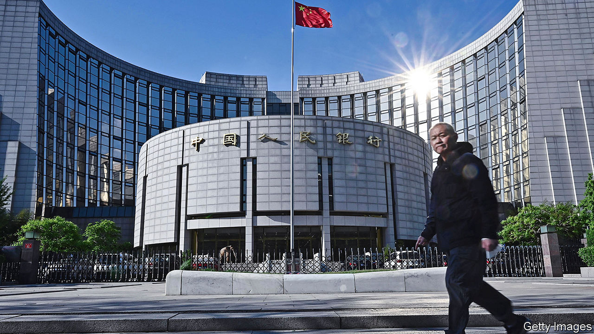
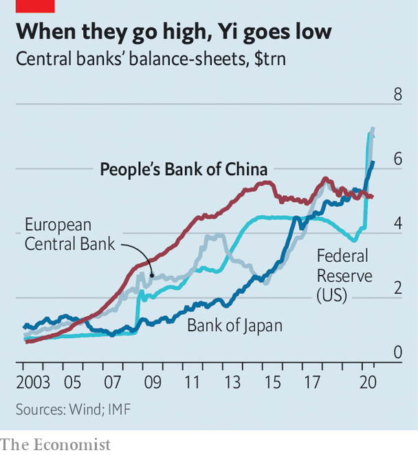

## Conforming to norms

# China’s monetary stimulus is unusually restrained

> Its apparent conservatism is partly an unwinding of past excesses

> Aug 22nd 2020SHANGHAI

YI GANG, THE head of China’s central bank, is fond of saying that he wants to run “normal” monetary policy. By that he means keeping interest rates well above zero, ensuring that the yield curve slopes upwards and avoiding direct purchases of the government’s bonds—much of which, in fact, make the People’s Bank of China (PBoC) a highly abnormal central bank these days. The clearest sign of this is its balance-sheet. In terms of its assets, the PBoC has gone from the undisputed heavyweight to a middleweight. Its restraint is a combination of two different strands in its pursuit of policy normality: an avoidance of the unusual manoeuvres that have become common elsewhere and a reversal of some of the unusual manoeuvres that used to be common in China.

Starting in the early 2000s, the PBoC accumulated assets at a prodigious rate, almost entirely in the form of foreign-exchange reserves. The build-up was a result of its policy of limiting the yuan’s appreciation at a time when China was running a giant trade surplus. The PBoC’s assets peaked at 70% of GDP in 2008, more than twice the level of its peers in America, Europe and Japan at the time. But as China’s foreign-exchange reserves have shrunk and then stabilised over the past five years, so has the central bank’s balance-sheet.

By contrast, the assets of the Federal Reserve, the European Central Bank and the Bank of Japan have mostly risen over the past decade or so, as they undertook quantitative easing, buying up government bonds and, in some cases, corporate paper and equities. In order to minimise the economic damage from the coronavirus pandemic, they are buying yet more bonds. The PBoC, though, has barely added to its assets (see chart). As a share of GDP, the size of its balance-sheet is now roughly the same as the Fed’s—around 35%.

In part China’s restraint is because the economy is in relatively better shape, with the virus all but stopped and a growth rebound well under way. Partly it also reflects what might be called the Kipling doctrine in China’s bid to promote the yuan’s international role: if you can keep your money supply in check when all about you are expanding theirs like mad, then reserve-currency status may some day be yours.

There is also a deeper reason for China’s apparent conservatism, though. It is gradually reversing some of its extraordinary past interventions. In order to maintain an undervalued currency, the PBoC printed as much yuan as needed to buy the foreign currency streaming into China. To prevent that newly created money from causing inflation, it then had to soak much of it back up, or to “sterilise” the inflows. It did that primarily by jacking up reserve-requirement ratios for commercial banks. At the peak in 2011, banks were forced to place 21.5% of their deposits at the central bank. After repeated cuts, including two since the coronavirus outbreak, mid-sized banks now need to set aside only 9.5% of their deposits, freeing them to lend more. Coupled with targeted liquidity injections and old-fashioned moral suasion (a powerful tool in a largely state-owned financial system), the PBoC can support the economy without dramatically scaling up its balance-sheet.

Still, the very stability of that balance-sheet has led to questions about whether it may be accumulating foreign-exchange reserves on the sly. The main reason for suspicion is that even as China has notched up huge trade surpluses ($62bn in July, just shy of a monthly record set in May), its reserves have barely budged. But a focus on trade overlooks the cash that has left through other channels. In the second quarter, net financial outflows (excluding direct investment) soared to $104bn—equivalent to two-thirds of trade earnings—partly thanks to mainlanders punting on stocks in Hong Kong. This points to one more way in which the monetary system looks more normal—it is becoming fiendishly complex to monitor all the cash criss-crossing China’s borders as, little by little, it opens up its capital account. ■

## URL

https://www.economist.com/finance-and-economics/2020/08/22/chinas-monetary-stimulus-is-unusually-restrained
