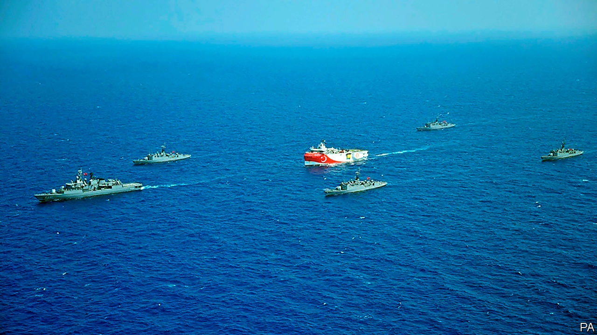
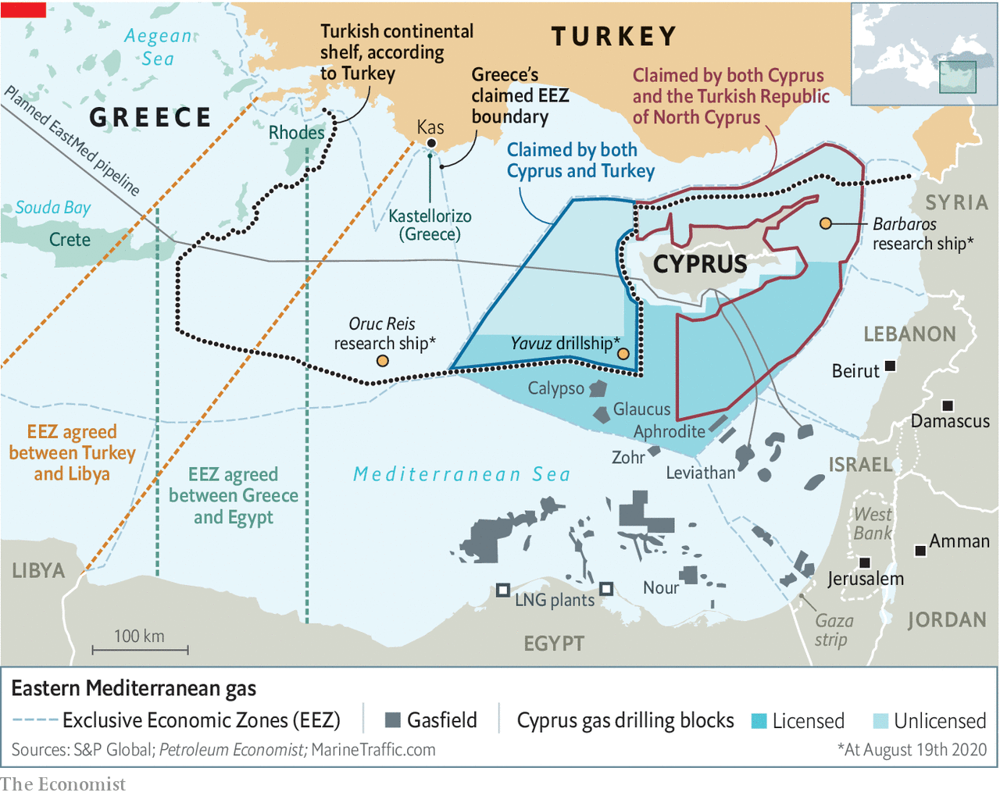
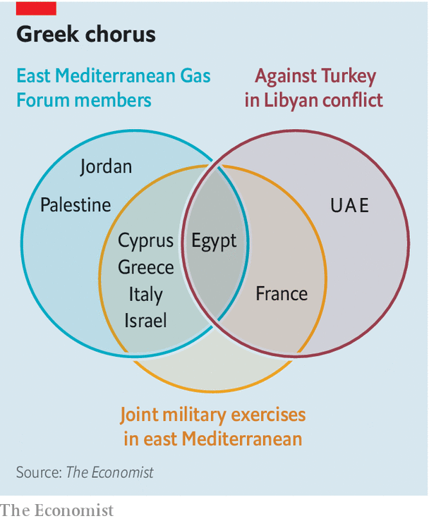
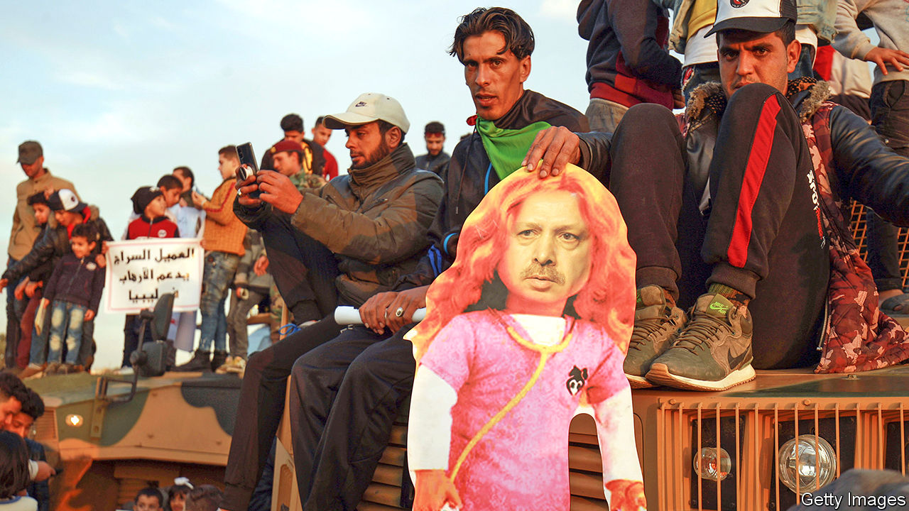

## Angst in the Aegean

# A row between Turkey and Greece over gas is raising tension in the eastern Mediterranean

> A plethora of countries is entangled in a string of disputes in the area

> Aug 22nd 2020ATHENS, ISTANBUL AND PARIS

AS NAVAL BATTLES go, it was not a classic. The Kemal Reis, a Turkish frigate named after a 15th-century Ottoman admiral who tormented the Venetian fleet, was one of five escorts sent to protect the Oruc Reis, an exploration ship designed to hunt for undersea oil and gas. The Limnos, an elderly Greek frigate charged with protecting Greece’s Exclusive Economic Zone (EEZ) from such predations, watched warily from a distance. On August 12th they collided after a clumsy manoeuvre.

Both governments tried to keep the incident under wraps, but Greek navy officials soon leaked details to local news websites. “We have fewer and older ships, but we protected Greece’s maritime rights,” boasted one veteran naval officer. Greece’s defence minister is said to have congratulated the captain of the Limnos. “If this goes on, we will retaliate,” thundered Recep Tayyip Erdogan, Turkey’s president. “We shall not leave either the dead or the living of our kin alone.” After a call to Kyriakos Mitsotakis, the Greek prime minister, Emmanuel Macron, France’s president, said that he had decided to “temporarily reinforce” France’s military presence in the region with two fighter jets and a pair of warships in order to “make sure that international law is respected.”

Dust-ups between Greece and Turkey are nothing new. The two countries came to the brink of war in 1996 over disputed Aegean islets, and continue to spar over them. Greece complained that Turkish warplanes ventured into its airspace over 3,000 times in 2017. They also disagree over the status of Cyprus, split into two after a Turkish invasion in 1974. The current dispute, however, is part of a larger tapestry of growing tensions in the eastern Mediterranean over energy, security and ideology. Turkey finds itself pitted against a broad coalition of European and Middle Eastern rivals in battlegrounds stretching from Libya to Syria.

On the face of it, the latest skirmish is all about energy. Ten years ago Israel, the most energy-starved country in the Middle East, announced it had a huge hydrocarbon resource, after all. Tucked beneath 1,645 metres of sea were some 450 billion cubic metres (bcm) of recoverable gas reserves, in a field presciently named Leviathan. Israeli officials dubbed it the best energy news in the country’s history.

The decade since has seen another boom. In 2015 Eni, an Italian oil-and-gas giant, discovered the huge Zohr field off Egypt’s coast. Big gasfields have been found near Cyprus, too, their names borrowed from Ovid or Homer: Glaucus (ExxonMobil and Qatar Petroleum), Aphrodite (Noble Energy, Royal Dutch Shell and Delek Drilling) and Calypso (Eni and Total). Together Egypt, Israel and Cyprus have 2.3tcm of gas, reckons Rystad Energy, a Norwegian research firm, with the potential for a lot more. Optimists claim that such riches may not only enhance the local supply of natural gas, but foster new co-operation in a fractious region and, via an ambitious pipeline, bolster energy security in Europe. Some of these lofty aspirations have been realised. Others remain the stuff of myth.

Many countries in the region are successfully exploiting hydrocarbons without provoking their neighbours. Zohr and Leviathan have become important suppliers of gas to their domestic markets. Egypt has become a hub for foreign investment. Eni’s swift development of Zohr brought other big oil and gas companies to Egypt, lured by geology, favourable regulations and a large, growing domestic market for gas. It helps that Egypt is also home to two large liquefied natural gas (LNG) facilities, which can accept gas by pipeline and turn it into LNG suitable for shipping around the world.

Shared gas interests have also fostered unlikely collaboration. Leviathan’s gas serves not only Israel but Jordan and Egypt. Leviathan’s developers, America’s Noble Energy and Israel’s Delek Drilling, have taken minority stakes in the pipeline that serves Egypt. They plan to export 18.4mcm a day of Israeli gas to Egypt by mid-2022.

Yet ten years after Leviathan’s discovery, the economics of eastern Mediterranean energy are shakier. Oil and gas companies, under pressure from investors, were cutting capital spending even before covid-19 punctured energy demand. The price of gas is almost half what it was in 2010. Chevron in July said it would buy Noble for a bargain $5bn. ExxonMobil, Total and Eni have delayed further drilling off Cyprus, as the firms slash spending and struggle to deploy crews in the pandemic.

The scramble for resources and how best to exploit them is aggravating international tensions. That is partly because of the awkward history and geography of the eastern Mediterranean. Greece argues that each of its scattered islands, however small, is legally entitled to its own continental shelf with sole drilling rights. Turkey, hemmed into the Aegean by a forbidding archipelagic wall of those islands, counters that the eastern ones rest on Turkey’s continental shelf and refuses to accept that they generate economic zones around them. It is one of only 15 countries, including Israel and Syria, that have refused to join the UN Convention on the Law of the Sea, which largely supports Greece’s case.

Turkey, which has been increasingly at odds with its Western allies over a number of issues, from illiberalism at home to migration flows into Europe, is also the only country to recognise the breakaway republic in the northern third of Cyprus and therefore the legitimacy of its waters. It insists that any exploitation of energy resources in the region must take into account Northern Cyprus. To back up these demands, it has sent exploration ships with naval escorts into Cypriot waters and those of Greek islands, most recently around Kastellorizo, close to Turkey’s mainland (see map).

“Let those who come to the region from far away, and their companies, see that nothing can be done in that region without us,” boasted Turkey’s foreign minister last year. In the past couple of years, Mr Erdogan’s government has embraced a revanchist doctrine known as the Blue Homeland, which seeks to give Turkey control over the waters of the eastern Aegean and the northern Mediterranean, disregarding every Greek island from Samothrace to Rhodes.

Turkey has discovered no new Mediterranean gas of its own (though as The Economist went to press, there were reports it may have done so in the Black Sea). But it too aspires to become an energy hub through the Trans-Anatolian pipeline (TANAP), which can deliver up to 16bcm from Azerbaijan to Turkey and Europe each year. Turkey plans to increase the pipeline’s capacity to 61bcm. “The problem is that Azerbaijan does not have enough to fill that,” says Michael Tanchum of the Austrian Institute for European and Security Policy. “Turkmenistan has among the world’s largest volumes of gas, but Russia and Iran keep preventing pipelines from there,” says Mr Tanchum. “So if you’re thinking where Turkey can get gas that Russia can’t interfere with, that’s Iraqi Kurdistan or Israel or the eastern Mediterranean.”

Others in the eastern Mediterranean have snubbed Turkey, however. In January Greece, Cyprus and Israel signed a deal to build a 1,900km undersea pipeline to carry 10bcm of natural gas a year (around a tenth of the EU’s needs) to Europe, bypassing mainland Turkey. The viability of the plan is questionable. The pipeline would travel at extraordinary depth—3km below the surface in one stretch—as well as through areas of seabed prone to earthquakes. Industry analysts reckon its projected cost of $6bn-7bn is optimistic.

To help settle these questions, the region is getting organised—without Turkey. In January Cyprus, Greece, Israel, Italy, Jordan and Palestine established a bloc called the East Mediterranean Gas Forum. France has applied for membership, America for observer status. The forum has taken on an increasingly Turkosceptic tenor as many of its members lock horns with Turkey over a host of issues beyond energy.

“A decade ago the question was whether these gas discoveries would help to overcome political conflicts, or whether they would exacerbate political conflicts”, says Sir Michael Leigh, who served in the European Commission from 2006 to 2011. “It’s pretty clear that it’s more the latter than the former now. The gas issue has fed into other conflicts. And what we’re seeing is very largely a result of the standoff over Libya.”

For years, Libya has been riven by civil war between a UN-recognised government in the west and the forces of Khalifa Haftar, a renegade general, in the east. Turkey supports the government, which works with Islamist militias, whereas France, Egypt, the United Arab Emirates (UAE) and Russia have aided General Haftar, who last year came close to seizing Tripoli, the capital. Though it now claims to be taking a neutral stance, France, which is battling jihadists in Mali, views the general as a useful bulwark against extremist forces. Total, France’s largest energy company, has investments in Libyan oilfields controlled by him. French anti-tank missiles were found at one of the general’s bases last summer, though France denied sending them.

In January Turkey halted General Haftar’s offensive by sending arms, troops and thousands of Syrian mercenaries to beef up the government in Tripoli. That prompted a crisis in June, when a French frigate, operating as part of a NATO mission, was threatened by a trio of Turkish naval vessels while inspecting a ship suspected of breaking the UN arms embargo on Libya.

Mr Erdogan’s intervention in Libya starkly illustrated how energy and security in the region are entangled. His price for halting General Haftar was the Libyan government’s assent to a maritime deal bolstering Turkey’s claims. The accord mapped out Libyan and Turkish continental shelves and EEZs spanning the Mediterranean. They overlapped with those of Cyprus and Greece—ignoring the existence of Crete and Rhodes—and pointedly cut across the path of the proposed pipeline. The deal prompted howls of complaint in Greece. So on August 6th Greece and Egypt, which supports General Haftar and chafes at Turkey’s support for Islamist factions in the Middle East, signed their own maritime accord. That contributed to Mr Erdogan’s decision to send in the Oruc Reis and so to the latest flare-up.

Libya is only one of several Franco-Turkish flashpoints. Last year Mr Macron denounced a Turkish offensive in northern Syria which disrupted American, British and French support for Kurdish fighters battling Islamic State. “This re-emergence of authoritarian powers, essentially Turkey and Russia, which are the two main players in our neighbourhood policy... creates a kind of turmoil,” he declared. France also responded to Turkish incursions into Cypriot waters by expanding its naval presence in Cyprus and conducting joint military exercises in the area with Greece, Cyprus and Italy (see diagram).

Turkey’s relations with other eastern Mediterranean countries have also soured. A decade ago Israel and Turkey were close military partners, but that ended after Israeli commandos attacked Turkish civilian ships trying to break a blockade of Gaza in 2010. “Greece became very important in providing a substitute, especially in terms of training space,” says Oded Eran, a former Israeli diplomat at the Institute for National Security Studies in Tel Aviv. Yossi Cohen, Israel’s spy chief, is reported to have told his Saudi, Emirati and Egyptian counterparts last year that Turkey posed a greater threat than Iran.

He would have found a sympathetic audience, for Turkey is at loggerheads with both Egypt and the UAE. A kaleidoscope of grievances against Turkey has helped to meld a trio of European states (Greece, Cyprus and France), a pair of Arab ones (Egypt and the UAE) and Israel into a loose but formidable geopolitical front. “Turkey basically has had its back against the wall for the last four or five years,” says Nathalie Tocci of the Italian Institute of International Affairs, who advises Josep Borrell, the EU’s foreign-policy chief. “What Turkey managed to do in the last year is get back into the game through Libya,” she says.

When Greece and Turkey came close to war in 1996, America helped calm the crisis. It remains a big player in the region and has its own gripes about Turkey. After Mr Erdogan bought Russia’s S-400 air-defence system against NATO objections, the Trump administration kicked Turkey out of the programme for buying F-35 warplanes.

In December America lifted an arms embargo on Cyprus, part of a batch of measures it said would boost energy security in Cyprus and Europe; that Cypriot interests align with ExxonMobil’s may have helped. Last month America said it would fund military training for the island for the first time and sent an aircraft-carrier to exercise with Greece off Crete, prompting the Oruc Reis to scurry back to harbour. This week a brand-new American helicopter carrier anchored in Souda Bay, a Greek base on Crete.

Yet American policy is erratic. Its approach to Libya has see-sawed. Donald Trump is unlikely to pay much attention to the intricacies of maritime boundaries as America’s presidential election looms. That makes the EU, which Cyprus joined in 2004, a vital actor. The club lacks America’s armadas. But it has other levers at its disposal. It has already sanctioned Turkey for “unauthorised drilling activities”. Mr Macron is keen to go further.

The problem is that the EU, which makes foreign-policy decisions by consensus, is itself divided. Italy and Spain want to smooth things over with Turkey. Germany was irked by Greece’s decision to tweak Turkey’s nose by signing the maritime pact with Egypt just a day before talks between Greece and Turkey—mediated by Germany—were to take place.

Others are irritated by France, particularly its support for General Haftar in Libya. “There is little love for Turkey in Western capitals these days, but the French way of confronting Erdogan is not popular either,” writes Emile Hokayem of the International Institute for Strategic Studies in London.

On August 19th European leaders expressed “full solidarity” with Greece and Cyprus and agreed to discuss the issue further in September, promising that “all options will be on the table”. But Ms Tocci concludes that “ultimately Europeans are not going to do anything significant.” That infuriates France, which believes someone should stand up to Turkey’s challenges to the EU’s maritime borders. “Defence is not a spectator sport,” comments François Heisbourg of the Foundation for Strategic Research, referring to German policy.

Neither Greece nor Turkey can afford these rising tensions in the Mediterranean. Both depend on their coastlines for billions of dollars from tourism. The few foreigners considering a trip to a Turkish or Greek resort later this year may be willing to risk covid-19, but not war. But neither country can back down easily. Mr Mitsotakis, Greece’s centre-right prime minister, is held hostage by a nationalist faction in his New Democracy party with enough MPs to topple his government. Mr Erdogan may be a divisive figure, but his Mediterranean policy wins bipartisan backing at home, notes Sinan Ülgen, a former Turkish diplomat who chairs EDAM, a think-tank in Istanbul. “This is viewed as an attack on Turkey’s national sovereignty.”

On August 16th Turkey’s foreign ministry vowed to press ahead with exploration: “No alliance of malice will manage to prevent this. Those who think otherwise have not taken their lessons from history.” On August 18th another Turkish vessel, the Yavuz, a drillship, headed for Cypriot waters to start four weeks of seismic surveys. A third vessel, the Barbaros, has been in the area since late July. If Turkish ships were to enter Crete’s potentially oil-rich waters, which under the Turkey-Libya accord is assigned to Libya, then “all bets are off,” warns Mr Tanchum. That is unlikely for the moment. But in the past, says Selim Kuneralp, a former Turkish ambassador to the EU, “there was the army and the president who acted as a brake. But now there is no brake and a guy [Mr Erdogan] who’s completely unpredictable.” ■

## URL

https://www.economist.com/international/2020/08/22/a-row-between-turkey-and-greece-over-gas-is-raising-tension-in-the-eastern-mediterranean
