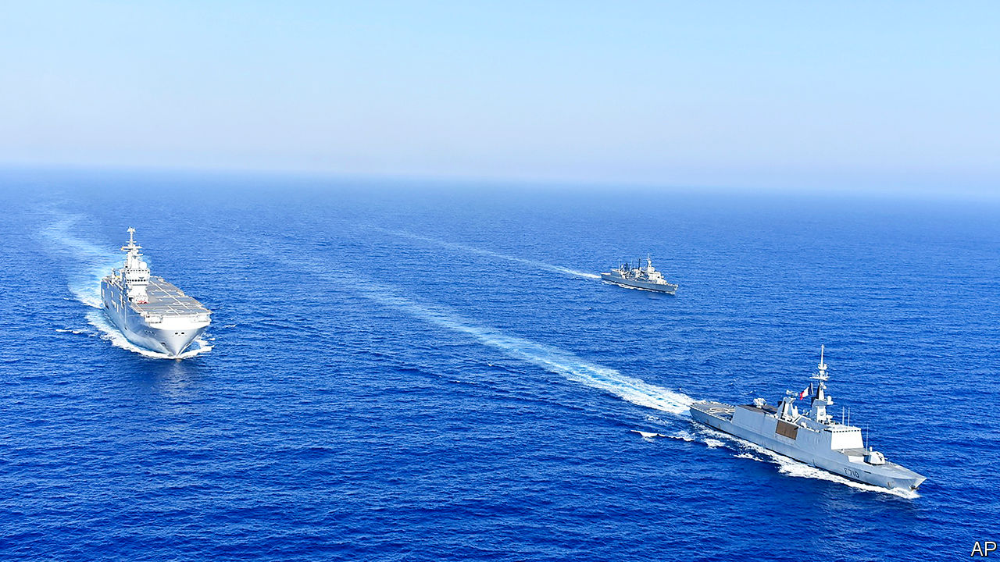

## Trouble among NATO allies

# Dealing with a dangerous dispute in the eastern Med

> Turkey and Greece must be encouraged to exchange views, not blows

> Aug 22nd 2020

AT THIS TIME of year the eastern Mediterranean evokes thoughts of holiday beaches. It has become a destination for superyachts avoiding covid-hit Spain. Unfortunately, this summer the region is also luring warships, as tensions rise between Greece and Turkey over disputed waters. A collision between Greek and Turkish frigates on August 12th was the worst confrontation between the two NATO allies since a face-off on an uninhabited island in 1996 that nearly led to war. In a show of solidarity with Greece, a fellow EU member, France has moved a couple of Rafale fighter jets to Crete and deployed two warships to exercise with the Greek navy. Unless cool heads prevail, there is a risk that matters will escalate further—even as far as blows.

Three main ingredients make this a recipe for trouble. One is interest in the region’s gas resources, which for a decade have been attracting the attention not just of Greece and Turkey but also Cyprus, Israel, Egypt and others. Several countries aspire to be a regional energy hub, helping supply the European market and providing a strategic alternative to Russian gas. Boosters hoped pipelines running across the eastern Med area could be a catalyst for regional co-operation, which in some cases they have (see [article](https://www.economist.com//node/21791015)).

But elsewhere that hope has been overpowered by the second ingredient in the Mediterranean mix: the region’s rivalries. Instead of diluting them, the energy opportunity has intensified them. Cyprus remains divided between a Greek-Cypriot south and a Turkish Republic of Northern Cyprus recognised only by Turkey. Turkish gas exploration in Cyprus’s exclusive economic zone last year brought condemnation from the EU and some (largely symbolic) sanctions. Now Turkish ships are again conducting seismic surveys in Cypriot waters.

Relations between Greece and Turkey are always in danger of flaring up over contested territory. The latest clash has been in the making ever since the signing last November of an agreement between Turkey and Libya’s UN-backed Government of National Accord (GNA). The deal claims an expansive maritime boundary that looks outrageous to Greeks, and also to international law. German efforts to bring Greeks and Turks together for talks came close to working until Greece and Egypt earlier this month rushed to finalise an agreement on maritime zones that countered the one between Turkey and Libya. The Turkish response was to send a seismic-research vessel into the area, with a naval escort—which was involved in that collision with an elderly Greek frigate.

Aggravating all this are wider frictions involving Turkey, from Libya to Syria, the third ingredient stewing in the pot. In Libya, Turkey and France are at loggerheads; in June Turkish warships prevented a French frigate from inspecting a ship suspected of carrying arms to the GNA. The French do not mind pushing back. The Turks, for their part, condemn French interference and think Greece and its friends are ganging up against them. Turkey’s response, under its authoritarian president, Recep Tayyip Erdogan, is to throw its weight around. He may feel emboldened because some countries, such as Britain, are keen to avoid antagonising a NATO ally while others, notably Germany, fear that if pushed too hard Turkey could cause chaos by letting more migrants into Europe.

How to defuse the situation? In the past America might have stepped in to hold the ring (as it did after the clash in 1996). But the mess in the eastern Mediterranean shows how that old order is unravelling—and at what cost. On August 20th France’s president, Emmanuel Macron, was due to welcome Germany’s chancellor, Angela Merkel, to his presidential retreat at Fort de Brégançon on the French Med. A combination of Mr Macron’s muscle and Mrs Merkel’s mediation could yet prove effective in convincing Turkey that, though its rule-breaking cannot be accepted, its concerns will be listened to. The priority is to create some breathing space for Greece and Turkey to talk. A moratorium on exploration in disputed waters might be a good start.

The irony is that, given today’s low prices, major oil companies are delaying further drilling near Cyprus. The transition to cleaner energy is continuing apace. Energy companies are becoming ever more selective in their investments. The longer that the eastern Mediterranean’s leaders bicker, the greater the chance that gas riches beneath the seabed will remain there. ■

## URL

https://www.economist.com/leaders/2020/08/22/dealing-with-a-dangerous-dispute-in-the-eastern-med
