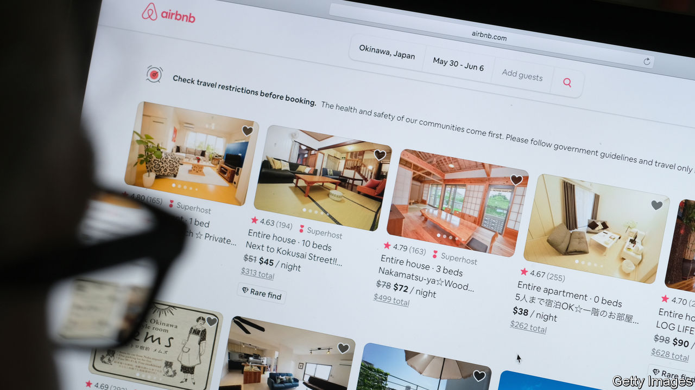

## Silicon Valley v Wall Street

# The IPO is being reinvented

> Tech firms are taking advantage of frothy stockmarkets to experiment with new ways to go public. Good

> Aug 22nd 2020

OVER THE past two decades fewer firms in America have listed on the stockmarket, opting instead to stay in the shadows for longer. Entrepreneurs and venture capitalists (VCs) make two complaints. First, initial public offerings (IPOs) are a rip-off. Second, the degree of outside scrutiny firms face can be uncomfortable. Now a new wave of tech firms are expected to go public, including Airbnb, a home-rental firm, and Palantir, which does data analytics (see [article](https://www.economist.com//node/21791050)). Some plan to use one of two alternative techniques for floating: direct listings and blank-cheque companies. This disruption to the conventional IPO market is risky but welcome. However, in the long run these newcomers won’t be able to escape ruthless outside scrutiny of their business models.

The decline of IPOs is striking. On average in the 25 years to 2000, 282 firms staged one each year, but since 2001 the figure has fallen to 115. This has made the economy more opaque and prevented ordinary people from investing in young firms. The underlying cause is a shift in the balance of power towards companies. Tech startups tend to be asset-light and need less capital, while the VC industry has grown and can fund firms for longer. Startups can thus delay going public. Amazon floated in 1997 when it was three years old, but the typical firm listing now is 11. There is a backlog of 225 unicorns—private startups worth over $1bn—which are supposedly worth a total of $660bn.

If firms are not acquired, they need to go public eventually. Staff want to sell their shares. Their VC backers are sitting on bloated portfolios and need to return cash to their investors. The push to clear this backlog began in 2019 and is gaining steam again. As well as Airbnb and Palantir, many other flotations are planned. In China stars such as Ant, a fintech giant, are listing, too. The pandemic has led to more buzz about the digital economy—Walmart has just reported soaring e-commerce sales. Central-bank stimulus has ginned up markets. And in America there is excitement about alternatives to IPOs.

In an IPO Wall Street banks act as middlemen between the firm and investors, negotiating a price. It’s a gruelling and expensive ordeal. Investors and regulators grill managers for months. Banks charge fees of 4-7% of the proceeds and sometimes sell firms’ shares too cheaply in order to please their clients at investment funds, who get a quick profit, or “pop”, on the first day of trading. Companies have thrown away $43bn of value in this way in the past decade, reckons Michael Mauboussin of Morgan Stanley. According to Bill Gurley, a VC investor, “that pop you hear is money going out of your pocket.”

One alternative to an IPO is a direct listing. Instead of a banker, a stock exchange sets the initial price, automatically balancing supply and demand just before the shares start trading. Last year Slack, a software firm, listed this way, and Palantir could follow. Another method involves blank-cheque companies known as “special-purpose acquisition companies”, or SPACS: listed shell companies that acquire private firms, instantly bypassing the IPO process. Virgin Galactic, a space firm, took this route in 2019. Both approaches have drawbacks. In a direct listing, the law says you cannot raise fresh capital, and without underwriters the share price can be volatile. Blank-cheque firms, meanwhile, have a patchy history, with sponsors often awarding themselves piles of shares, although one newcomer, a $5bn-7bn vehicle backed by Bill Ackman, an investor, says it will keep costs low.

These experiments put pressure on banks and regulators to improve the IPO process. The twist is that they are made possible by frothy markets (see [Buttonwood](https://www.economist.com//finance-and-economics/2020/08/19/bubble-hunting-has-become-more-art-than-science)). Some firms that have floated look overvalued—take Nikola, an electric-lorry firm, which has no material revenues but is valued at $16bn after a blank-cheque listing. Entrepreneurs and VCs love getting an easy ride, but they should be under no illusion: over time, the stockmarket hammers weak firms. Shares of Uber and Lyft, ride-hailing firms that floated in 2019, languish 35% and 61% below their listing price. WeWork, an office-rental firm, abandoned its listing last year after being exposed as a dud. By the end of the great flotation boom of 2020, the hope is that America will have established ways to make it easier for firms to go public. But make no mistake, some of the pioneer companies will be flops.■

## URL

https://www.economist.com/leaders/2020/08/22/the-ipo-is-being-reinvented
