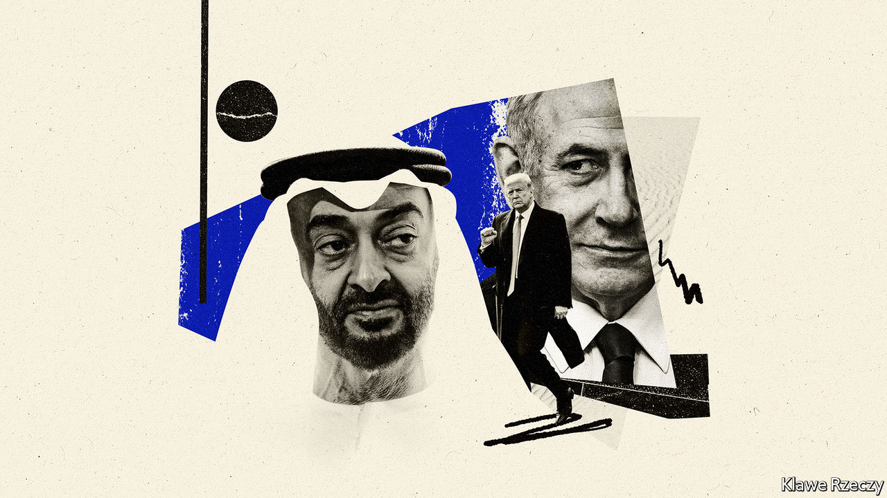

## Into the open

# The Israel-UAE deal is good news for a troubled region

> Even if tensions remain high elsewhere in the Middle East

> Aug 22nd 2020

IT WAS NOT only Yasser Arafat, leader of the Palestinians, who watched with “grief and fury” as Anwar Sadat went to Israel in 1977. Several of the region’s autocrats severed ties with Egypt’s president over what some called a “treasonous” act. When, two years later, Sadat signed a peace deal with the Jewish state, they erupted in outrage again. Egypt was suspended from the Arab League, which imposed a boycott on the country and left Cairo for Tunis. In 1981 Sadat was murdered by jihadists who cited the peace deal as one of their main grievances.

In many ways the region looks the same as it did four decades ago. Autocracy is still in vogue; the Palestinians remain stateless. But relations between Israel and the rest of the Arab world are unrecognisable. When the United Arab Emirates (UAE) agreed to establish diplomatic ties with the Jewish state on August 13th, there was little grief or fury in the region’s capitals. Israel’s first formal relationship with a Gulf state, and its third with any Arab country (Egypt and Jordan being the others), was met with praise from many Arab leaders (see [article](https://www.economist.com//node/21791040)).

Some are calling it a “breakthrough”, others a “turning-point for peace”. But the deal is not remarkable for how it might transform the region. Rather, it reflects remarkable changes that have already taken place. A part of the world once defined by Arab-Israeli hostilities is no longer so; countries increasingly look towards the future, not the past, when shaping their policies. In a perennially troubled neighbourhood, this decline in tension is worth celebrating, even if other dangerous fault-lines remain.

It was no secret that Israel and the Gulf states had grown closer of late. Motivated by a common enemy, Iran, their armies and spy agencies swap intelligence. Recently, Israeli officials began popping up in Gulf capitals. But the UAE’s decision to take its relationship public will bring more benefits for both sides. Israeli business people are excited about their access to Dubai, the region’s financial hub—which happens to be in dire need of a clean-up (see [article](https://www.economist.com//finance-and-economics/2020/08/22/can-dubai-enter-the-premier-league-of-financial-centres)). Deals have already been signed between Israeli and Emirati firms. It feels like a much warmer peace than that between Israel and Egypt. Other Arab states are talking about following the UAE’s lead.

Give the Trump administration due credit. Seven months ago it unveiled a peace plan that was immediately rejected by the Palestinians and most Arab states, because it allowed Israel to annex about 30% of the occupied West Bank and gave the Palestinians something less than a state in return. But at the same time America was sponsoring secret talks between Israel and the UAE. Somehow, in a feat of diplomatic alchemy, American officials turned this far-fetched scheme into leverage. The UAE demanded no real concessions from Israel, other than a promise from Binyamin Netanyahu, the Israeli prime minister, that he would not move ahead with annexation at the moment.

The deal is a boon for Mr Netanyahu, who has been under fire at home over allegations of corruption and for his poor handling of covid-19. The prime minister claims there is “no change” to his pledge to annex parts of the West Bank. In reality, the deal lets him duck a tricky issue. His nationalist allies have wanted him to absorb Israeli settlements in the occupied territories, even though it would have brought international opprobrium. He has avoided that choice and, nonetheless, thrown the nationalists a bone. They have always rejected the idea of swapping land for peace, long the framework of talks with the Arabs. Peace for peace should suffice, they argued. Now, apparently, it does.

The big losers, as ever, are the Palestinians. Only three years ago the Arab states re-endorsed a strategy of offering normal relations with Israel in return for its withdrawal from the occupied territories and the establishment of a Palestinian state, among other things. But Arab rulers, particularly in the Gulf, have grown increasingly frustrated with the stale and stubborn Palestinian leadership. Perhaps exposing the charade of pan-Arab solidarity, and separating the Israeli-Arab conflict from the Israeli-Palestinian one, will lead to a more honest assessment of what is possible. For the time being, though, a just solution to the Palestinian plight feels as elusive as ever.

And what of those other fault-lines? The most dangerous lies between, on one side, America, Israel and much of the Arab world, and, on the other, Iran. Its economy is on the brink of collapse, while its proxy in Lebanon, Hizbullah, faces a backlash over a deadly explosion in Beirut. The Israel-UAE deal, as much as it reflects their shared antagonism to Iran, adds a new element to President Donald Trump’s “maximum pressure” campaign. Where that campaign will ultimately lead remains an open question. But officials in America and the Middle East would do well to remember that bitter enemies need not always remain so. ■

## URL

https://www.economist.com/leaders/2020/08/22/the-israel-uae-deal-is-good-news-for-a-troubled-region
