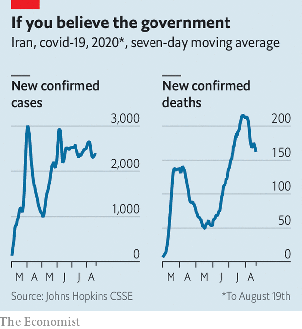

## A rite old mess

# Iran’s clerics argue over how to hold the festival of Muharram

> Social-distancing doesn’t appear to be on the cards

> Aug 22nd 2020

LAST MONTH Saudi Arabia did something unprecedented. To slow the spread of covid-19, it restricted participation in the haj, the annual pilgrimage to the holy city of Mecca, which every Muslim is expected to perform once in their life. Somewhere between 1,000 and 10,000 people already resident in the kingdom were allowed to take part—a tiny fraction of the 2.5m pilgrims who attended last year from around the world. It has been well over a century since the ritual was so disrupted.

Iran is taking a very different approach to this year’s Muharram ceremonies, which begin on August 20th and bring millions of Muslims together to mourn the death of Imam Hussein, the Prophet Muhammad’s grandson and favoured martyr of Shia Islam. “Even if we die, we will hold this year’s Muharram ceremonies splendidly,” says Saeed Haddadian, a maddah, or cantor, who chants for Iran’s supreme leader, Grand Ayatollah Ali Khamenei.

So vast crowds will file through the streets, beating their chests, banging huge drums and re-enacting the passion with mock swords. They will wail their laments in black-draped basements and share food close together. Nothing could spread the virus faster, but President Hassan Rouhani, a cleric himself, says the pageant “cannot be cancelled”. As in past years, his officials have erected stages festooned with coloured flags in streets across the country.

Iran’s doctors are aghast. Officials say the virus has killed just over 20,000 people—the highest death toll in the Middle East. But a BBC Persian-service investigation found that the government’s own records appeared to show that covid-19 had killed almost 42,000 people by July 20th.

The second wave was certainly deadlier than the first. And the mass gatherings of Muharram risk triggering a third. For months Iranians have been told to forgo mourning rites for loved ones and hold funerals online. But now Mr Rouhani says the entire populace can mourn a man who died long ago, if masks are worn. “Masks won’t stop transmission by sweat and tears,” says an official on Iran’s covid-19 task force.

Mr Rouhani is in thrall to the hardline clerics who dominate Iran’s politics. They think the Muharram showpiece may revive flagging enthusiasm for Islam in public life. Cantors like Mr Haddadian are religious pop stars. The president, for his part, is desperate to preserve a semblance of normality in the face of an economy in steep decline. Another lockdown, he fears, could provoke mass protests and even hunger. So doom-mongers are being muzzled. When a newspaper reported claims by a senior Iranian medic that the real death toll was 20 times the official tally, it was promptly shut down.

Not all clerics are so rash. Grand Ayatollah Ali al-Sistani, a popular Iraq-based cleric, says “alternatives” to the processions should be found. A Shia body in India urges believers to mourn online. Even Mr Khamenei says the advice of Iran’s covid-19 task force should be heeded. He knows many Iranians already blame the clerics for the virus, since it surfaced in Qom, Iran’s holiest city, and was spread by pilgrims going home. Another wave, he warns, may unleash “catastrophe”. ■

Editor’s note: Some of our covid-19 coverage is free for readers of The Economist Today, our daily [newsletter](https://www.economist.com/https://my.economist.com/user#newsletter). For more stories and our pandemic tracker, see our [hub](https://www.economist.com//news/2020/03/11/the-economists-coverage-of-the-coronavirus)

## URL

https://www.economist.com/middle-east-and-africa/2020/08/22/irans-clerics-argue-over-how-to-hold-the-festival-of-muharram
