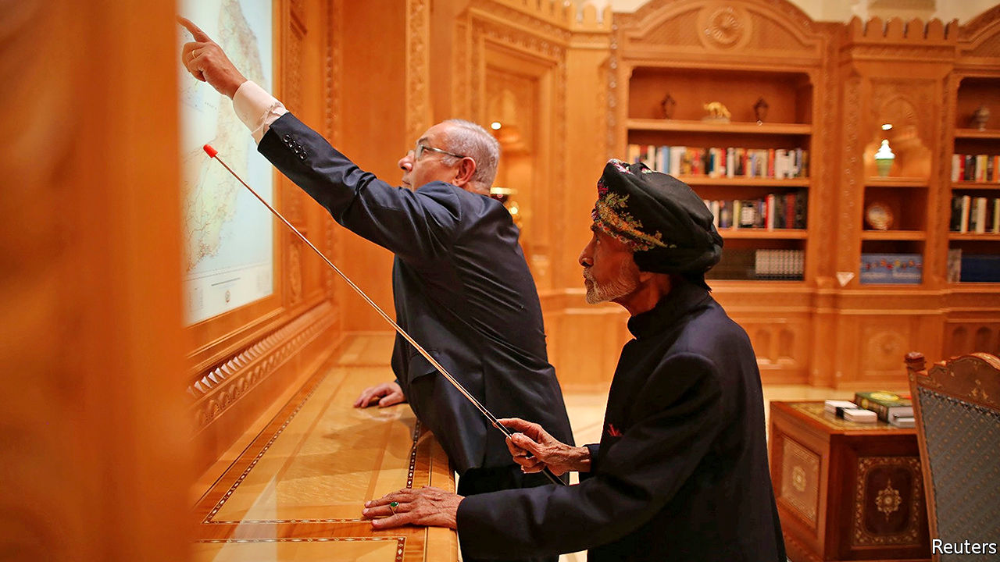

## Who’s next?

# The Arab countries most likely to recognise Israel

> The United Arab Emirates has charted a path. Others will probably follow

> Aug 22nd 2020JERUSALEM

“NOW THAT the ice has been broken, I expect more Arab and Muslim countries will follow the United Arab Emirates’ lead,” said President Donald Trump on August 13th, when the UAE became just the third Arab state (after Egypt and Jordan) to establish formal ties with Israel. The move was greeted with approval by several of the region’s leaders, who have long had secret dealings with the Jewish state. So who will be next to bring them into the open?

A good bet is Oman, which congratulated Israel and the UAE on their agreement. In the past Oman has played the role of interlocutor between Israel and the Arab world. In 2018 the late Sultan Qaboos hosted Binyamin Netanyahu, the first visit by an Israeli prime minister to the Gulf in over two decades (pictured). But in January a new sultan, Haitham bin Tariq, took over. He dismissed the foreign minister on August 18th, a day after the top diplomat spoke to his Israeli counterpart. The move came as part of a larger government shake-up, but Sultan Haitham may not yet feel secure enough to take such a bold step.

If Oman doesn’t go next, perhaps Bahrain will. Its cabinet praised the “historic” Israel-UAE deal. Its prime minister has reportedly talked to the chief of Israel’s spy agency. And it has hosted Israeli officials before. American diplomats unveiled the economic half of Mr Trump’s Middle East peace plan in Bahrain’s capital, Manama, last year. The tiny kingdom is close to the UAE and, like Israel, it views Iran as a threat.

Some point to Sudan as a strong possibility. Its interim leader, Abdel Fattah al-Burhan, met Mr Netanyahu this year in Uganda, where they agreed to start normalising ties. Lately, though, Sudan has sent mixed messages.

On the other side of Africa, Morocco is a decent bet too. It has played a leading role in previous Arab peace initiatives with Israel and was once a hub of Jewish life. Hundreds of thousands of Israelis hail from the north African state. Nearby Mauritania is another contender. It had formal ties with Israel from 1999 to 2009, but broke them off because of war over Gaza. Still, it praised the UAE’s “good judgment”.

A long shot is Saudi Arabia. Muhammad bin Salman, the kingdom’s crown prince and de facto ruler, has said that formal relations could be mutually beneficial. He seems envious of Israel’s economic and technological might. The two countries already co-operate to counter Iran. But formal ties are probably still a step too far for the conservative kingdom. ■

## URL

https://www.economist.com/middle-east-and-africa/2020/08/22/the-arab-countries-most-likely-to-recognise-israel
