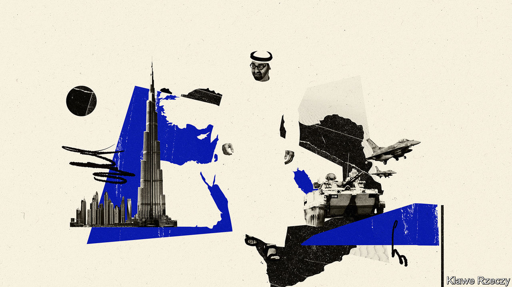

## The strong, silent type

# The United Arab Emirates has become a force in the Middle East

> Its deal with Israel is indicative of a quiet, yet savvy foreign policy

> Aug 22nd 2020ABU DHABI AND BEIRUT

IT WAS NOT quite Anwar Sadat speaking before the Knesset, or King Hussein and Yitzhak Rabin clutching hands in the Rose Garden. That would not have been Muhammad bin Zayed’s style. The agreement between Israel and the United Arab Emirates (UAE), announced on August 13th, was hashed out quietly by spies and sheikhs and unveiled largely on Twitter. It made the UAE the first Gulf country and only the third Arab state to open formal relations with Israel. Yet it had all the pomp and circumstance of a tariff agreement.

Though long overshadowed by Saudi Arabia, Prince Muhammad, the UAE’s de facto ruler (pictured in illustration), has turned his small country of 10m people into arguably the most influential Arab state. It wields soft power through Dubai, the region’s business hub, and firms like DP World, a shipping giant. A compact but capable army provides a sharper edge. Emirati money and media have backed coups and intrigue across the Middle East.

Much of this is done quietly, allowing the UAE to evade the scrutiny applied to bigger powers. Savvy at playing politics in Washington, Paris and other capitals, it positions itself as a reliable partner. “We realise our size,” says one Emirati official. “We need to be part of collective policies.” Westerners who advise the government in Abu Dhabi, often ex-diplomats or retired soldiers, slip into the first-person plural, as if there is no daylight between their employer and their native countries.

Yet the UAE is increasingly willing to go its own way. Its priorities differ from some of its neighbours’: more pragmatic towards Iran and more hostile towards political Islam. It broke with the Saudis in Yemen, the Americans in Libya, and many of its partners in Syria. Optimists hope it can spread “the Dubai model”—good governance, a vibrant economy, an admirable emphasis on religious tolerance—across the Middle East. But the UAE’s efforts to secure its own interests may just as well entrench the region’s woes.

In military matters it is true that the UAE rarely acts alone. But it plays an outsized role. The troops it sent to Yemen in 2015 were the most effective piece of a Saudi-led coalition fighting the Houthis, a Shia rebel group. Their departure last summer left the Saudis little choice but to start negotiating their own exit. Emirati drones propped up Khalifa Haftar, the Libyan warlord who tried last year to conquer Tripoli, until Turkey’s superior forces put paid to that effort.

Officials at the Pentagon admiringly call the UAE “little Sparta”. Actual Spartans might have found its glitzy hotels a touch frivolous. But the aphorism reflects frustration with Arab states that spend billions on Western kit yet accomplish little with it. The Emiratis have proved more capable.

They are also less dogmatic, at least in some areas. Most Gulf states joined the effort to unseat Bashar al-Assad in Syria. The UAE was the first to recognise its failure. It reopened its embassy in Damascus in December 2018 despite concerns from allies. Some Emiratis insist, implausibly, that the mission focuses simply on consular cases. Others argue that engaging Mr Assad may make him more receptive to change. “It’s about trying to bring Syria back to the Arab fold,” says one official.

Such hopes are unrealistic. But the willingness to court Mr Assad reflects a wider split on how to handle his main backer: Iran. The Saudis see Iran as an existential threat. The Emiratis have no love for it either. They harbour a long-running territorial dispute over islands in the Gulf; Western officials blame Iran for the sabotage of oil tankers in Emirati waters last year. Yet the UAE takes a softer line. Firms linked to Iran and its allies do business in Dubai. Not all of it is legitimate (see [article](https://www.economist.com//node/21791062)). Once an eager backer of America’s “maximum pressure” campaign, the UAE has recently tried to lower tensions.

The UAE’s more assertive role roughly coincides with the ascent of Muhammad bin Salman, or MBS, the Saudi prince who became heir to the throne in 2017. “MBS is young, he’s new, and he’s busy with socioeconomic changes at home,” says a Western diplomat in the Gulf. “The Emiratis felt they needed to pick up the slack.”

In some cases the Saudis were happy to let them. For decades the Saudis wielded influence in Lebanon through Rafiq and Saad Hariri, the father-and-son duo who served as prime ministers for 16 of the past 28 years. But on their watch corruption spread, while Hizbullah, the Iranian-backed militia and political party, became Lebanon’s most powerful actor.

After the Saudis briefly kidnapped Saad in 2017 in a failed attempt to bring political change, they washed their hands of the country. “They gave the Lebanon file to the Emiratis,” says a diplomat in Beirut. The Emiratis have been content to let it languish: they have not stepped in to bail out Lebanon’s bankrupt government.

With its factious politics, Lebanon is unappealing territory for the UAE. Underlying much of its regional policy is a suspicion of mass politics. The Arab uprisings of 2011, seen from Abu Dhabi, brought not hope but chaos. The UAE wants “evolution, not revolution”, says an official. In practice this means a preference for anti-Islamist autocrats who pose as modernisers.

Perhaps the exemplar of this is Abdel-Fattah al-Sisi, the Egyptian general who led a coup, with Gulf support, against an elected Islamist government in 2013. At times he seems to model himself on the Emirati crown prince. Mr Sisi’s ambition to build a gleaming new capital in the desert east of Cairo is reminiscent of Dubai. Periodic lectures to Egyptians about their work ethic or physical fitness evoke the top-down approach to shaping society in the UAE.

That may work for the UAE, which keeps citizens and residents in line with a comfortable standard of living, electronic surveillance and, for the foreigners, the threat of deportation. But Mr Sisi’s fondness for Gulf-style mega-projects seems wasteful in a poor country of 100m people; his intolerance for politics grates on citizens of a country that, for all its years of dictatorship, has a rich political tradition. What works in Dubai does not necessarily work elsewhere—neither as evolution, nor as an effort to forestall future revolution. ■

## URL

https://www.economist.com/middle-east-and-africa/2020/08/22/the-united-arab-emirates-has-become-a-force-in-the-middle-east
