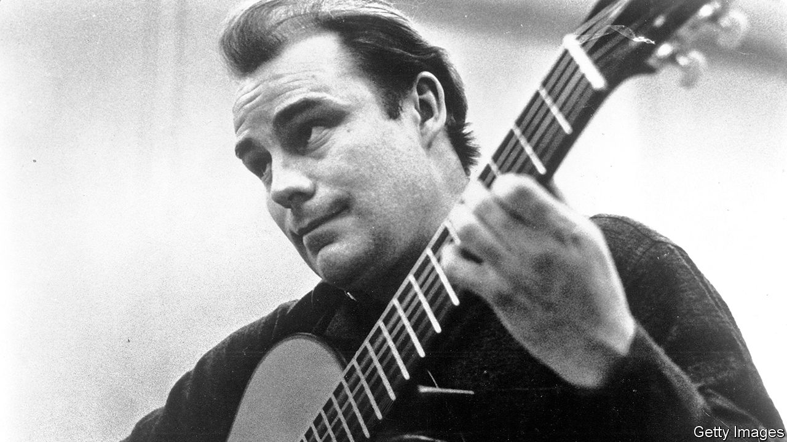

## Passion plays

# Julian Bream died on August 14th

> The player who restored the reputation of both the classical guitar and the lute was 87

> Aug 22nd 2020

ALMOST AS SOON as he started his long love affair with the guitar, Julian Bream was aware he was doing something disreputable. When he was caught as a teenager practising Bach in the Royal College of Music, he was warned not to bring that instrument into the building again. It lowered the tone. Signing on to do his National Service in an army band, he was told he could play piano and cello, fine, but the guitar only “occasionally”. Audiences clapped long and hard when he performed in the Wigmore Hall at 18, in 1951, but as he toured round Britain in the mid-1950s, sleeping in his Austin van to save on hotels, not many came to hear him. The guitar was not a proper instrument, somehow. Its voice was too soft to carry over an orchestra. The electric version was for pumped-up rock ’n’ rollers, the non-electric for holidays in Spain. And from Spain, the spiritual and historical home of the guitar, came the loudest scorn of all. An Englishman playing a guitar, said one virtuoso, was a kind of blasphemy.

But this Englishman, almost as devoted to cricket and dogs as to music, was in love, and nothing was going to deter him. His life’s passion was to restore the guitar’s reputation as a serious instrument, to bring its acres of repertory to the public, and to open their eyes to its beauty. He offered a different approach, clarity and a certain coolness, against the emotional vibrato of the Spanish style. To get the message across he toured the world, picked up four Grammys in the process, encouraged the building of guitars in England, and asked the best composers of the day—Benjamin Britten, William Walton, Michael Tippett, Hans Werner Henze—to write pieces for an instrument they had never considered before. His methods of persuasion were chummy and larky, as might be expected of a South Londoner, proudly born in Battersea between the power station and the dogs’ home: convivial drinks, invitations to his farmhouse in Dorset, races round the lanes in his classic cars, demonic table-tennis games. And they worked.

In effect he had two lives. One was the gregarious whirl of jet planes, hotels, parties and interviews, when he would throw himself around in his chair with the sheer joy of talking guitars. The other was rapt communion with the object of his love. No one had taught him how to play, beyond basic scales and chords as a child. He had picked up technique for himself, and was continually stretching and perfecting it. Practice demanded at least four hours a day, but he also took long sojourns away from the stage to study, play alone and gather his thoughts. To learn Britten’s “Nocturnal after John Dowland”, which was nearly beyond him, he immured himself in a shepherd’s hut on Robert Graves’s estate in Majorca. To make recordings, he would use an empty chapel near his house, at night, with no one else there save a producer and one sound engineer. This intense need for privacy inevitably flowed over into his performances, he and his guitar alone and barely moving in the spotlight, his body bent low over the instrument, coaxing the strings to express more, wincing when they did not, opening his mouth with delight, closing his eyes, until he was almost surprised on finishing to find an audience there.

Where had this passion come from? Partly from his father, who played in a dance band and left his own guitar lying about at home; partly from the burning anguish of Django Reinhardt and the Quintette du Hot Club de France; partly from watching Andrés Segovia, the greatest Spanish master of the age, closely through clenched binoculars at a London concert. Still quite young, he had followed his father’s repair of a battered Ramírez guitar, discovering the instrument’s inner life. He could tell later, simply from playing for a few minutes, how the internal bars were spaced, or what adjustment, perhaps a thousandth of an inch, was needed in the bridge saddle. He mourned lost loves: the little singing guitar made for him by José Romanillos in 1973, which after a decade had started to lose its vitality, as they all did; the noble Hauser and the Bouchet, an absolute pearl, stolen from his car in the 1960s. But the instrument’s character flaws did not escape him either. The guitar might be a great wooer, so suggestive in its fullness and complexity of tone; it could also be obstinate and shallow, a deceiver.

In that respect he seemed to love the lute even more. This, too, he rescued from ignorance and virtual obsolescence, revelling in its repertory of songs and sad airs from Tudor and Elizabethan times. (He supposed that, like all jesters, he was a melancholy person underneath.) Again, he taught himself to play, starting as a boy on a lute picked up by his father, dodgily, for a couple of quid on Charing Cross Road. He persevered with this new enterprise of plucking with his nails rather than fingering, and formed a consort of period instruments to revive the music, mostly, of Dowland and Thomas Morley. The tenor Peter Pears teamed up with him for lute songs. Against the democratic guitar, played from street corner to (now, at last) concert hall, the lute struck him as more beautiful, more aristocratic, more honest. It was also guarded by scholars, who criticised his technique until, in his usual style, he shut himself away and worked out mutually, just man, instrument and many packs of Gauloises, what needed to be done.

One great attraction of the lute was its relative Englishness. The spirit that lived in it, and had done since the wood was first fashioned from the tree, was one he instinctively understood. All through, though, he knew that the spirit of the guitar had been infused in Spain. There was no getting away from this, nor from the country whose language he never spoke but whose music made up most of his life. So in 1985 he tipped his English hat to it, with an eight-part TV series called “¡Guitarra!” in which he described the history of the instrument, went to bars, smoked cigars and played in Spanish cloisters, villas and castles, looking perfectly at home.

Yet perfection was always two steps off. Did he feel, an interviewer once asked him, that he had removed the tag of “blasphemy” from an Englishman playing the guitar? Had he, in fact, sanctified it? The question stunned him for a moment. Then he stammered, with his flat London vowels, “Not necessarily.”■

## URL

https://www.economist.com/obituary/2020/08/22/julian-bream-died-on-august-14th
