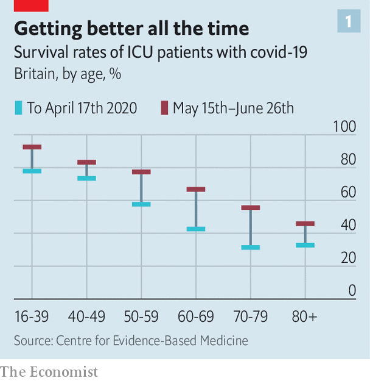
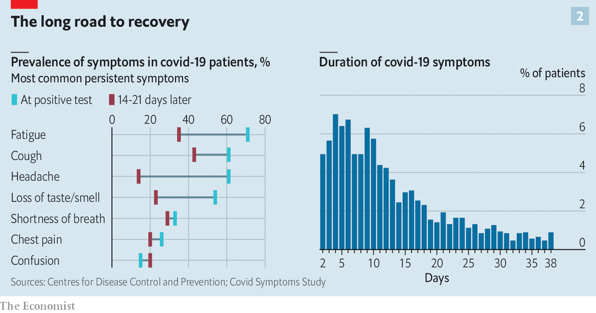

## Covid-19

# When covid-19 becomes a chronic illness

> Scientists are investigating why some people suffer with the virus for many months

> Aug 22nd 2020

Editor’s note: Some of our covid-19 coverage is free for readers of The Economist Today, our daily [newsletter](https://www.economist.com/https://my.economist.com/user#newsletter). For more stories and our pandemic tracker, see our [hub](https://www.economist.com//news/2020/03/11/the-economists-coverage-of-the-coronavirus)

THE SYMPTOMS began in March, says Laura, a British woman in her mid-20s. At first covid-19 felt like a bad case of flu: a dry cough, fever, shortness of breath, loss of smell, “horrendous nausea” and general fatigue. After three weeks of rest, things started to improve. Five months later, she has still not recovered. Sometimes her symptoms ease for a week or two, but they inevitably return. “When it’s bad I can’t even go on work calls, because if I talk too much I can’t breathe.”

In March, as covid-19 cases began their exponential rise in country after country, doctors focused on saving patients’ lives. Speedy sharing of knowledge, clinical trials and hands-on experience have made the illness less deadly. In Britain about half the patients treated in intensive-care units (ICUs) in the weeks to the middle of April died. By the end of June mortality was below 30%. Reductions were seen across all age groups, which means the fall cannot have been caused by fewer frail old people arriving in hospital (see chart 1). In places where the epidemic has subsided, calmer wards have meant better care. But improved knowledge about treatment probably accounts for much of the improvement.

Doctors have learned a lot. They have stopped rushing covid-19 patients onto ventilators, which can cause lung damage. Oxygen supplied through small prongs in the nostrils is much less invasive and often does the job. In British ICUs the share of covid-19 patients on ventilation fell from 90% in the early days to 30% in June. Treatment protocols have improved further with the addition of dexamethasone, an immune-dampening drug that increases survival rates in patients who need oxygen.

Now, though, doctors and scientists are shifting their focus to those who survive the infection—including the subset of people like Laura, who have never been ill enough to be hospitalised, but who have also never recovered sufficiently to return to normal life.

In most people, covid-19 is a brief, mild illness. Between a third and a half of those infected do not notice any symptoms. In those who do become unwell symptoms usually clear within two to three weeks with just home rest. In Europe only around 3-4% of those who become infected are admitted to hospital.

Yet at the same time it is becoming clear that some small but significant proportion of those infected have symptoms that persist for months. Prolonged recovery is not unusual for patients hospitalised for pneumonia, a frequent complication of covid-19. It is also common for people who have been admitted to an ICU, who are by definition seriously ill. But many clinicians say that the share of covid-19 patients with lingering problems is far higher than is seen with other viral illnesses such as influenza. The problems are also more varied, often including lung, heart and psychological symptoms, says Sally Singh of the University of Leicester, who leads the development of a covid-19 rehabilitation programme for Britain’s health service.

Anecdotal reports of long-lasting illness have been around since the early days of the pandemic. But with more than 22m cases confirmed worldwide, and with infection rates having peaked several months ago in most rich countries, statistical patterns about the virus’s lingering effects are starting to emerge. A paper in the British Medical Journal on August 11th concluded that as many as 60,000 people in Britain have long-term symptoms. Yet only about 6% of Britain’s population—around 4m people—seems to have been infected with the virus so far.

Severity of the illness is one predictor of lasting problems. Ian Hall, the director of the Biomedical Research Centre at the University of Nottingham, reckons that 30-50% of patients hospitalised with covid-19 have significant symptoms six to eight weeks after they have been discharged. That number rises further for patients who were admitted to an ICU. But even those who escaped with a mild illness, like Laura, are at risk. More than 10% of them remain unwell for more than three weeks, according to a patient-tracking study that follows mostly American and British patients. They struggle with fatigue, breathlessness, body aches and cognitive problems which many describe as “brain fog” (see chart 2).

Some long-term covid-19 patients may be suffering from undiagnosed conditions such as diabetes or thyroid dysfunction, which are “unmasked” by the infection, says Avindra Nath of the National Institutes of Health in America. For others, the collection of symptoms is suggestively similar to those seen in chronic fatigue syndrome (CFS). The biological causes of CFS are still poorly understood, but data from America indicate that three-quarters of cases follow viral or bacterial infections. One hypothesis is that the syndrome is caused by the immune system failing to properly stand down after being called on to battle an infection. It may be that SARS-CoV2, the virus that causes covid-19, is unusually likely to provoke such a lingering over-reaction.

If the root cause is not known, then the growing understanding of just what covid-19 can do to the body can at least suggest what sorts of care long-term sufferers may need. The hallmark of many covid-19 cases is damage to the lungs. Aggressive inflammation leads to the destruction of lung tissue and the formation of scars. The scarring, in turn, impedes the flow of oxygen from the lungs into the blood. That can cause breathlessness, even with light exercise. Small studies of covid-19 patients discharged from hospitals have found that 25-30% have impaired oxygen flow.

The prognosis is unclear. People treated in ICUs for other viral infections usually recover about 80% of their previous lung function fairly quickly, but the final 20% can take three to six months, says Dr Hall. And in some cases lung scarring can worsen over time, especially if combined with new health problems later in life.

Breathing problems can also arise from another effect of covid-19—its tendency to cause blood clots, which is unusual for a respiratory virus. When they form in the lungs, clots can choke off blood flow, making it even harder to absorb oxygen. And the virus may cause breathlessness in a more subtle way, too, by damaging the lining of blood vessels, which limits how much blood can flow through them.

Covid-19 can also damage the heart. It can inflame the tissues that surround the organ, as well as the blood vessels that ferry nutrients to it. That can weaken the heart muscle, and eventually lead to heart failure. Blood clots cause problems here, as well, since the heart must pump harder to push blood through partly blocked vessels. Over time, that can weaken the muscle.

Nobody knows exactly how often such cardiac complications occur. But news from Germany is worrying, says Clyde Yancy, a cardiologist at Northwestern University, in Illinois. Using MRI scans, one study found evidence that covid-19 causes inflammation and other heart changes—including in people who had tested positive for the virus more than two months earlier and were, by the time of their scans, free from symptoms. The changes were small, and not enough by themselves to cause clinical symptoms. But even a minor injury to the heart may eventually lead to heart failure if it lingers for long enough, says Dr Yancy.

Least understood are the long-term effects of covid-19 on the nervous system and the brain. Patients with lingering post-covid symptoms complain of headaches, tingling and numbness in the feet, and other neurological problems. Problems that suggest a dysfunction of the autonomic nervous system, such as irregular heart beat, dry mouth and gastrointestinal problems are also common, says Dr Nath. But the exact cause of such symptoms remains unclear, as does the reason why more than half of those infected suffer a temporary loss of their sense of smell. (Some, rather than losing it, have it altered instead, so that things smell different after the infection than they did beforehand.)

Confronted with a baffling array of symptoms and few detailed explanations about exactly what is going wrong, doctors are desperate for guidance. A third of general practitioners in Britain already have patients with lasting post-covid symptoms. For now, the best they can offer is referral to lung or cardiac rehabilitation. Such therapy may improve a patient’s quality of life with something as simple as a breathing exercise. Britain, Belgium and other countries are setting up specialised covid-19 rehabilitation programmes for those recovering from the disease. Waiting lists are already long.

In the absence of understanding, doctors must fall back on lessons from other illnesses. Lingering symptoms are not the exclusive preserve of covid-19. Full recovery from other viral diseases such as influenza can occasionally take months. Data on CFS suggests chances of recovery are best in the first three months.

More specific data are on the way. Studies in America, Britain, China and Europe have enrolled thousands of patients, and should begin reporting initial results in the next few months. But for now, those suffering the lingering effects of the disease must deal not only with the physical symptoms, but with uncertainty about just how long it will take them to get better. ■

## URL

https://www.economist.com/science-and-technology/2020/08/22/when-covid-19-becomes-a-chronic-illness
