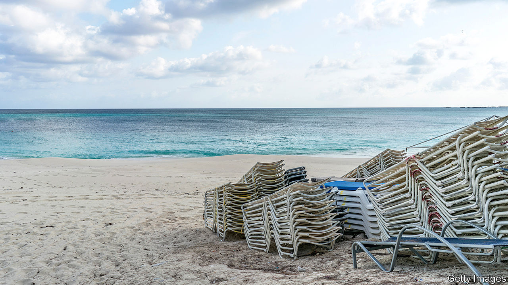
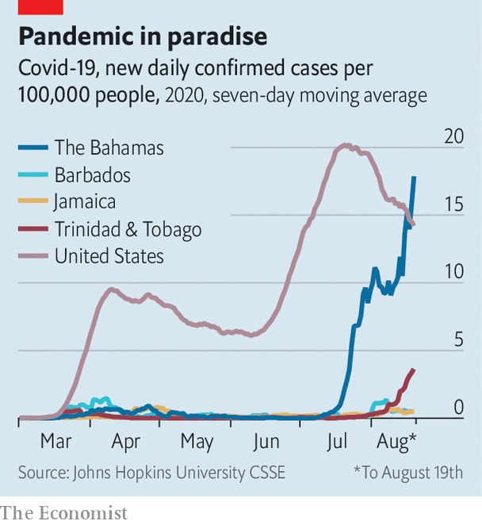

## Anxious isles

# The pandemic’s indirect hit on the Caribbean

> The region has been spared the worst ravages of covid-19. That has not protected its economies

> Aug 22nd 2020

Editor’s note: Some of our covid-19 coverage is free for readers of The Economist Today, our daily [newsletter](https://www.economist.com/https://my.economist.com/user#newsletter). For more stories and our pandemic tracker, see our [hub](https://www.economist.com//news/2020/03/11/the-economists-coverage-of-the-coronavirus)

WHEN A HIGHLY infectious disease is the biggest threat to global well-being, islands with small populations have an advantage. They can seal themselves off. The English-speaking islands of the Caribbean have by and large done this. Most have, at least until recently, kept rates of infection low (see chart). Some small islands, such as Anguilla and Montserrat, have no confirmed infections.

But that has not protected the Caribbean from the economic consequences of the pandemic. Much of the region depends on tourism, which has been hit hard. In Jamaica, which with 3m people is the most populous of the Anglophone islands, tourism accounts for 10% of GDP. Its indirect contribution is much higher. Remittances, another big source of income, especially for Jamaica, have slumped as workers in rich countries have lost their jobs. The drop in energy prices will offset part of these losses in most Caribbean countries, which are oil importers. Trinidad & Tobago, however, depends on exports of gas.

The islands’ economies are likely to contract by a tenth or more this year. The Central Bank of Barbados, an especially prompt reporter of data, says the country’s economy contracted by 27% in the second quarter compared with the same period last year. More than a fifth of workers filed for unemployment benefit.

Governments now face an agonising choice. Should they keep their countries relatively closed to contain the pandemic, or open them back up to revive their economies, at the risk of spreading the virus? They must also watch out for the weather. Forecasters predicted that the storm season, which runs from June to November, would be unusually active. A major hurricane would make matters far worse for any island it strikes.

The region’s economic turmoil has seemingly tranquillised its politics. Unlike New Zealand, which postponed an election due on September 19th because of a covid-19 outbreak, most Caribbean countries have stuck to their electoral schedules or even decided to vote early. Facebook appearances and motorcades have mostly supplanted the star-studded rallies and walkabouts that bring colour and clamour to Caribbean political campaigns.

Incumbents have done well. Timothy Harris, prime minister of St Kitts & Nevis, increased his majority in June. Trinidadians re-elected Keith Rowley on August 10th. A day later Jamaica’s prime minister, Andrew Holness, hoping to extend the incumbents’ winning streak, called a snap election for September 3rd. His Jamaica Labour Party has a double-digit lead over the opposition People’s National Party (PNP), according to recent opinion polls.

That is not because Jamaica has been spared the worst of the crisis. Covid-19 struck at the peak of the winter tourism season. To shield itself, the country shut down airports. Resorts emptied.

On June 15th the government reopened airports, but that has not tempted tourists back. The tourism ministry reports 90,000 arrivals over the past two months, about 20% of normal. Many may be Jamaicans living abroad. The US State Department continues to advise Americans contemplating a trip to Jamaica to “reconsider”.

Other forms of foreign income have shrunk. Remittances in April were a tenth lower than a year before. Some call centres became centres of infection and had to close. Banana plantations are a memory and sugar is in decline. Since March the Jamaican dollar has lost a tenth of its value against the American one. That has helped push up inflation. A journalist in Kingston, the capital, reports that the cost of his lunch has jumped from J$350 at the beginning of the year to J$450 ($3).

Mr Holness, who won by less than a percentage point in the last election, held in early 2016, seems to have persuaded Jamaicans that he is the man to pull the country out of its hole. In 2019 Jamaica completed a six-year course of austerity prescribed by the IMF (and begun under the PNP). That held down economic growth, which was just 0.1% last year, but has left Jamaica with a cushion of foreign-exchange reserves. In May the IMF stepped back in with an emergency loan of $520m, about 3.5% of GDP.

Fossil-fuel-rich Trinidad & Tobago has large foreign-currency reserves. But most Caribbean countries have less to spend. Barbados, which is highly indebted, is shoring up its finances under Mia Mottley, prime minister since 2018, and getting help from the IMF. The Bahamas has not recovered from Hurricane Dorian, which struck last year. The IMF is helping it, too.

Governments pray for a pickup in tourism when the peak season begins in December. But their efforts to tempt back travellers may spread disease without boosting growth much. After the Bahamas reopened its airports to flights from Florida in July, the number of covid-19 cases jumped. The State Department changed its advice for the Bahamas to a stark “Do not travel”.

Jamaica’s government is trying to avoid the problem by requiring tourists to stay at their hotels or resorts. But that is difficult to enforce. Social distancing tends to break down during election campaigns. Recorded infections jumped in Trinidad & Tobago after polling day. Jamaica’s “nomination day” on August 18th, the deadline for registering candidates, brought out carousers from both parties.

Peter Phillips, Mr Holness’s opponent, is not expected to put up much of a fight. He has been treated for cancer and has had to beat off challenges for the leadership of the PNP twice since September. His approval rating is below 20%. The prime minister called his snap poll on the same day that Joe Biden chose Kamala Harris, whose father was born in Jamaica, to be his running-mate. Jamaicans were delighted. Mr Holness hopes to be safely re-elected before voters remember how much they have to worry about. ■

## URL

https://www.economist.com/the-americas/2020/08/22/the-pandemics-indirect-hit-on-the-caribbean
