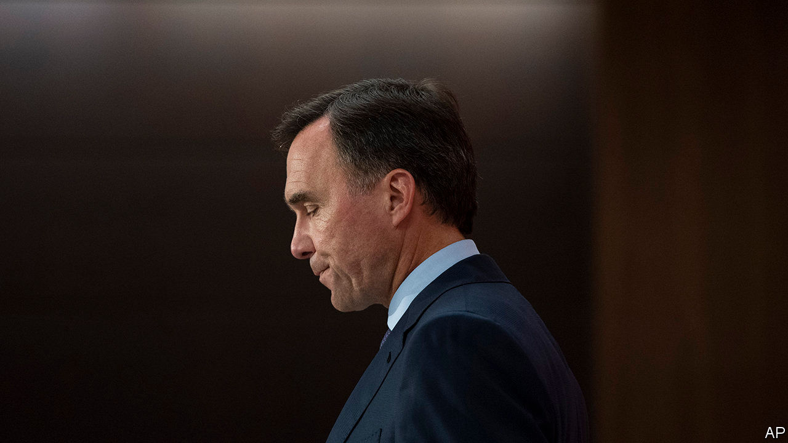

## No more Morneau

# The resignation of Canada’s finance minister hurts and helps Trudeau

> Now the prime minister can spend more freely

> Aug 22nd 2020OTTAWA

CANADA’S PRIME MINISTER, Justin Trudeau, can claim to have managed the pandemic well. His country has had far fewer cases and deaths as a proportion of its population than the United States. Government spending to protect the economy from the pandemic’s worst effects was prompt and well targeted. The economy looks as if it will recover faster than its neighbour’s. Although Mr Trudeau’s Liberal Party lost its majority in the election held in October, its fortunes recovered after the virus struck.

Lately, though, things have gone badly wrong for Mr Trudeau. The most visible sign of this was the sudden resignation on August 17th of Bill Morneau, the finance minister since the Liberals won power in 2015, who has led the economic response to covid-19. He was swiftly replaced by Chrystia Freeland, the deputy prime minister (who keeps that job).

Mr Morneau said he was leaving because Canada needs a finance minister with a long-term commitment to rebuild after the pandemic. He had decided long ago that he would not serve in more than two governments (the next election is due by 2023). Ergo he should leave now. He is also vacating his parliamentary seat.

Two other explanations are more plausible. One is Mr Morneau’s involvement in a scandal, into which Mr Trudeau has also been dragged. The second is that the finance minister and his boss disagreed over how fiscal policy should now proceed. Mr Morneau’s departure enables Mr Trudeau to spend more freely.

Parliament’s ethics commissioner and its ethics committee are investigating whether both men had a conflict of interest when the cabinet in May awarded a contract worth C$43.5m ($33m) to WE Charity to administer a programme that rewards students for helping their communities. In the preceding five years, WE paid Mr Trudeau’s mother and brother more than C$350,000 for appearing at events. Mr Morneau, whose daughter worked for the charity, and members of his family travelled to Ecuador and Kenya in 2017 at WE’s expense. Neither Mr Trudeau nor Mr Morneau recused himself from the decision to give government work to WE.

Both apologised. Mr Morneau says he has repaid more than C$41,000 that he realised belatedly he owed for travel costs. By the end of July the Liberals’ approval rating had dropped to 34%, six percentage points lower than it was in June, according to Abacus, a pollster.

A second source of tension may have been fiscal policy. The government expects a deficit of C$343bn this year, 16% of GDP. Mr Morneau went along with that, but wanted to take advantage of economic recovery to reduce the deficit swiftly. Mr Trudeau, on the other hand, is eager to boost post-pandemic spending on social programmes and the environment without raising taxes.

He prorogued Parliament, which ends the ethics committee’s investigation into the WE affair. (The commissioner’s probe continues.) When the legislature reopens next month he will dare the three opposition parties to vote him out in a confidence motion. The Conservatives, who are due to announce a new leader on August 23rd, may vote to topple him. So might the Bloc Québécois. But Mr Trudeau may survive thanks to the left-leaning New Democrats. Strapped for cash, they are loth to fight an election. And they may find much to like in Mr Trudeau’s post-pandemic plans.

Echoing the “just-society” rhetoric of his father, Pierre, who was prime minister in the 1970s, he wants to move “towards a society that is fairer and more welcoming, towards communities that are better prepared for future crises”. He is likely to propose a prescription-drug benefit and creation of a national child-care scheme. How much he will spend will begin to become clear in the budget, which should have been presented in March.

Ms Freeland, who won praise from provincial premiers for her co-ordination of a national response to the pandemic, will probably back that project more enthusiastically than Mr Morneau would have. A green recovery is “very important”, she declared in her first statement as finance minister. It matters as much to Mr Trudeau’s reputation as to Canada’s future.■

## URL

https://www.economist.com/the-americas/2020/08/22/the-resignation-of-canadas-finance-minister-hurts-and-helps-trudeau
