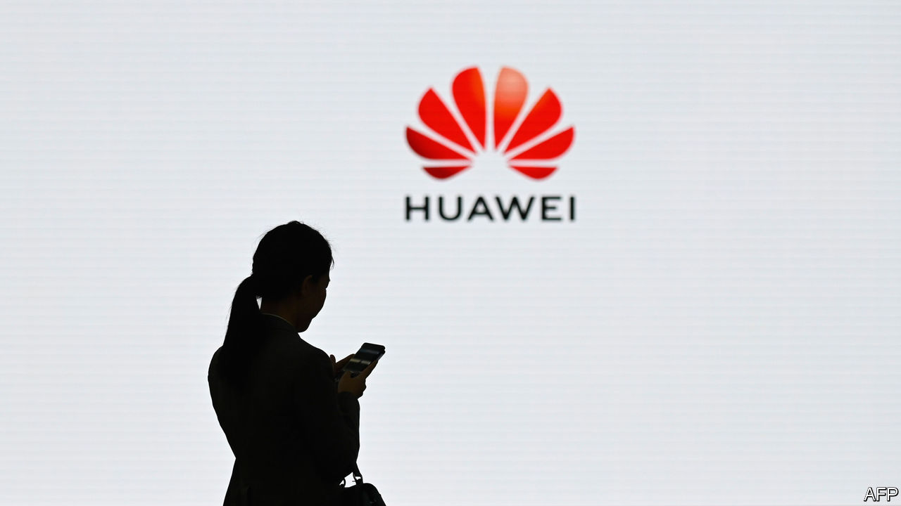
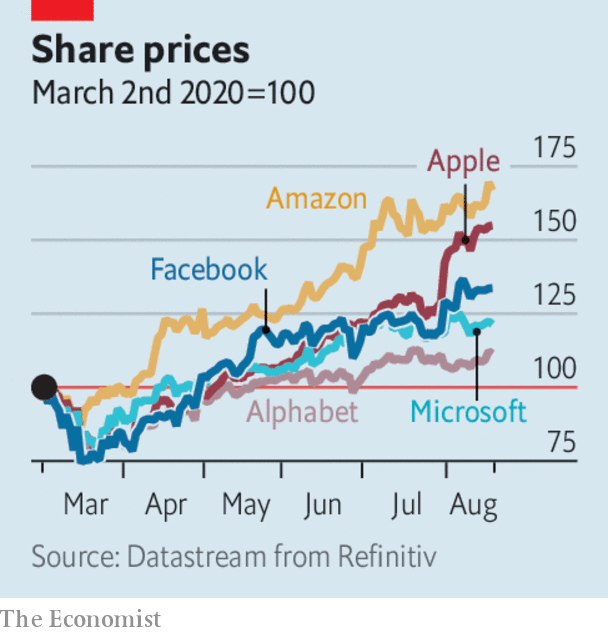

# Business this week

> Aug 22nd 2020

The Trump administration issued an edict tightening the embargo on Huawei. The measure prevents anyone from supplying semiconductors to the Chinese maker of network equipment if they are made using American technology. It is the biggest blow the American government has yet landed on Huawei, which will now tap the stockpile of chips it has accumulated to cover such an eventuality. China said America’s action contravened international trade rules. See [article](https://www.economist.com//node/21791055).

Oracle was considering whether to bid for TikTok, according to reports. TikTok is another Chinese tech firm that has fallen foul of the American government; Donald Trump has ordered its parent company, ByteDance, to sell its American operations (though his decree is legally dubious). Microsoft is already vying to buy TikTok, but Mr Trump now supports Oracle’s bid.

The operator of the Hong Kong stock exchange reported a solid set of earnings for the first half, as revenues from trading, listing fees and clearing increased. The city’s political turmoil has done little to dent appetite for IPOs. A stream of Chinese tech companies are also offering secondary listings of their shares in Hong Kong, supplementing their listings in New York, as a hedge against warnings from American regulators that they face being delisted if they do not abide by US accounting rules.

Airbnb made it official and filed papers for an IPO. There were no details about when it might float shares on the stockmarket, or how many shares it would offer, but it is expected to be one of the biggest IPOs this year. See [article](https://www.economist.com//leaders/2020/08/22/the-ipo-is-being-reinvented).

In Europe Ryanair reduced its flight schedule for September and October by a fifth. Bookings have drooped again because of the resurging coronavirus. The airline had hoped to operate 70% of its capacity.

Official data showed that Japan’s GDP was 7.8% smaller in the second quarter than in the first. A plunge in consumption during the pandemic and a drop in exports were to blame, though the contraction was less severe than in America or most European countries. Japan was already in recession following a steep rise in the sales tax last year.

The S&P 500 closed at a record high for the first time since February. Like some other share-price indices the S&P has rocketed back from the market rout of mid-March, when America and Europe went into lockdown, though this has been fuelled mostly by the success of tech companies. Alphabet, Amazon, Apple, Facebook and Microsoft account for around a fifth of the index; the stocks of most other companies on the S&P are still below their February levels. Apple this week hit $2trn in value, after adding another $1trn to its market capitalisation in just five months. See [article](https://www.economist.com//finance-and-economics/2020/08/19/bubble-hunting-has-become-more-art-than-science).

The rebound in stockmarkets led to more consternation about their detachment from the performance of the real economy. The dollar is another bellwether of the economic fallout of covid-19 in America. It dropped to a two-year low this week against a basket of currencies.

Californians were told to prepare for rolling power blackouts for the first since 2001. A number of factors including a heatwave were responsible. So was what Gavin Newsom, the governor, described as a “gap” in the ability of solar power to respond to increased demand.

Epic Games, which makes Fortnite, is taking Apple to court over the technology giant’s policy on in-app purchases. Apple takes a 30% cut from money spent within most iPhone apps, something that has long annoyed software developers. After Epic deliberately flouted Apple’s payment rules, Apple removed Fortnite from its app store, meaning iPhone users can no longer download one of the world’s most popular games. See [article](https://www.economist.com//business/2020/08/22/epic-games-takes-on-apple).

The bloodbath on Britain’s high streets showed little sign of abating, as Marks & Spencer announced 7,000 job cuts. The retailer is shedding around a tenth of its staff in total, the most in its 136-year history. See [article](https://www.economist.com//britain/2020/08/22/mass-unemployment-threatens-britain).

Walmart had another bumper quarter. Net sales from its American operations for the three months ending July 31st were up by 9.5% compared with the same quarter last year, helped by a 97% rise in revenues from online shopping. At Target, a 195% increase in revenues from e-commerce helped the company chalk up its biggest-ever rise in quarterly sales.

Carlyle, a global private-equity firm, reportedly told its staff not to use public transport to commute to their offices when they reopen, and if they use trains and buses at the weekend to quarantine for 14 days. Like other firms, Carlyle wants to limit the spread of covid-19. But the directive raises questions about how far a company can interfere in an employee’s private life. Using public transport during the pandemic is perfectly legal for its workers in London, for example; the only rule is to wear a face mask.

## URL

https://www.economist.com/the-world-this-week/2020/08/22/business-this-week
