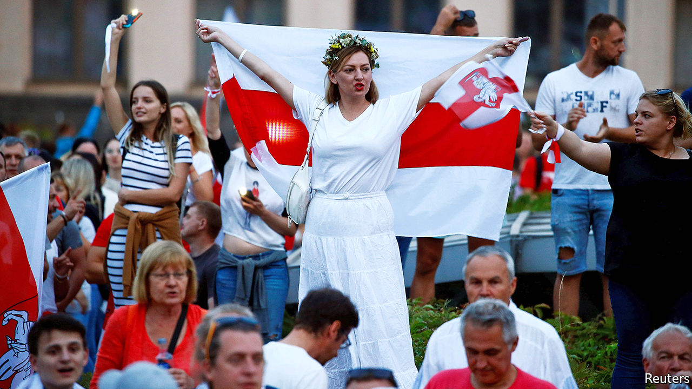
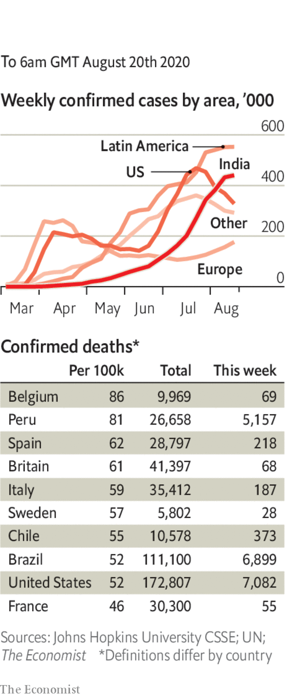

# Politics this week

> Aug 22nd 2020

Alexander Lukashenko, the president of Belarus, continued to cling to power despite large demonstrations and strikes, after he fraudulently claimed victory in an election on August 9th. The European Union’s leaders have refused to recognise the result, and vowed to enact sanctions against officials involved in ballot fraud and in brutal attacks on demonstrators by Belarusian police. Vladimir Putin, Russia’s president, has not indicated whether he will come to his neighbour’s aid. See [article](https://www.economist.com//node/21791042).

Alexei Navalny, a Russian anti-corruption activist and the country’s main opposition leader, was taken into intensive care after falling ill on a flight from Siberia to Moscow. Doctors suspected that he had been poisoned. See [article](https://www.economist.com//node/21791048).

France deployed two fighter jets and a naval frigate to the eastern Mediterranean in response to Turkish moves to send gas-exploration vessels into disputed waters. The area is claimed by Greece. The Greek and Turkish navies have periodically been put on high alert since the tussle began last month. See [article](https://www.economist.com//node/21791024).

Another round of peace talks involving the government of Myanmar, the Burmese army and several ethnic groups were held in Naypyidaw, the capital. Hopes of ending the country’s ethnic strife have faded. See [article](https://www.economist.com//node/21791056).

Around 10,000 people marched in Bangkok calling for a return to democracy and the reform of the monarchy, the biggest anti-government rally in Thailand since the junta seized power in 2014. The protesters risked imprisonment under the country’s draconian lèse majesté laws, but that did not stop them giving three fingers to the authorities, a gesture inspired by “The Hunger Games”. See [article](https://www.economist.com//node/21791090).

New Zealand’s general election was delayed until October 17th because of a recent uptick in cases of covid-19.

America suspended its extradition treaty with Hong Kong and two other agreements with the territory. It is the latest in a number of actions taken by the American government in response to Beijing’s imposition of a national-security law, which the State Department said had “crushed the freedoms of the people of Hong Kong”.

China stepped up the pressure on Australia for its vocal criticism of various Chinese policies by announcing an anti-dumping investigation into the country’s wine exports.

The United Arab Emirates agreed to establish diplomatic relations with Israel, becoming the first Gulf state and just the third Arab country to formally recognise the Jewish state. The move was praised by several Arab leaders, leading to speculation that other countries in the region would soon follow the UAE’s lead. The Palestinians said they had not been told about the agreement. See [article](https://www.economist.com//leaders/2020/08/22/the-israel-uae-deal-is-good-news-for-a-troubled-region).

A UN-backed tribunal found Salim Ayyash guilty in absentia of killing Rafik Hariri, a former Lebanese prime minister, and 21 others in a bomb attack in Beirut in 2005. Three other defendants were acquitted. Though all four were members of Hizbullah, a Shia party-cum-militia close to the governments of Iran and Syria, the judges found no evidence that either Hizbullah’s leadership or Syria was involved.

Ibrahim Boubacar Keita, Mali’s president, was forced to resign after being arrested by rebel soldiers in a coup. Mr Keita dissolved parliament and said he wished to avert bloodshed. See [article](https://www.economist.com//leaders/2020/08/22/a-coup-in-mali-is-unlikely-to-make-matters-better).

An attack by al-Shabab, a group linked to al-Qaeda, on a seaside hotel in Somalia’s capital, Mogadishu, killed at least 11 people.

America’s postmaster-general, Louis DeJoy, suspended proposed changes to the postal service’s operations until after November’s presidential election. Democrats accuse Mr DeJoy, who is one of Donald Trump’s big political donors, of trying to suppress postal votes. See [article](https://www.economist.com//united-states/2020/08/22/more-mail-in-voting-doubles-the-chances-of-recounts-in-close-states).

The Democrats held their national convention, virtually and without the usual razzamatazz. Although Milwaukee was the event’s official hub, the roll call that officially nominated Joe Biden as the party’s candidate for president was broadcast from each state. See [article](https://www.economist.com//united-states/2020/08/22/democrats-set-factionalism-aside-for-the-big-push-against-donald-trump).

Bill Morneau resigned as Canada’s finance minister. Members of Mr Morneau’s family went on trips in 2017 paid for by WE Charity, which this year won a government contract to administer a student-grant programme. The ethics commissioner is investigating whether Mr Morneau and the prime minister, Justin Trudeau, violated conflict-of-interest rules. WE Charity has also paid tens of thousands of dollars to Mr Trudeau’s mother and brother to speak at events. See [article](https://www.economist.com//the-americas/2020/08/22/the-resignation-of-canadas-finance-minister-hurts-and-helps-trudeau).

Anti-abortion activists gathered at a hospital in Brazil’s north-eastern city of Recife to try to stop a ten-year-old girl from having an abortion. Her name had been revealed by an associate of the minister for women. Feminists rallied to support the girl, who had been raped by her uncle. She was entitled to the procedure under Brazil’s strict abortion laws.

Thousands of Argentines demonstrated against the government’s plan to extend lockdown measures. Protesters also object to a proposed reform of the judiciary, which they suspect will serve the interests of Cristina Fernández de Kirchner, the vice-president, who has been indicted for corruption.

India’s cases soared past 2.8m, the third-highest in total behind America and Brazil.

Restrictions on social gatherings were reimposed in Seoul, after South Korea reported its highest number of daily infections since March. Churches are a big source of the outbreak.

Ireland reintroduced some restrictions and again asked people to work from home.

The World Health Organisation warned against a growing “vaccine nationalism”, as countries seek to hoard the prospective drugs rather than ensure their global availability.

Sweden and the Netherlands declined to make face masks mandatory in public despite rising numbers of infections. Both countries have implemented comparatively lenient social-distancing measures, and have higher-than-average rates of excess deaths.

## URL

https://www.economist.com/the-world-this-week/2020/08/22/politics-this-week
