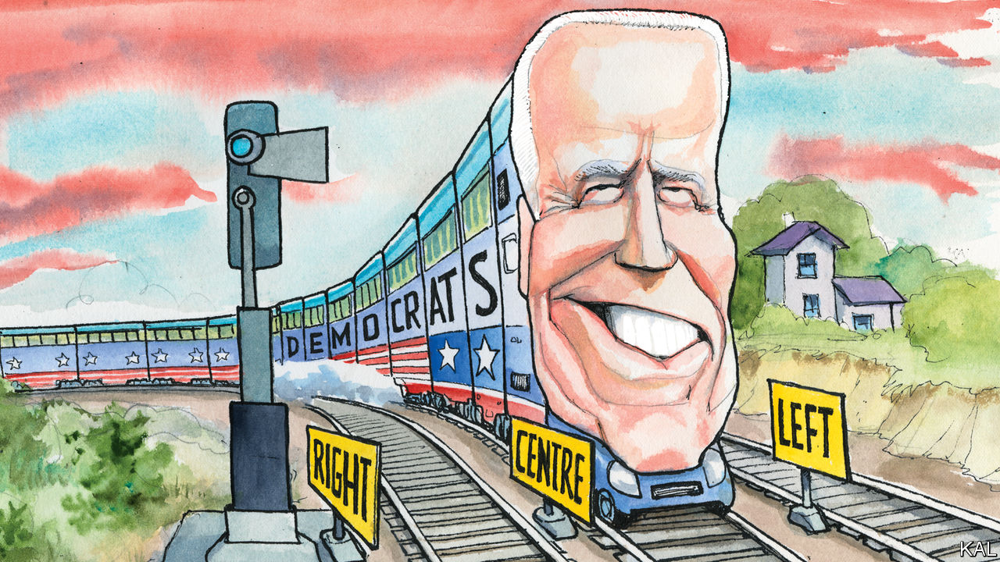

## Lexington

# Democrats set factionalism aside for the big push against Donald Trump

> How long will party unity hold?

> Aug 22nd 2020

IN THEIR PRESCIENT book “It’s Even Worse Than It Looks” the political scientists Norm Ornstein and Thomas Mann coined a phrase that has come to encapsulate the relative standing of America’s two main parties: “asymmetric polarisation”. While acknowledging that both were becoming more radical, the term describes how much more jarring and pronounced this shift is on the right.

In a little over a decade Republicans have gravitated from John McCain’s big-tent moderation, via Mitt Romney’s more stringent conservatism, to become, in Mr Ornstein’s phrase, “a radical Trumpist cult”. On the left, hardliners such as Bernie Sanders and Alexandria Ocasio-Cortez have meanwhile challenged but not fundamentally altered their party’s centre-left pitch. Democrats have gravitated from Barack Obama campaigning for a $10 an hour minimum wage, to Hillary Clinton campaigning for $12, to Joe Biden promising $15. Republicans who decry their opponents as radical socialists are, like disorientated train passengers leaving a station, chiefly misattributing their own accelerating momentum to a relatively stationary neighbour. Their febrile opposition to Mr Obama’s health-care reform, though it was modelled on one promulgated by Mr Romney, is one of many illustrations of this.

Mr Biden’s primary win, which was confirmed at the Democrats’ virtual national convention this week, suggested their train had in fact moved even less than many thought. Even after the left flexed its muscles and dominated coverage of the contest, the former vice-president won almost twice as many votes as Mr Sanders with a platform not dramatically to the left of his two predecessors. Emboldened by Mr Trump’s unpopularity, which makes Mr Biden the favourite to win in November, he now appears to be attempting an even more audacious ploy: to rebuild America’s eroded centre.

This week’s covid-disrupted Democratic convention, which has been taking place in two-hour daily instalments, provided evidence for this. At the halfway mark, centrists—including sometime Republicans such as John Kasich and Colin Powell, both of whom endorsed Mr Biden—were far more prominent than left-wingers. To the extent that lefties such as Mr Sanders featured, it was to stress their commitment to Democratic unity—more forcefully than they did during the party’s ill-tempered 2016 confab.

The virtual convention also involved hardly any mention of divisive policy. The main focus was on Mr Biden’s kindness, conciliatory manner and long record—which the left hates —of seeking bipartisan compromise. The friendly Republicans helped underline that. A segment on Mr Biden’s deep friendship with Mr McCain contributed a genuinely endearing moment.

This emphasis was consistent with the primaries. As they made clear, most Democratic voters mainly want to remove Mr Trump and, despite having little enthusiasm for the old, rather inarticulate Mr Biden, think his moderation and inoffensiveness, combined with his stature, make him the likeliest to do so. That most left-wingers are also putting victory (over “fascism”, as Ms Ocasio-Cortez put it) ahead of ideological purity this time has further liberated him to be his authentically moderate self.

No longer need he tie himself into knots over his various “evolutions” on social issues. It is now enough for him to smile and represent a united Democratic front against a detested president—as Michelle Obama implied, by saying how much she hated politics, while offering her fulsome endorsement.

The staging of the convention also helped the Biden campaign bury the usual infighting. The traditional stadium-affair pits factions against one another like football fans. This year’s “roll-call”, during which delegates rang in the votes from their respective states, left a more expansive impression of national politics. As the sequence of masked figures, wearing local dress in Hawaii or touting Rhode Island seafood, called in votes from across their continent-sized country, intra-party rivalries seemed small or irrelevant. The convention was intended as an all-American repulse to Mr Trump. It quite often came over that way.

This was politically spot-on. So long as Mr Trump continues to stir up Democratic voters—as he will—Mr Biden’s task will be to keep breathing unity, promising decency, avoiding blunders (and, in his secret heart, praying for no miracle vaccine before November 4th). He has shown himself to be up to this and it may be enough. He may also lack the campaign skills to do more.

A perhaps more intriguing question is whether the Democrats’ burst of pragmatism could outlast the election. The conventional wisdom is, of course not. The activist left exists to make trouble. It has already put Mr Biden on notice that its compliance is Trump-specific. Yet there are two possible caveats to that.

The 2018 mid-terms and this year’s primaries tightened the centre-left’s grip on the party. A sizeable Democratic victory, replenishing its stock of moderates disproportionately, would do so further. New Democratic senators from Georgia or North Carolina would have little time for Mr Sanders.

In addition, the crises the next administration will inherit could create propitious circumstances for trade-offs. A Biden one would probably start by pushing a huge stimulus, with blanket Democratic and some Republican support (given that almost $3trn has already been splurged on a bipartisan basis). The left might be mollified with some portion of that: for example, lavish climate-related spending, a promise of Mr Biden’s platform that represents less a leftward shift than a new political consensus.

That is still a way off; Mr Biden could come unstuck in the coming weeks. But, at the time of writing, he is on track. His campaign is making the most of his talents. It is giving those Americans justly concerned about the future of their democracy something to hope for. It even did so this week, in a possible first for presidential campaigning, while making some pretty watchable TV.■

## URL

https://www.economist.com/united-states/2020/08/22/democrats-set-factionalism-aside-for-the-big-push-against-donald-trump
