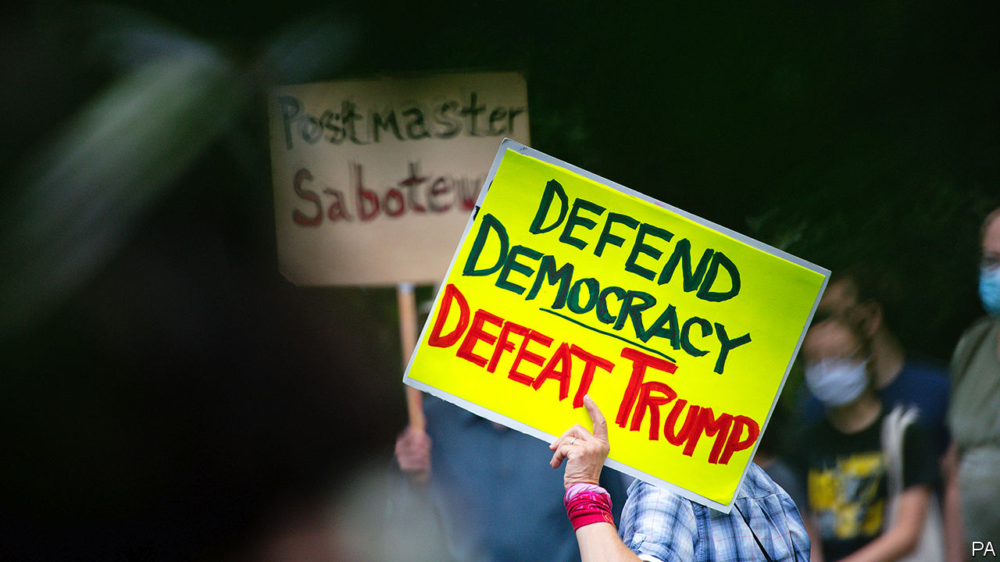
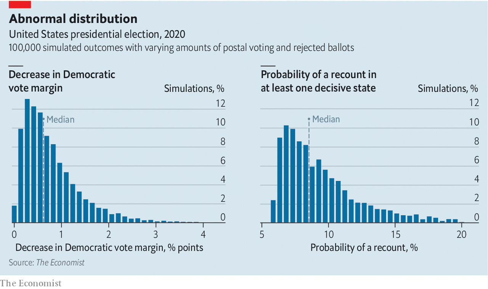

## The postmaster always rings twice

# More mail-in voting doubles the chances of recounts in close states

> We ran 100,000 simulations to quantify this effect

> Aug 22nd 2020WASHINGTON, DC

THE REPUBLICAN PARTY goes into its virtual convention next week in a mess. According to The Economist’s election model, the president is trailing by nine points in the popular vote and is currently expected to end up roughly 70 electoral votes shy of the 270-vote threshold on polling day. But has Donald Trump found a way to stack the deck in his favour? A large number of Americans will cast votes by post between now and November. And the US Postal Service, which has to deliver those votes, is in the midst of a partisan fight.

The postal service was created by the Second Continental Congress in 1775, and though it has a public-service mandate—to deliver mail to the whole country—it receives no public funding. In recent years it has consistently lost money, because Americans have been sending less first-class mail, among other things. Louis DeJoy, who ran a large logistics firm, was brought in as the postmaster-general in May with a mandate to fix its finances by finding savings.

Yet Mr DeJoy is also a prominent Republican donor. In 2017 he was one of three national finance chairmen of the Republican National Convention, along with Michael Cohen, the president’s personal lawyer (who is now in jail), and Elliott Broidy, an investor. This alarms Democrats, who spy a scheme by the president to steal an election he would otherwise lose.

Mr Trump opposes voting by mail because he thinks it is bad for Republicans. Mr DeJoy’s reorganisation has slowed down mail delivery in a way that therefore seems to accord with the president’s re-election strategy. Panicked voters have been snapping and posting pictures of the famous blue mailboxes, some of which have been carted off as part of the efficiency drive. The postal service’s board of governors, composed of both Republican and Democratic appointees, proposed a $25bn (0.1% of GDP) public subsidy, which House Democrats have taken up. Mr Trump is not keen. “If we don’t make a deal,” he told Fox News, “that means they don’t get the money. That means they can’t have universal mail-in voting, they just can’t have it.”

The postal service’s capacity has been particularly reduced in cities in swing states such as Pontiac, Michigan; Philadelphia, Pennsylvania; Columbus, Ohio; and even in Houston, Texas. The USPS warned 46 states that mailed-in ballots could arrive too late to be counted. Mr DeJoy then said that changes to the postal service would be postponed to avoid disrupting the election.

Is that the end of the saga? Not quite. Even if the USPS is functioning as normal, an increase in voting by mail could still have a significant effect on the result. In New York’s primary in July, staffing shortfalls combined with a surge in postal voting meant thousands of ballots were not sent out on time, and many others were discarded for minor technical errors. According to election officials, one out of every five ballots sent by mail were rejected—more than three times the statewide rejection rate from 2016. In November, election workers could be inundated with ballots that could take weeks to count.

Using our election-forecasting model, polls on how likely voters are to vote by mail and how often postal votes typically get rejected, we have tried to quantify the effect that more postal voting might have on the election. There are four factors to consider: the share of voters casting ballots by post; the share of those ballots that get rejected (eg, because they arrive after the deadline); the share of those ballots that get cast for each candidate; and the overall share of the vote going to Mr Trump or to Joe Biden regardless of voting method.

We obtained data on these factors from a variety of sources. For the likelihood of voting by mail, we rely on a Pew Research Centre poll of voters between July 27th and August 2nd. According to this survey, 39% of voters are planning to cast postal votes this year. A 2018 canvass of state data from the United States Election Assistance Commission, which helps states with administrative issues related to voting, revealed that the average rejection rate for postal votes was about 4% in states with the least vote-by-mail infrastructure and experience, and 1% in the best-prepared—though rates in extreme cases can exceed 15%.

For the partisan composition of postal votes, we analysed data from YouGov, which conducts polls on The Economist’s behalf, and found that roughly 80% of voters who are planning to cast their ballots for either Messrs Trump or Biden by post favour the Democratic candidate. Finally, for the share of voters nationally who will pick Mr Biden over Mr Trump, we took predictions from our presidential forecast.

There is no secret formula for combining these numbers. What happens, for example, if even more people vote by mail, but they are less Democratic? What if the race is closer than we predict? To answer these questions, we generated 100,000 different combinations of our four factors and altered the results of our election forecast accordingly. For each simulation, Democrats get punished more by postal-service and election-office inefficiencies (deliberate or not), when the election is close, when more votes are cast by mail and if those votes lean towards Mr Biden. In sum we find that slightly above-average rejection rates for postal ballots could clip about 0.6 percentage points from the Democratic candidate’s vote margin. But in the very unlikely case where rejection rates approach 10% in the average state—more than three times the normal rate—Mr Biden could lose closer to four percentage points relative to his standing in a fair contest (see chart).

Although such a scenario is unlikely, even small glitches with postal voting cause a sizeable increase in the probability of a recount in one of the decisive states. Failure of election workers to attach postmarks to ballots, voters assigning signatures that do not match the state’s rolls (typically because elderly voters have trouble with the pen, or young voters have no record against which to match), and failure to deposit a ballot before the deadline are all common errors that can lead postal votes to be rejected—and they only become more common when more people vote by mail. According to our modelling, the chance that a marginal state ends up in recount territory (typically when the margin between the candidates is less than half a percentage point) is around 5%, before factoring in trouble with vote-by-mail. It nearly doubles to 9% when these postal simulations are taken into account. Few Americans who voted in 2000 will have forgotten that debacle, when after several weeks Florida’s hanging chads decided the presidency. A large increase in voting by mail, plus a big increase in rejected ballots, could lead to a repeat in November, even if Mr DeJoy is as good as his word.■

## URL

https://www.economist.com/united-states/2020/08/22/more-mail-in-voting-doubles-the-chances-of-recounts-in-close-states
