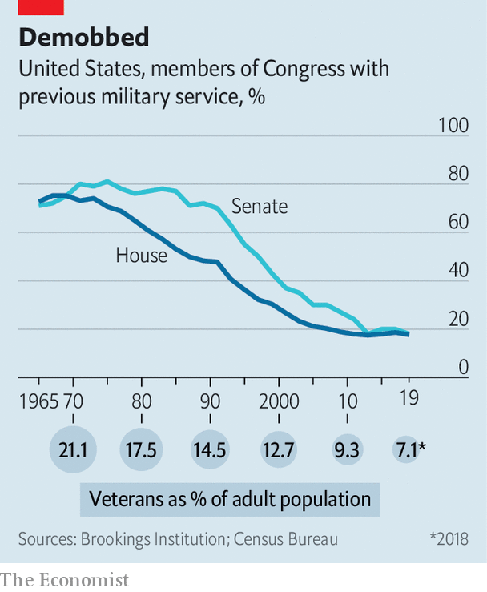

## Old soldiers

# War heroes no longer dominate American politics as they once did

> They are now outnumbered by lawyers, bankers and business folk

> Aug 17th 2020

FOR TWENTY years Elaine Luria sailed the seas with America’s navy, rising to the rank of commander. In January 2019, two years after retiring, she entered the House of Representatives as a member for Virginia’s 2nd district, one of 96 ex-servicemen and -women in the 116th Congress. Veterans like Ms Luria remain over-represented in politics—they make up 7% of the adult population but nearly three times that share of Congress—but their numbers have dwindled over the years. That reflects electoral attitudes to military service that are more ambivalent than America’s esteem for veterans might suggest.

For much of American history, soldiers have dominated the country’s legislative branch. The first Congress, in 1789, was stacked with veterans of the revolutionary war: almost three in five of its members had fought in that conflict or previous ones. In the 20th century, a steady succession of wars in Europe, Korea and Vietnam, fuelled by a national draft, supplied an even larger stream of lawmakers with military experience. Between 1965 and 1975, seven out of every ten members of both houses were veterans, rising to four-fifths of the Senate in the latter year.

Their ranks have thinned ever since. Veterans lost their majority status in the House at the turn of the 1990s and in the Senate a decade later. Today 18% of the House and 19% of the Senate have done military service. Veterans are now comfortably outnumbered by lawyers, bankers and business folk, having once dwarfed them. The obvious explanation for this reversal of fortunes is that, with the end of the draft in 1973 and a shrinking army, there are fewer veterans to elect. There were over 26m of them in 2000 (13% of the adult population); now there are 18m (7%). But their share of seats in Congress has fallen even faster than their share of the population.

Part of the answer is that women, who entered Congress in growing numbers from the late 1980s, are under-represented in the armed forces, making up just 16.5% of the army. Another factor is that the cost of a campaign has spiralled over the years, says Rebecca Burgess of the American Enterprise Institute, a think-tank. And because today’s soldiers and sailors tend to run for office more quickly after leaving service than their counterparts who served in Vietnam, this can leave them with weaker networks. Though Ms Luria represents a navy-dominated district of Virginia in which she put down roots 20 years ago, she points out that many of her globetrotting peers might find it harder to feel the call of service to a particular community.

When veterans do run for office, their service is respected but not necessarily rewarded. In surveys, the public are considerably more enthusiastic about the idea of a veteran candidate than about business executives or religious leaders, according to Jeremy Teigen of Ramapo College of New Jersey. But studies by Mr Teigen show that these feelings wane at the ballot box.

In the first post-9/11 elections for the House of Representatives, in 2002, veteran Democrats collected just 2% more of the vote than non-veteran Democrats, even when accounting for other factors. In 2006 veteran Republicans took 1.3% more of the vote than non-veteran Republicans. At the last mid-terms in 2018, veterans had no edge at all. Notably, every combat veteran running for the presidency since 1990 has lost, sometimes to draft dodgers.

That might be seen as a welcome development. In June, Mike Mullen, a former chairman of the joint chiefs of staff, lamented that “too many foreign and domestic policy choices have become militarised”. Yet the paradox is that the absence of military experience among lawmakers and leaders could compound the problem. A study published in 2002 by Christopher Gelpi and Peter Feaver found that, between 1816 and 1992, as the percentage of veterans in Congress and the White House decreased, the probability of America getting into a military tangle actually went up.

Contrary to stereotype, those who have never worn a uniform are typically more willing to countenance intervention for humanitarian or nation-building purposes, says Danielle Lupton of Colgate University in New York state. A paper by Ms Lupton analysing votes in the House of Representatives during the wars in Afghanistan and Iraq finds that lawmakers with military experience are also more likely to favour congressional oversight of operations and limits on deployments.

Even if veterans no longer stand astride American politics as they once did, they continue to play an outsized role. That is clearest in primary elections, in which parties choose their candidates. Regardless of whether they win or lose in November, veterans are disproportionately likely to put themselves forward as candidates in the first place and to be selected by parties, says Mr Teigen. A country founded on a fear of standing armies has not lost its fondness for those who marched in its ranks.■

Dig deeper:Sign up and listen to Checks and Balance, our [weekly newsletter](https://www.economist.com//checksandbalance/) and [podcast](https://www.economist.com//podcasts/2020/08/14/checks-and-balance-our-weekly-podcast-on-american-politics) on American politics, and explore our [presidential election forecast](https://www.economist.com/https://projects.economist.com/us-2020-forecast/president)

## URL

https://www.economist.com/united-states/2020/08/17/war-heroes-no-longer-dominate-american-politics-as-they-once-did
