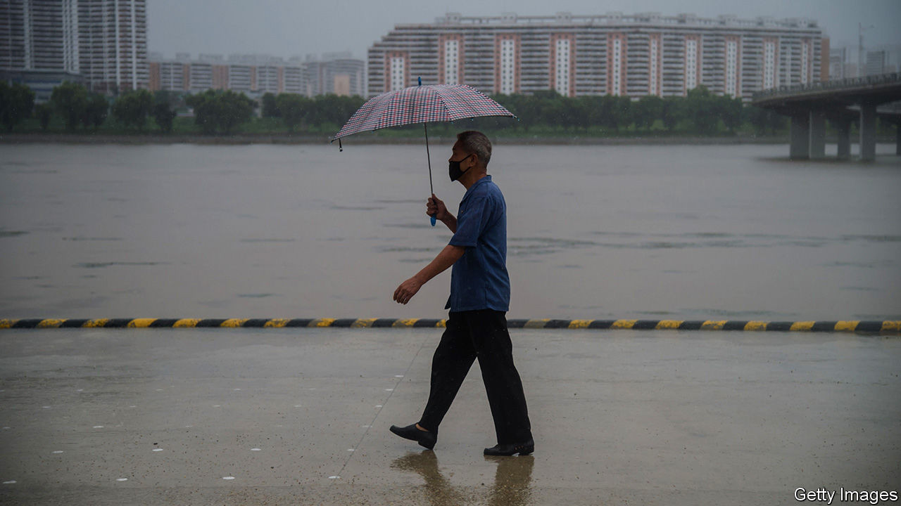

## Self-strangulation

# As natural disasters strike, North Korea cuts itself off

> The extent of the damage may never be known

> Aug 29th 2020SEOUL

NORTH KOREAN dictators are not given to self-deprecation. Indeed, they seldom admit to being anything less than godlike, and lock up those who suggest otherwise. Yet in mid-August Kim Jong Un told a meeting of the Workers’ Party that, owing to multiple “unexpected difficulties”, his government had recently failed to improve the lives of the people and meet its economic goals. To remedy the situation, the report in the party newspaper went on, a party congress would be convened in January to adopt a new five-year plan.

Most economies have been hobbled by covid-19, but few are doing as badly as North Korea’s. Never healthy, it was made less so by international sanctions intended to stop Mr Kim’s nuclear-weapons programme. Floods, brought on by the wettest rainy season in years, have devastated crops. And to ward off the pandemic, the regime has imposed one of the world’s strictest quarantines.

North Korea shut its borders soon after the initial outbreak in the Chinese city of Wuhan in January. For months the authorities insisted that North Korea was covid-free, to widespread scepticism. In recent weeks they have quietly dropped that claim, asserting instead that a repentant defector who returned from South Korea was “suspected” of having brought the disease with him. Nonetheless, the border remains largely closed. Trade has all but ceased. The value of goods exchanged with China, North Korea’s main trading partner, amounted to just over $400m during the first half of the year, a reduction of two-thirds compared with the same period last year, according to a report released by South Korea’s unification ministry on August 25th. And the North is reportedly planning to tighten the quarantine ahead of celebrations to mark the 75th anniversary of the Workers’ Party in October.

The consequences were already visible in the spring, when even usually well-stocked shops in the capital ran short of many consumer goods. Staples such as cooking oil were rationed. There were bouts of panic-buying; some North Koreans asked foreign colleagues to purchase scarce items on their behalf in shops reserved for foreigners. Such shortages in Pyongyang suggest much worse conditions in the provinces, which are often deprived to ensure that the capital remains well-fed. Sporadic reports suggest that provincial street vendors, wary of raising prices in a crisis, have instead taken to cutting portion sizes.

Since then, things have got worse. Over the past two months the Korean peninsula has suffered one of the longest and wettest rainy seasons for many years. North Hwanghae province, where much of North Korea’s rice is grown, was particularly badly hit. In early August state media reported that the flooding in the province was likely to affect the harvest, raising concerns about food security later in the year (even in better times, the United Nations estimates that two-fifths of North Koreans suffer from malnutrition). As The Economist went to press the first typhoon of the season, which had already ravaged South Korea’s southern islands, had just made landfall in North Hwanghae, adding to the region’s woes.

In less unusual times humanitarian organisations would be gearing up to send water pumps and food aid to the affected areas to cushion the impact on ordinary people. Such efforts have never been straightforward given the regime’s obsession with “self-reliance”. But the North’s current determination to isolate itself even more than usual makes relief work almost impossible. Mr Kim, although keen to showcase his concern for “the people’s well-being” during a visit to flood-hit areas, has rejected offers of foreign help, ostensibly for fear that it might bring the virus into the country. Shipments of humanitarian goods have slowed to a trickle, owing both to sanctions and to the quarantine. The vast majority of foreign aid workers have been forced to leave in recent months, along with most diplomats. The few who remain are barred from leaving Pyongyang. As life in North Korea grows ever more miserable, the rest of the world is ever less likely to hear about it. ■

## URL

https://www.economist.com/asia/2020/08/29/as-natural-disasters-strike-north-korea-cuts-itself-off
