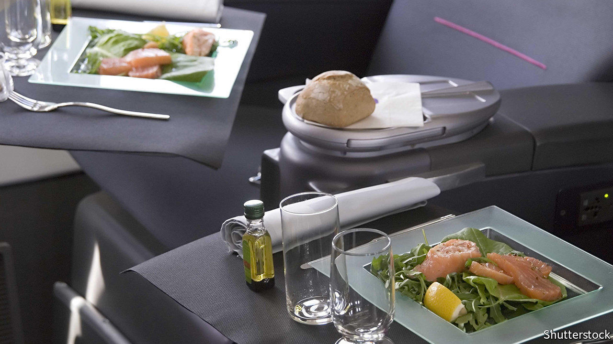

## Grounded beef

# Asian airlines are selling in-flight meals directly to the public

> Nostalgic travel junkies are actually buying them

> Aug 29th 2020SINGAPORE

MOST TRAVELLERS see the food as one of the least palatable aspects of air travel. Rubiyanto Haliman is not most travellers. A worker at an Indonesian shrimp hatchery who flew four to six times a month before the pandemic, he collects in-flight menus, magazines and tumblers, and likes to post pictures of aeroplane food to his Instagram feed—not in an ironic way. The past few months, with airlines largely grounded, have been difficult for him. He so misses the experience of flying that a couple of weeks ago he bought a few in-flight meals from Garuda, the national carrier. The food, which was delivered to his home, was packaged in white plastic containers and served with plastic cutlery, on a tray, just as it would be on a plane. The dishes—spinach and pastrami quiche and nasi daun jeruk (rice infused with coconut milk and lime leaf), each costing 30,000 rupiah ($2)—actually “taste better than normal in-flight meals,” he says. 

Garuda is not the only Asian airline to flog its food to the land-lubbing public. Santan, owned by AirAsia, a big low-cost carrier, sells two Malay staples, nasi lemak and beef rendang (each $4) at its main hub in Kuala Lumpur, Malaysia. Thai Airways offers stir-fried tiger prawns ($8) and tandoori lamb chops ($9.25) in Bangkok. Hong Kongers can pick up $5 “stir-fried beef strip” and “Indian curry fish” from Cathay Pacific’s catering arm. Australians can choose from the voluminous menu of SnapFresh, an airline caterer, or buy a mystery meal from Gate Gourmet, a rival which sells “main meals combination” or “vegetarian combination” in bulk packs.

Santan began dishing up its food on the ground in December, when it opened a restaurant in Kuala Lumpur as part of a branding exercise. Most airline caterers pivoted to terrestrial retail after the pandemic forced the industry to make a hard landing. In June IATA, a trade body, forecast that the global air-transport industry’s revenues will fall by half this year. Marcello Massie, the general manager of PT Aerofood, Garuda’s caterer, says that revenue at the company has plummeted by 97% since the start of the pandemic. In April it decided to start selling food directly to “people who miss flying” in order to shift surplus stock and recoup at least some of its losses.

The grub is flying off the trolleys. Santan sells about 700 meals a day; SnapFresh roughly twice that. In June Gate Gourmet sold out. PT Aerofood is so pleased with “Fly with Meals”, as it calls its retail wing, that it is opening restaurants in three big Indonesian cities. It is a far cry from the 80,000-90,000 meals that Garuda normally serves each day, but it helps. 

Reviews, however, are mixed. Zhenyu Wang, a software developer based in Brisbane, Australia, bought a ten-pack from Gate Gourmet not because he is a fan of plane food but because, at $1.80 per meal, it was a bargain. The Italian pasta was “no good” and the beef oily and salty. Too bad he didn’t get Gate Gourmet’s chicken mango curry. Scott Hamilton, an IT worker in Sydney, enjoyed it so much, he says, that “I would consider flying to somewhere just to eat this.” ■

## URL

https://www.economist.com/asia/2020/08/29/asian-airlines-are-selling-in-flight-meals-directly-to-the-public
