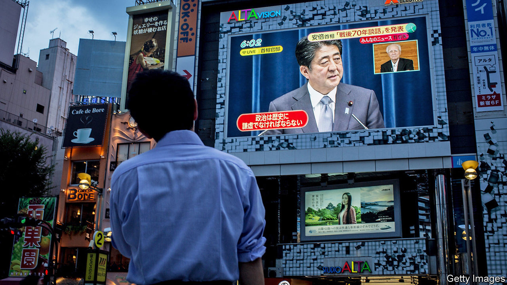

## After Abe

# Speculation about the health of Japan’s prime minister is rampant

> Who will succeed Abe Shinzo when he goes?

> Aug 29th 2020TOKYO

Editor’s note: Since this article was published, Abe Shinzo has announced his resignation because of ill-health

FOR ABE SHINZO August 24th was supposed to be a celebration. It was his 2,799th straight day as Japan’s prime minister, making him the longest-serving in the country’s history, surpassing a record set by his great-uncle, Sato Eisaku. Instead, Mr Abe spent the afternoon at Keio University Hospital in Tokyo undergoing medical checks and denying reports that he was about to step down.

Ill health has long dogged Mr Abe. His first stint as prime minister came to an abrupt end in 2007, after a turbulent year marred by, among other things, a flare-up of ulcerative colitis, a chronic intestinal disease. A new drug has helped Mr Abe manage the symptoms since he took up the job again in 2012. Yet as he has receded from public view in recent months, rumours about his health have proliferated. Japanese media have taken to analysing footage of his gait to see if it has slowed. It now takes him 21 seconds to walk down the corridor outside his office, compared with 18 seconds in April, reports TBS, a television station. The visit to the hospital on the 24th was his second in as many weeks. On August 28th Mr Abe plans a press conference to clarify the state of his health.

Aides admit that the stress of leading the country through the pandemic has taken a toll on Mr Abe, but they balk at the idea that he is too ill to carry on. His third and, by the party’s regulations, final term as leader of the ruling Liberal Democratic Party (LDP) lasts until September next year. A general election is due around the same time. On August 26th Suga Yoshihide, the chief cabinet secretary, declared that it was “premature to talk about ‘post-Abe’”. Nonetheless, the prime minister’s perceived frailty has fuelled exactly that kind of talk. Within the LDP, “many are sniffing blood,” says one of Mr Abe’s advisers.

The succession could play out in three ways. If Mr Abe is hospitalised or temporarily incapacitated, the deputy prime minister, Aso Taro, would become the interim leader. Mr Abe could step down early, allowing the LDP to elect a replacement to complete the duration of his current term. The party’s rules allow an emergency election at a meeting of its MPs, bypassing the normal party-wide vote. Or Mr Abe could stay on until the end of his term, reshuffling his cabinet or even calling an election to reassert control.

Mr Abe’s stamina is just one of many uncertainties. Two opposition parties, the Constitutional Democratic Party and the Democratic Party for the People, announced a merger earlier this month. Their support remains too shallow to challenge the LDP’s hold on power, but the LDP might favour an early election to deprive them of the chance to organise and make their mark. The Tokyo Olympic Games remain in limbo because of covid-19. Mr Abe seems to have thought of them as his swansong—but they may not happen at all.

Then again, if Donald Trump triumphs in November, calls for Mr Abe to stay on might increase, given his skill at buttering up the mercurial American president. Moreover, covid-19 has sent Japan’s economy into a tailspin, and Mr Abe’s poll numbers along with it: GDP shrank by a record 7.8% in the second quarter of this year compared with the first. Approval of Mr Abe’s government sits at 34%, the lowest since the start of his long second term. He might prefer to try to regain popularity in order to leave his successor on solid electoral footing—and to have bigger say in choosing that successor, his adviser notes.

Kishida Fumio, the LDP’s head of policy, is believed to be Mr Abe’s favourite. Voters see him as competent, moderate and thoroughly uninspiring. Ishiba Shigeru, a former defence and agriculture minister, staked out a rare position as an Abe critic. He has broad support among the party’s rank and file, but few backers among its MPs. (Mr Abe may resign early to avoid a party-wide vote and thus block Mr Ishiba’s rise, argues Toshikawa Takao, editor of Tokyo Insideline, a political newsletter.) Mr Suga is a master at managing the bureaucracy, but has little foreign-policy experience. Kono Taro, the current defence minister, and Motegi Toshimitsu, the foreign minister, both have aspirations for higher office, though their candidacies are seen as long shots.

The differences among them all are more of tone and tactics than of ideology. Finding differences on policy requires a microscope. Mr Kishida would carry Mr Abe’s flag, though he hails from a more centrist wing of the LDP, less wedded to Mr Abe’s priorities, such as revising the constitution. Mr Ishiba may favour more orthodox fiscal and monetary policy, but his room for manoeuvre would be limited after the pandemic. Mr Suga might devolve more power to local governments. Mr Kono casts himself as a maverick, having taken stances at odds with the party in opposition to nuclear energy and in favour of allowing the sons of female royals—or even (gasp!) the female royals themselves—to inherit the throne. Ultimately, the decision will come down to personalities and factional arithmetic. “The selection process is not really a policy choice,” says Sone Yasunori of Keio University.

Whoever replaces Mr Abe will inherit immense problems: gargantuan public debt, a shrinking population and an economy that has been limping along for decades. But he will also wield great authority. During his long reign, Mr Abe has centralised decision-making, establishing a national security council and shifting power away from the bureaucracy. “To navigate a turbulent world, you need a strong prime minister—that pattern is embedded,” says Tobias Harris of Teneo, a consultancy. “The institutional power will be there for a prime minister who manages to keep the LDP in his grip.” For now, however, the question is whether Mr Abe himself, not his as-yet-unknown successor, can maintain his grip on the party. ■

## URL

https://www.economist.com/asia/2020/08/29/speculation-about-the-health-of-japans-prime-minister-is-rampant
