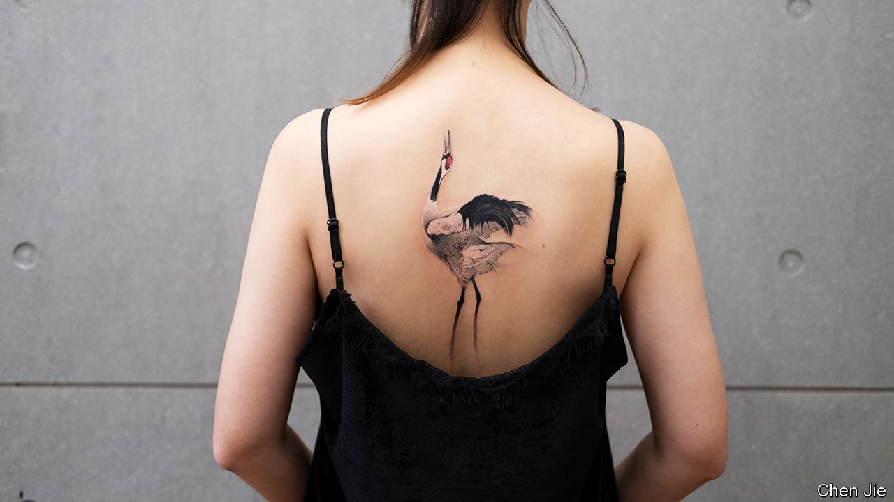
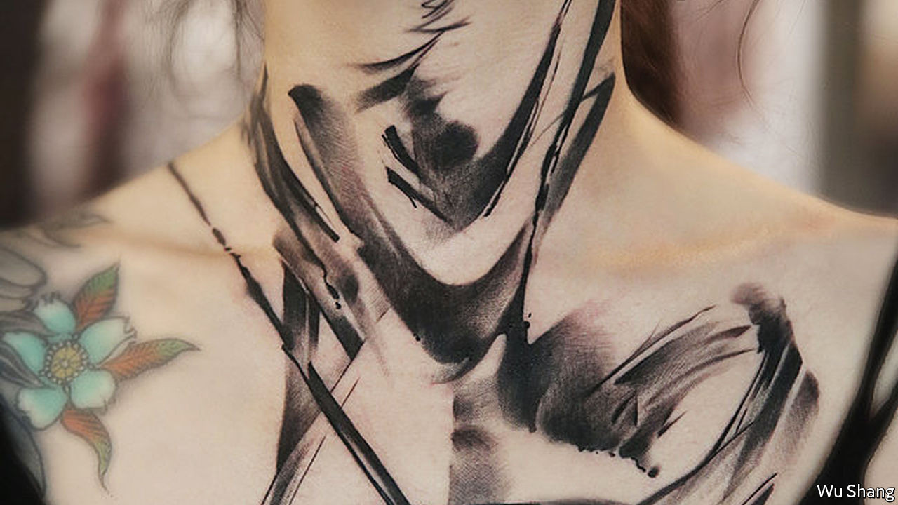
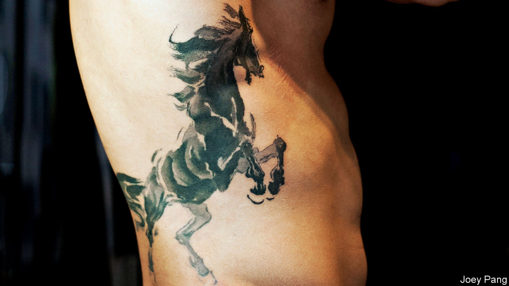

## The new ink masters

# China makes its mark on the world of tattoos

> The innovations pioneered by China’s tattooists are transforming the art of inked flesh everywhere

> Aug 29th 2020WENLING, ZHEJIANG

THE ARMS are those of a tall young man, his muscles toned and skin firm. One is covered in thick sweeps of black Chinese calligraphy from shoulder to wrist. That and the other limbs—around ten in all—are piled in a disembodied heap on Wu Shang’s desk. They are models that he commissioned, made of silicon rubber that looks and, crucially for him, feels like real skin. Wu Shang is a tattooist in the coastal city of Wenling. Having seen hundreds of his carefully inked pieces of art walk out of his studio door, he wanted to keep a few to decorate the walls. “Otherwise, all I have is imperfect pictures,” he says.

 These might be the quirkiest tattoos in China, but they are part of a much broader trend. Tattooed arms, backs and legs are fast becoming common sights in the country’s biggest cities. The delicate flora and fauna of traditional Chinese art have migrated from rice paper to bodies, carried along by a revolution in techniques. And the innovations pioneered by China’s tattooists for their swelling market are transforming the art of inked flesh everywhere.

The Communist Party is not among those who appreciate their work, instead viewing tattoos as undesirable avatars of hip-hop culture. As part of its fumbling effort to control them, China’s top media regulator has ruled that actors cannot show their tattoos on television. Footballers have been ordered to cover up theirs before taking to the pitch.

At the same time, the party has shown some flexibility, bowing to the facts on the skin. The People’s Liberation Army now allows recruits to have small tattoos. For a government so concerned about cultivating its global appeal, the real question is why it cannot recognise the beautiful gift under its nose—or, more accurately, on the forearms of the nation.

Tattooing is not new in China. Literature from the Tang dynasty (618-907AD) describes people getting tattooed with scenes of natural beauty and lines from poetry. Without question the most famous tattoo in Chinese history belonged to Yue Fei, a revered 12th-century general in the Song dynasty who had four characters inscribed on his back: jing zhong bao guo, or “serve the realm with utter loyalty”.

 These, though, are the positive exceptions. For much of Chinese history tattoos were seen as markers of trouble. They were the preserve of borderland barbarians, rogues, bandits and criminals, whose faces were sometimes tattooed as punishment. Some believe that Confucianism frowns on tattoos as an act of filial impiety that damages your body, which is seen as an extension of your parents.

 China’s modern dalliance with tattoos began in the 1980s as foreign fashions streamed into the country, just then opening to the world. Tattoo parlours popped up in its biggest cities, especially Shanghai and Beijing. Artists mostly imitated the designs popular elsewhere. But by the late 1990s a uniquely Chinese style was emerging, best captured in the work of Shen Weiguo, a soft-spoken man whose studio in Shanghai remains a fixture on the Chinese scene today.

 Mr Shen was drawn to the Japanese fondness for dense images, infused with historical legends and covering the whole back. He also admired Western oil painting and China’s own cultural heritage. In his hands these were fused into what became known as the “Chinese neo-traditional school”, similar to the tattoos associated with Japan’s Yakuza gangsters but with Chinese content and brighter colours. (Think more dragons, fewer waves and less rigid rules.) Not that Mr Shen himself likes being called a neo-traditionalist. “I jump around a lot. As soon as you define yourself as this or that, you stop evolving,” he says.

 Two other distinctively Chinese styles are now edging out the neo-traditional school in popularity. One is classic calligraphy, updated with a modern sensibility. Chinese characters often appear as tattoos in the West, too, but these mostly look like basic handwriting. By contrast, Wu Shang and other tattooists in China apply bold, inventive strokes (see below).

 The other style is an approximation of ink-wash painting, the stuff of traditional Chinese landscapes. Among its finest exponents are Joey Pang (see below) and Chen Jie (see main image), two women who got started in the early 2000s, the former in Hong Kong, the latter in Beijing. Orchids bloom up the napes of necks; songbirds perch on branches that run across shoulders and down arms; mist-wreathed mountain ranges extend across collarbones. Their tattoos have an almost ethereal quality, as if floating above the skin. And just as important, they are perfect for the age of social media: Ms Chen has more than 420,000 followers on Instagram.

As is increasingly common globally, some of the best Chinese tattooists had formal art training before opting for ink and skin as their preferred medium. Wu Shang attended the prestigious China Academy of Art in Hangzhou, where he studied Impressionist painting. He says that he intended Wu Shang, his nom de plume, as a tribute to the French artist Paul Cézanne, meaning “I am no Cézanne”. Coincidentally or not, it can also mean “None are better than me”.

 For art-school graduates, the lucrative potential of tattooing is part of the allure. A famous tattooist can charge 3,000 yuan ($435) an hour. Purists worry that such rewards have created unwanted pressures. Consider the fate of Ms Pang, the ink-wash pioneer in Hong Kong. She spent a decade studying under a calligraphic master. As her reputation spread, people came from around the world to her studio. By 2017 her waiting list stretched three years into the future. “I need time to think and draw before I work on skin, and I didn’t have that,” she says. Her husband was also her business partner. When their relationship collapsed, she left him and her business and fled to Dali, a city nestled among mountains in the south-western province of Yunnan, her birthplace.

After a couple of years spent fighting deep depression, Ms Pang is getting back into tattooing with a new studio. It looks nothing like the dingy lairs of the popular imagination. It is a one-room country retreat, with a floor-to-ceiling glass wall and a courtyard set up for tea service. “I can reconnect with my art here,” she says, speaking in her first interview since her disappearance. She adds a pledge to former clients: she will complete their unfinished tattoos for nothing if they come to Dali.

Ms Pang’s ability to create watercolour-like works on skin is a result of dramatic improvements in tattooing equipment, which is linked to China’s rise as a manufacturing powerhouse. Tattooists used to rely on coil-based machines, which produced a buzzing sound as the needle bounced up and down. Over the past two decades many have switched to rotary alternatives. They are lighter and quieter, with more efficient motors. This allows tattooists greater precision as they wield two different formations of needles: a pen-like point for outlines and a flat brush for colouring. Their technique resembles painting, mixing different hues to generate the right look and then dabbing the colours on the skin.

But China’s manufacturing muscle has also generated a problem: a proliferation of cheap tattoo machines. “It used to be really hard to get tattoo equipment if you weren’t an artist yourself,” says Matt Lodder, an art historian at the University of Essex who has written extensively about tattoos. Now the devices can be easily purchased online. In the West some in the tattoo industry (normally averse to rules) have started calling for regulation to control the sale of equipment and ensure that studios meet adequate standards.

In China several prominent tattooists are taking a different approach. They have set up schools. In Wu Shang’s studio four students are hunched over flat pieces of silicon rubber—mimicking skin, just like his model arms—trying to recreate images that they first painted on paper.

That might seem inoffensive, but it goes against a widespread but unwritten code. Masters may take an apprentice or two under their wings, but only if they are truly committed to the craft. The idea that anyone can just show up, pay a tuition fee and after a few months apply ink to skin leaves purists aghast. Even in China some are critical. Mr Shen, the neo-traditionalist, says that he honed his technique over many years by wielding needles by hand. “You need to learn about the relationship between skin and needle. You can’t just get that overnight in school,” he says.

There is, however, a counter-argument. People in the business estimate that China now has tens of thousands of tattoo studios, up from hundreds a decade ago. Last year at least 16 large tattoo exhibitions were held around the country, bringing together crowds of would-be tattooists and soon-to-be-inked patrons. Given the surging demand, the need for well-trained artists is evident. Wu Shang knows that all too well. A garish orange-and-yellow fish on the underside of his left forearm testifies to the experiments on himself that taught him his craft. Who could begrudge his students wanting to start on fake arms? ■

## URL

https://www.economist.com/books-and-arts/2020/08/29/china-makes-its-mark-on-the-world-of-tattoos
