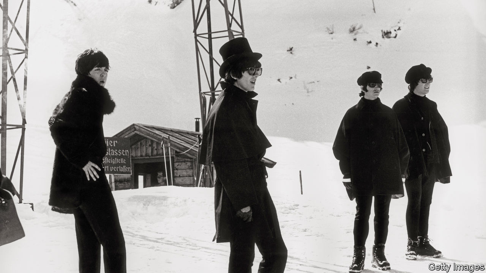

## Home Entertainment

# The therapeutic properties of “Help!”

> The album includes some of the sweetest melodies and tightest harmonies the Beatles produced

> Aug 29th 2020

THE ONLY benefit to overplaying the Beatles’ greatest albums—surely a common problem in these lockdown days—is that it forces the listener back to their less celebrated material. Weary of “Rubber Soul” and “Help!” is at hand.

“Rubber Soul”, written and recorded in two months in late 1965, is considered a watershed in the band’s development. The album was the first over which the Beatles had creative control, and it is both experimental and coherent. On “Norwegian Wood”, George Harrison introduced the sitar to pop; John Lennon showed a new lyrical depth on “In My Life”. Ringo Starr called it the band’s “departure album”. By comparison, “Help!”, a poppier album completed a few months earlier, might seem to represent what they were departing from.

The silliness of the film to which it formed the soundtrack hasn’t helped its reputation. It featured the four being chased around the Alps by evil cultists who were after one of Ringo’s rings. But the Beatles did not evolve in fits and starts, just rapidly. Many of their later innovations are discernible on “Help!” in nascent form.

Its title track was a forerunner to Lennon’s more confessional style. “And now my life has changed in oh so many ways/My independence seems to vanish in the haze,” he wrote of his confining marriage. His anguished tone was belied by George Martin revving up the tempo. The effect is comical—one of the band’s qualities—as well as incongruous.

There is a similar tension in some of Paul McCartney’s contributions. “Last night is the night I will remember you by...when I think of things we did, it makes me wanna cry!” he sings on “The Night Before”, one of the jauntiest songs about rejection ever. It feels like a teenage precursor to “I’m Looking Through You”, his dig at Jane Asher on “Rubber Soul”.

“Help!” also features a lot more experimentation than is commonly remembered. “I’ve Just Seen a Face”, another McCartney foot-stomper, was the band’s first fully acoustic song (and includes a prime bit of Beatles Scouse, rhyming “her” with “aware”). The string quartet on “Yesterday” was equally novel. The song’s promotion of Mr McCartney, who wrote and performed it solo, seems in retrospect to prefigure his rise to dominate the band. But on “Help!” that role still belonged to Lennon, who contributed most of the mid-60s pop that is its therapeutic essence.

“You’ve Got to Hide Your Love Away”, his homage to Bob Dylan; “You’re Going to Lose That Girl”; “Ticket to Ride”; “It’s Only Love”: these songs include some of the sweetest melodies and tightest harmonies the band produced. Without underrating the extent of Lennon’s later contributions, they perhaps represent the moment at which he was at his zenith compared with his two songwriting rivals in the band. Play them through lockdown days: they can help.■

## URL

https://www.economist.com/books-and-arts/2020/08/29/the-therapeutic-properties-of-help
