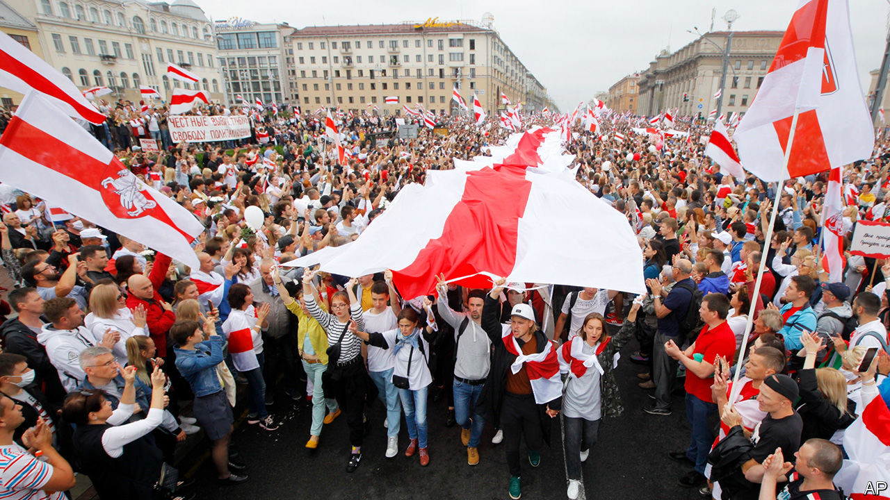
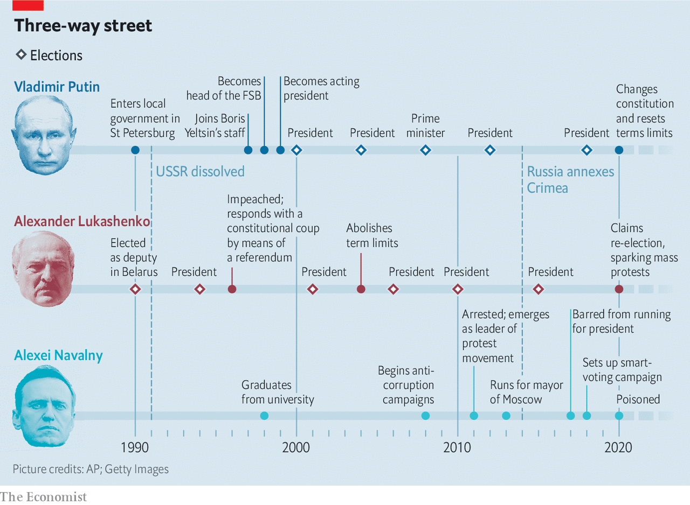
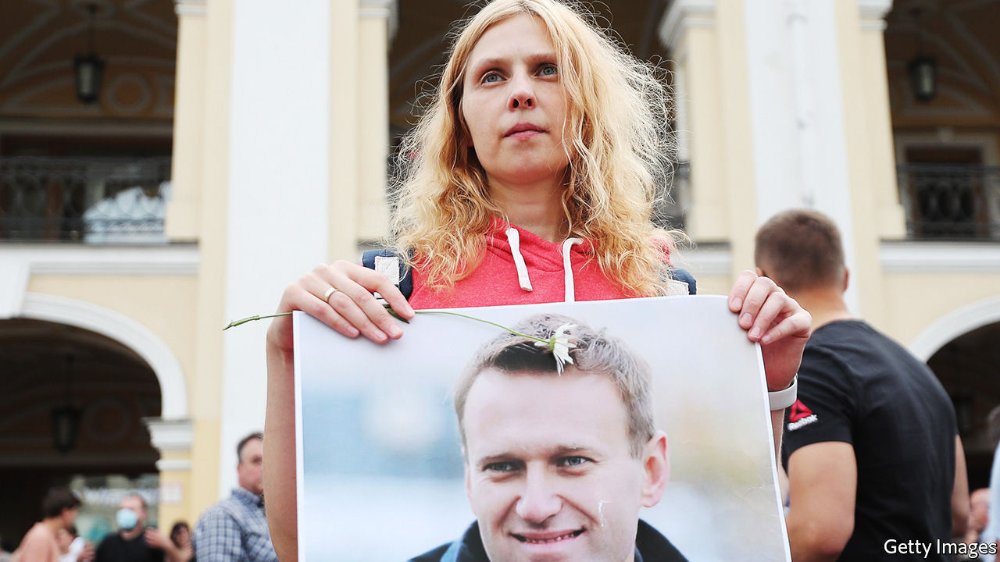

## A cold coming together

# The uprising in Belarus and the poisoning of Alexei Navalny

> Together they reveal the weakness of Russian autocracy

> Aug 29th 2020MINSK

TO RUSSIA’S WEST, Belarus, previously a model of authoritarian stability, is in tumult. On August 9th its people refused to accept the official assertion that they had, once again, chosen to elect Alexander Lukashenko, the country’s dictator. In Russia’s far east demonstrators have been on the streets since July, when the governor of the Khabarovsk region, who had been elected without the Kremlin’s blessing, was arrested on Moscow’s orders and charged with murders committed in the early 2000s.

Those protests were a harbinger of hope for Alexei Navalny, a charismatic Russian opposition leader. He was looking forward to issuing a palpable rebuke to the Russian regime at this September’s regional elections; the far-eastern unrest showed the strategy was working. But Mr Navalny now lies in a coma in a Berlin hospital, having apparently been poisoned in Russia by persons unknown on August 20th.

Together, these three developments make the prospects for Russia’s president, Vladimir Putin, more precarious than at any time since he came to power.

The unspecified neurotoxin which his doctors blame for Mr Navalny’s condition seems to have been administered while he was returning to Moscow after a trip to Siberia. Whoever carried out the attack, the subsequent attempts by the Kremlin to stop Mr Navalny’s transfer to a hospital in Germany, its refusal to investigate the attack and its efforts to muddy the waters strongly suggest complicity if not outright responsibility.

For years Mr Putin has used the power of the state to harass Mr Navalny, pursuing him through the courts, imprisoning him for short spells, excluding him from ballots—but never silencing him definitively. Holding back in this way, it was thought, demonstrated the president’s confidence in his invincibility. At the same time it held out the faint possibility that Mr Navalny might one day lead a real uprising—a possibility which helped ensure the support of the elites with whom Mr Putin lives in codependency. For Mr Navalny to be removed from the scene, as has now happened, would show either that the president no longer controlled his own partisans or that he felt real fear.

What there is to be afraid of can be seen over the western border. Despite—indeed to some extent because of—reprisals which have included beating and torture, apparently leaving at least five people dead, the people of Belarus are protesting in ever greater numbers, feeling their moment has come. Their revolt matters to Mr Putin not because he is particularly dependent on Mr Lukashenko, nor because the two countries have, since 1996, been joined in a two-country common market known as the “Union State”. It matters because Belarus has served as a template for many of the tactics Mr Putin has used to achieve and maintain his power, and Mr Lukashenko has now lost any semblance of legitimacy. Though Mr Putin has never been dictatorial in quite the same way, he may only be a few steps behind him.

Those involved join the dots quite explicitly. On August 15th Mr Lukashenko, trying to drum up support, said on television “It is not a threat to just Belarus anymore. Defending Belarus today is no less than defending our entire space, the Union State, and an example to others.” The others who needed that example set, it went without saying, were those in Russia sympathetic to Mr Navalny. Or, as Leonid Volkov, Mr Navalny’s chief of staff, put it on Facebook, “Lukashenko with a rifle or Putin with his poison—which one of them is more crazy?...What is happening in Belarus today provides some clues about what awaits Russia in the very near future.” On the streets of Khabarovsk the protesters have started shouting their support for the Belarusian uprising.

The Belarusians, for their part, are experiencing a true awakening. On August 23rd, in the biggest protest to date, hundreds of thousands came to Independence Square in Minsk, covering it with the red and white of the flag used by the short-lived Belarusian republic of 1918-19. The authorities, which have dialled back the extreme violence of their response to the first protests, sent in police patrols and played patriotic songs from the second world war over a rooftop tannoy system. The protesters responded by howling, beating drums and chanting, shaking their heads in seeming disbelief at what they were doing. The atmosphere had an odd resemblance to that of an early Pride parade: something repressed was coming out, surprised and delighted to recognise itself.

The awakening is decentralised, its lack of established leaders a testament to the years Mr Lukashenko has spent steamrollering all opposition. Svetlana Tikhanovskaya, the candidate who the protesters believe would have won the election handily if the ballots had been fairly counted, was a complete unknown when the campaign started. She stood because her husband Sergei, a popular vlogger who had announced his intention to run for president and thereby crush Mr Lukashenko, had been jailed as a result.

“There has never been a plan other than reminding people of their own dignity,” says Maria Kolesnikova, one of the two other women who helped lead Ms Tikhanovskaya’s campaign and now the only one of the three still in the country. Ms Tikhanovskaya fled for Lithuania on August 11th after the government effectively took her hostage and coerced her into reading out a condemnation of the protests.

Mr Lukashenko seems in shock. The four previous elections he has staged since becoming president in 1994 (he abolished his country’s term limits 16 years ago) all provided him with between 75% and 85% of the vote. This one, rigged just as well if not better, seemed sure to see the streak continue. But when his 80% of the counted vote was duly announced the people simply refused to believe it. On August 23rd he flew over the protests in a helicopter with his 15-year-old son, railing at the streets below. On landing he emerged toting a semi-automatic rifle, oddly lacking a magazine, to cheer the riot police guarding his residence in their armoured personnel carriers: “Thank you. You are gorgeous. We will sort them out.” The images were meant to demonstrate his resolve to the armed forces. Their brittle edge of craziness may have undercut the intended message.

Were it not for Russia’s support, so far political and rhetorical, Mr Lukashenko would probably have fallen by now. Sergei Lavrov, Russia’s foreign minister, claims that the country’s backing for Belarus stems from a need to shore up all former Soviet territory against inroads by Russia’s Western enemies. But Mr Putin’s reasons have more to do with maintaining power at home than with geopolitics.

Mr Lukashenko and Mr Putin are hardly cut from the same cloth. Boris Yeltsin, Russia’s first president and Mr Putin’s patron, staked his legitimacy on a rejection of the Soviet past. Mr Lukashenko’s maverick rise to power was based on returning to it. He implemented no market reforms and privatised no large state enterprises. He kept wages low, but roughly equal. His critics and opponents disappeared.

Most Belarusians did not seem too bothered. Some Russians, their economy in tatters and their lives upended by reforms, gazed over the border in nostalgic envy at old-style collective farms, filthy but functional factories and clean streets. When he negotiated the agreement that created the Union State in 1996, Mr Lukashenko may have entertained the hope that, after Mr Yeltsin shuffled on, the desire for a simpler past might see him become the two countries’ leader himself.

When Mr Yeltsin anointed Mr Putin as his successor in 1999 it was expressly to prevent any such backsliding. The former KGB man’s remit was to protect the wealth and safety of Russia’s new elite and preserve Mr Yeltsin’s reforms. But in securing his grip on power Mr Putin appealed to some of the same feelings as Mr Lukashenko. He championed those who felt they had lost out in the 1990s, and provided them with the symbols, at least, of the past they held dear—rather as Mr Lukashenko had when he restored a version of its green and red Soviet-era flag to Belarus. He encouraged them to identify with him, and returned the favour; as he said when criticised for re-establishing the Soviet Union’s Stalinist anthem in 2001: “Perhaps I and the people are mistaken, but...” The Russian state media, which he quickly made his own, reinforced the identification.

Mr Putin chose to act on the people’s dislike of the new elite not, in the main, through economic appropriation but through political emasculation. Those who had made fortunes in the post-Soviet world could expect protection as long as they got out of politics and accepted that they now depended on him. He was not worried about jailing those who balked at the new dispensation.

Having consolidated power, in 2008 Mr Putin embarked on a sojourn as prime minister in order to avoid the constitutional limit on consecutive presidential terms, with Dmitry Medvedev sitting in for him as president. When they swapped jobs again in 2012, though, it was against a background of new level of discontent. The urban middle class, despite having done well under his rule, was protesting.

These protests marked the beginning of Mr Navalny’s career as a front-rank politician. Previously mostly known as an anti-corruption blogger and activist, they made him a leading figure in the opposition. His vision of Russia as a modern nation state offered an alternative both to the excesses of the 1990s and to Mr Putin’s increasingly imperial autocracy.

In Belarus, Mr Navalny would have mysteriously disappeared. But Russia was an autocracy, not a dictatorship. To keep the country’s elites, regional leaders and private sector on-side Mr Putin needed some sort of pseudo-democratic legitimacy. So when Mr Navalny announced he would stand in Moscow’s mayoral election of 2013, the Kremlin permitted it—while at the same time seeking to undermine his efforts with trumped-up embezzlement charges. The ruse backfired when an overzealous court sentenced Mr Navalny to five years in prison shortly before the election. Tens of thousands of Muscovites took to the streets to demand his release. In the end he won 27% of the vote, according to the official count.

Things changed in February 2014, when Viktor Yanukovych, a corrupt president, was overthrown by the Ukrainian people. Mr Putin encouraged pro-Russian thugs in the east of the country who rose up against the new regime—portrayed in the Russian media as fascists—and made use of the conflict to annex Crimea. This massively boosted his popularity, sidelining the opposition for years. In 2018 Mr Putin was re-elected president; Mr Navalny was not allowed on the ballot.

At that point, though, Mr Putin faced a problem. The constitution barred him from a fifth presidential term. But without the possibility of one he was a lame duck. He considered reviving Mr Lukashenko’s 1990s notion in reverse—amalgamating Russia and Belarus, and becoming the first president of a new country that would benefit from a retailored Putin-friendly constitution. Mr Lukashenko was not keen on the idea and sought, by resisting it, to rally his people round the flag (the green and red one he had introduced in 1995, rather than the white and red one now flying above every protest).

Stymied on the whole-new-country front, Mr Putin was eventually forced to change the constitution under the cover of a plebiscite in which the abolition of presidential term limits was bundled up with all sorts of other changes, most of them crowd-pleasing but inconsequential. It was, as it happens, a stratagem Mr Lukashenko had employed to bestow new powers on himself after he was impeached by parliament in 1996.

Through all this Mr Navalny continued to organise. In 2017, when the post-Crimea euphoria had largely dissipated and the economy was sagging, he sensed a new opportunity. The country’s growing reliance on the internet, as opposed to state-controlled television, for information helped him to seize it. A YouTube video which detailed Mr Medvedev’s yachts and palaces sparked a protest that rolled from Vladivostok in the east to St Petersburg and Moscow in the west, engulfing some 90 cities.

Mr Navalny himself was taken by surprise. You can never predict how many people will turn up, he said at the time; they won’t come out just because they are asked to. The protesters of 2017 were angrier and poorer than those of 2011-12, and half of them were under 30. What brought them on to the streets, Mr Navalny noted, was their lack of prospects.

Mr Navalny looked to fill that emptiness with the optimism and confidence of an American-style politician. He shunned ideological issues that might divide people, concentrating instead on what brought them together: incomes, health, education and a desire for the rule of law. The most important thing, he said, was to battle “learned helplessness”.

Unable to register a party and disqualified from standing in the 2018 presidential elections, he nevertheless built up a formidable campaigning machine, mobilising 120,000 volunteers. He came up with a strategy of “smart” voting in regional elections: his followers were to vote for whoever was best placed to defeat the Kremlin’s candidate regardless of party and however uninspiring or unpalatable that choice might be. At a rally in Khabarovsk he said his job was to create as many stresses for the Kremlin as possible.

The stress was seen in the summer of 2019. The Kremlin, afraid of smart voting, disqualified all of the independent candidates from seemingly insignificant local-council elections in Moscow. Protests broke out; the Kremlin responded with violence. Across the country, though, most sympathy was on the side of the protesters. The level of brutality being applied was counterproductive. This probably explains why there has been very little police violence in Khabarovsk over the past month.

That success, coupled with evidence that Mr Putin’s popularity was in long term decline, led Mr Navalny to concentrate even more effort on the regional elections to be held on September 13th as a rehearsal for the parliamentary elections in 2021.

The increasing appeal and sophistication of his operation, coupled with the protests in Belarus, may have changed Mr Putin’s calculations about the safety of leaving an opposition leader in place as a signal that such opposition did not worry him. And events in Minsk have shown again the limits of police violence. Even when applied with bestial enthusiasm it could not make up for Mr Lukashenko’s cataclysmic loss of legitimacy; instead it accelerated it. Better act savagely against a leader now than take on the people later.

The irony is that this could lead to the regime’s eventual downfall being more tumultuous than it would have been. Mr Navalny may be the last Russian opposition leader who can control street protest while also engaging in negotiations with the Kremlin. His absence does not make future protests a lot less likely, but it makes them a lot less predictable. Mr Putin may feel that he has the situation under control. So did Mr Lukashenko. ■

## URL

https://www.economist.com/briefing/2020/08/29/the-uprising-in-belarus-and-the-poisoning-of-alexei-navalny
