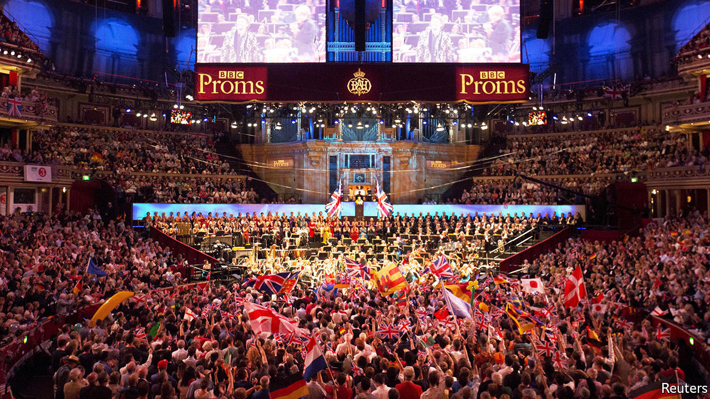

## Last fight of the Proms

# Britons never, never, never shall be free of the culture wars

> An inconsequential but convenient fight for the government

> Aug 26th 2020

“SURRENDER!” thundered the Daily Mail, outraged by the decision of the BBC to drop two patriotic songs, “Rule, Britannia!” and “Land of Hope and Glory”, from the running order of the Last Night of the Proms, the September 12th finale of an annual series of broadcast concerts. Orchestral versions will be played, and the BBC, which was said to have deemed the anthems racist, maintains that the words are being dropped only because covid-19 means there will be no audience to belt the numbers out. Yet a choir will sing some of the other pieces, and there is a certain wokeness elsewhere in the programme. “Jerusalem” is to have a new arrangement referencing other countries of the Commonwealth; its composer, Errollyn Wallen, has dedicated it to the “Windrush generation” of Caribbean migrants caught in a bureaucratic foul-up.

The BBC, which next week gets a new director-general, Tim Davie, wants to attract younger, more diverse audiences. The average BBC1 viewer is over 60. Younger people, who spend more time watching YouTube than television, balk at paying the £157.50 ($208) annual TV licence fee. But the Proms is an odd place to woo them. Only 8% of people think the songs in question should be dropped, and 9% that they should be performed without lyrics, according to YouGov. Those people will probably not tune in.

There are misunderstandings on both sides of the argument. Traditionalists exaggerate the Proms’ pedigree. Though the concerts began in 1895, the party atmosphere of the Last Night, with its boisterous crowds and Union Jacks, began only after it was regularly televised in the 1950s. Reformers have some things wrong too. “Rule, Britannia!”, which sounds like 19th-century triumphalism, dates from 1740. “The song was an exhortation to naval greatness, rather than a celebration of it,” writes Sir David Cannadine, a historian (hence Britannia “rule”, not “rules”, the waves).

This week’s skirmish, which has distracted from the government’s various covid-19-related foul-ups, is the best thing that has happened to Boris Johnson for some months. With the economy battered by the virus and facing a no-deal Brexit in January, it makes sense to focus on culture. Mr Johnson, who had a career writing liberal-baiting Daily Telegraph columns before he was prime minister, is particularly good at it.

But Labour under Sir Keir Starmer is not the sitting duck that it was when led by Jeremy Corbyn, who appeared uncomfortable even singing the national anthem. This week the party affirmed that “the pomp and pageantry of the Last Night of the Proms is a staple of British summer”. The memo did not, apparently, reach Neil Coyle, one of the party’s MPs. “These fat old racists won’t stop blaming the EU when their sh*t hits the fan. Here they come blaming others,” he tweeted of the BBC’s critics.

## URL

https://www.economist.com/britain/2020/08/26/britons-never-never-never-shall-be-free-of-the-culture-wars
