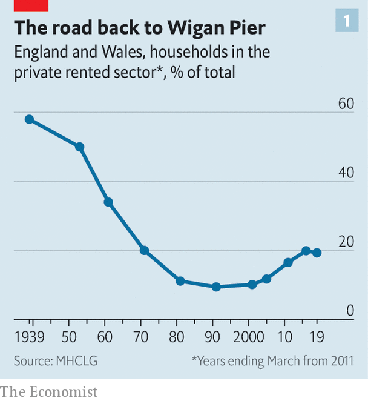
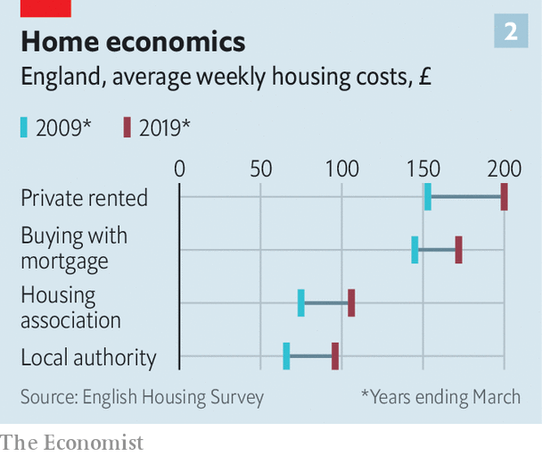

## Housing

# Generation rent grows up

> The shift in housing tenure towards renting creates a problem that Conservatives find hard to handle

> Aug 29th 2020

“IDEALLY,” WROTE George Orwell in “The Road to Wigan Pier”, his account of pre-war poverty, “the worst type of slum landlord is a fat wicked man, preferably a bishop, who is drawing an immense income from extortionate rents. Actually, it is a poor old woman who has invested her life’s savings in three slum houses, inhabits one of them, and tries to live on the rent of the other two—never, in consequence, having any money for repairs.”

When Orwell was writing, almost 60% of Britons rented their homes from private landlords. After the second world war the private rental sector (PRS) shrank to insignificance, thanks to the rise of social housing and the subsequent liberalisation of mortgage lending. But rising house prices and the need for a substantial deposit have reversed the trend (see chart).

As renting has grown, renters have changed. Back in the mid-1990s around one in 20 families with children lived in the PRS. Now more than one in five do. More than half of all private renters are now over 35. A form of tenure once confined to urban centres and university cities has spread to the suburbs and small towns. Some of the fastest growth in the five years to 2017, the most recent period with reliable data, came in places such as Purbeck and Hertsmere.

That presents the Conservative Party with a problem. Since Lord Salisbury espoused “villa Toryism” in the 1880s, it has been the party of home-ownership. Margaret Thatcher gave this purpose new vim by selling off social housing. The notion that home ownership makes people conservative, by giving them a stake in the social order, is embedded deep in the Tory soul. But economics and politics both argue for measures that favour renting. A large rental sector encourages mobility and thus helps promote growth. At the same time, today’s renters are the kind of people whose votes the government wants.

That long-term conundrum is overshadowed by the acute problem that the crisis has created. Housing charities estimate that some 200,000 private tenants have slipped into rent arrears over the past six months. In the early days of the pandemic, the government put in place a temporary ban on evictions from rental properties that was due to expire on August 24th. Three days beforehand, it extended the moratorium for another four weeks.

This hand-to-mouth decision-making suggests that the government is struggling to deal with the problem. That’s partly because Britain has not only a lot of tenants nowadays but also a lot of landlords. While one in five English households rents privately, more than one in ten households own more than one property. Most landlords let fewer than five properties. For most, their rental property is a substitute for a pension or a supplement to one. They tend to be the older, better-off voters who make up the bedrock of Boris Johnson’s political coalition—the contemporary equivalent of Orwell’s old ladies.

But landlords are outnumbered by tenants, many of them families, whom British housing policy has taken little trouble to accommodate. Labour governments have focused on social housing, Conservative ones on home-ownership. Renting is treated as a waiting room in which future homeowners spend some of their 20s before knowing the joys of being responsible for their own boiler. Tenants’ groups complain of a host of issues—repairs badly or tardily done, the common ban on keeping pets—that make it hard for renters to treat their accommodation as a home. With money cheap, the cost of a buying has fallen compared to renting (see chart), but rising deposit requirements put a purchase beyond most renters’ means.

The big issue is security of tenure. The norm in England—the issue is devolved, so Scotland and Wales have gone their own ways—is a 12-month lease with no obligation to renew. Most continental European countries offer much more security. Germany, for instance, gives tenants who behave themselves an indefinite right to remain in their homes.

Opponents of greater security for tenants argue that it would decrease the supply of properties as landlords would worry about not being able to get them back. Proponents argue that the opposite would happen: longer leases would attract families seeking security and give institutions the security they seek, thus encouraging investment in the sector. There are few such investors in Britain, which is why the market remains dominated by Orwell’s old ladies. Countries with the largest rental sectors tend to be those which also offer greater security of tenure.

England’s near-neighbours are moving in a continental direction. Tenancies were made more secure in Wales in 2016, Scotland went for German-style open-ended tenancies in 2017 and Ireland substantially extended eviction notice periods in 2019. In England, the government has pledged to remove “section 21” evictions, under which a landlord can evict a tenant without giving a reason, but has done nothing about it. Even if it does, rolling year-long leases would remain the norm.

Offering tenants more security would put the Conservative Party at odds with its property-owning supporters, and also with its worldview. As the 2019 manifesto said, home ownership is “one of the most fundamental Conservative values”. The Tories’ answer is to increase the supply of homes—or “build, build, build”, as Mr Johnson’s new slogan puts it—to allow more people to buy. Previous Conservative governments have tried that, and been frustrated by their nimby supporters.

The Tories’ blinkered vision of housing tenure offers Labour an opportunity. In 2019 Labour embraced Scottish-style open-ended tenancies but combined that with rent controls which, history shows, destroy rental markets. The political space for a sensible offer to tenants in England lies open. In these uncertain times, the promise of more security to a fifth of the country could win Labour plenty of friends.■

## URL

https://www.economist.com/britain/2020/08/29/generation-rent-grows-up
