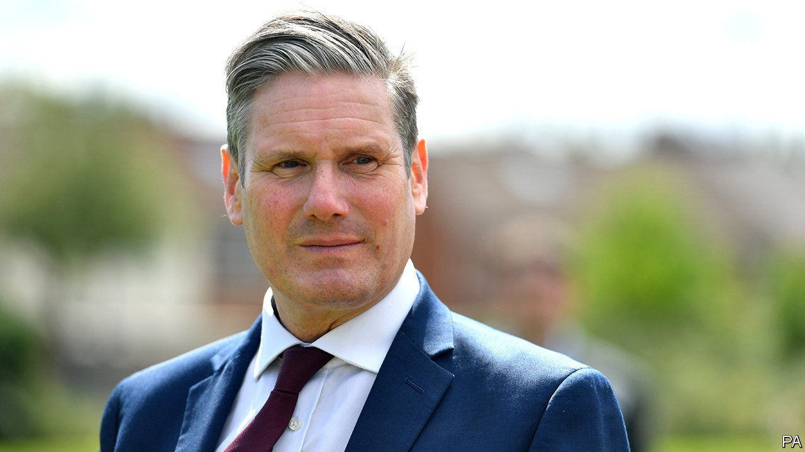

## The Labour Party

# Keir Starmer, middle-class hero

> The Labour Party leader is a hit in the Tories’ backyard

> Aug 29th 2020

“KEIR IS AN absolutely fantastic fit for here,” says Andrew Western. It’s a striking claim, for Altrincham and Sale West, a constituency south of Manchester, is not natural terrain for the Labour Party. Sir Graham Brady, a Tory bigwig, has represented the medieval market town since 1997, and his party hasn’t lost since 1924. The area is home to footballers, their wives and their actor pals, and bristles with charming restaurants, hair salons and Scandi furniture shops. It has some of the country’s best GCSE results and the lowest levels of deprivation, and house prices to match. Little wonder that the Sunday Times, the newspaper of the skiing-and-sourdough classes, recently crowned it the best place to live in Britain.

Yet the ground is slowly shifting. Labour took control of the council last year. Sir Graham’s majority fell from more than 13,000 in 2015 to 6,139 in 2019. Mr Western, the Labour candidate, lost, but his vote held up and he was spared the abuse that greeted his colleagues in nearby towns as the party’s supporters revolted against Jeremy Corbyn. “It was a lovely campaign.” One reason for his warm reception was Brexit, which Sir Graham supported, but 62% of local voters opposed. Another was an influx of liberally-minded media workers and architects to neighbourhoods once home to firemen and gasfitters, a byproduct of Manchester’s boom.

It’s trendy in the Tory Party to sniff at the middle classes. The Daily Telegraph denounces the “callous metropolitan bourgeoisie” with a gusto more familiar to the Morning Star. But Britain has lots of them, and they like Sir Keir Starmer, a former human-rights barrister. Labour is supported by 45% of managerial and professional voters likely to turn out, and 30% of low-skilled manual workers (known as “ABs” and “DEs” in the jargon), according to a recent survey by Ipsos MORI, a pollster. The Tories have 35% and 48% of those groups respectively. Graduates are much more likely to approve of Sir Keir, while those without qualifications like Mr Johnson.

Labour has been gentrifying for a long time, but it has accelerated under Sir Keir. Tony Blair’s victory in 1997 is often regarded as a conquest of the middle classes, yet he won 59% of the DEs to 31% of the ABs. In the last election, Labour won a bigger share of DE than AB voters, while the Conservatives won more of both than Labour did.

Jeremy Corbyn lost in part because the anti-Brexit camp fragmented. Sir Keir is winning Remainers back, with four in ten of those who voted Liberal Democrat last year now backing Labour. One arm of Sir Keir’s coalition, says Paul Hilder, the head of Datapraxis, an electoral research firm, may be what he identifies as “older establishment liberals”—middle-aged professionals who like the EU and David Cameron, and couldn’t stomach Jeremy Corbyn.

Altrincham poses a conundrum for the Labour Party: whether to embrace the change or fight against it. Labour needs to gain 120 seats to win the next election. In 67 of them, including former industrial towns such as Bury, Redcar and Bolton, it has been losing support to the Tories since 2015, notes Alan Wager of King’s College London. Yet in 53 others—places like Altrincham, Wycombe and Chingford—it has been inching forward on the backs of graduates, renters and professionals.

Sir Keir’s allies say he must focus on winning back the former, and reverse the realignment that put Mr Johnson in power, because speaking for industrial towns is the party’s historic mission. There are too few seats like Altrincham to form a path to government, they argue.

But the grand realignment could continue. Mr Johnson may tighten his grip on Bolton, while Brexit and a culture war alienate the liberal, well-heeled commuter towns which have long voted Tory. Mr Western doubts that his party would throw its energy into unseating Sir Graham when there are seats like Leigh nearby to win back from the Tories. But he says, “in 15 or 20 years, this is a genuine bellwether.” ■

## URL

https://www.economist.com/britain/2020/08/29/keir-starmer-middle-class-hero
