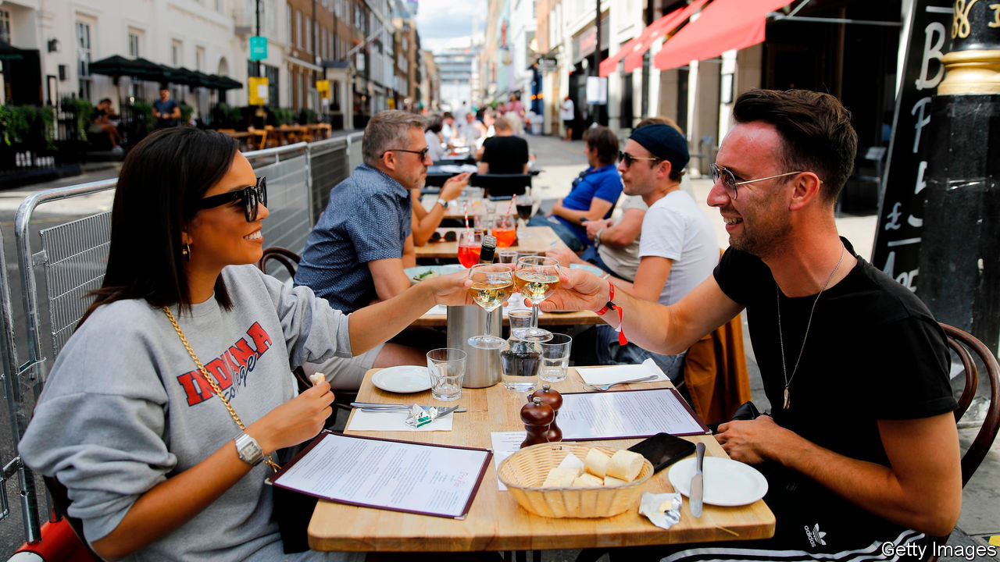
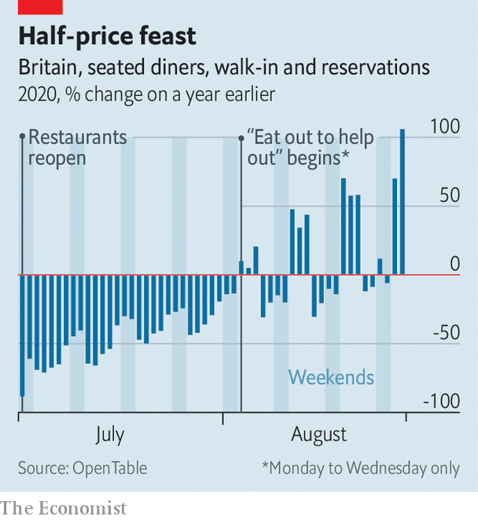

## Turning the tables

# The worst is yet to come for Britain’s food-and-drink industry

> “Eat out to help out” was a huge success. But restaurants and pubs still face a difficult autumn

> Aug 29th 2020

DECADES FROM now when the grandchildren of the covid generation ask, wide-eyed, “What did you do during the great pandemic of 2020?” the wizened elders will pause to reflect on hardships past and they will answer: “I did my bit for the country. I ate a lot of steak-frites.”

Brits have taken to “eat out to help out”, a government scheme which offers a 50% discount on restaurant meals—up to £10 ($13) per person, from Mondays to Wednesdays in August—with an enthusiasm exceeding even the wildest expectations of the hospitality industry. On the scheme’s first day food sales were up by 100% over the previous Monday, according to CGA, a hospitality industry researcher. Some 64m meals were consumed at 84,000 venues over the first nine days, at a cost of £336m to the exchequer.

Yet the key achievement of the scheme is not that it has driven Britons into pubs and restaurants on discount days, but that it reintroduced Brits to the practice of eating out. The cash incentive was a boost, but the psychological effect was more important. “What people have been saying in surveys is if the chancellor is giving you a discount, it’s the right thing to do,” says Kate Nicholls of UK Hospitality, an industry body. Nearly 40% of those who used the scheme had come out for the first time since venues reopened on July 4th. Once people returned, they were reassured that it was safe to do so again.

Moreover, fears that weekend business would be displaced to earlier in the week proved unfounded. Bookings have grown consistently. Undiscounted meal bookings have picked up too (see chart). That suggests trade will not return to its pre-scheme doldrums once “eat out” comes to an end on August 31st. In the week to August 25th, according to OpenTable’s data, bookings in Britain were up by 31% year-on-year, compared with 21% in Germany, which handled the pandemic well, and a drop of 49% in America, which did not.

Yet the hospitality industry faces a series of challenges starting in September. The first is rent. Most hospitality venues pay rent in advance on a quarterly basis. Many have had their rent reduced or deferred. But many will have to cough up nine months of rent at the end of September. That is likely to cause a wave of bankruptcies in the sector.

For those that get through the rent crunch, October will bring colder weather and fewer customers. And current government rules allow members of up to six households to gather outdoors, but only groups of two households to meet indoors.

That is in addition to ongoing worries. Social distancing measures have reduced capacity at most venues. Nine in ten hospitality businesses are operating at 80% or less; half are operating at 50% or less. City-centres remain deserted, wreaking havoc on venues that rely on commuters and office-workers. According to Nick Mackenzie, the boss of Greene King, a brewer that also runs some 2,700 pubs, trading is down by an average of 20% overall, rising to 65% in central London and 80% in the City of London.

Another headache is data protection: most venues are taking customers’ details to help the government’s test-and-trace efforts, but some are doing it sloppily, for example by leaving an open register on the counter than anyone can photograph. Still, the industry has been fortunate that no big new outbreaks have been traced to pubs or restaurants. Consumer confidence, like the industry’s recovery, is a fragile thing.■

Editor’s note: Some of our covid-19 coverage is free for readers of The Economist Today, our daily [newsletter](https://www.economist.com/https://my.economist.com/user#newsletter). For more stories and our pandemic tracker, see our [hub](https://www.economist.com//news/2020/03/11/the-economists-coverage-of-the-coronavirus)

## URL

https://www.economist.com/britain/2020/08/29/the-worst-is-yet-to-come-for-britains-food-and-drink-industry
