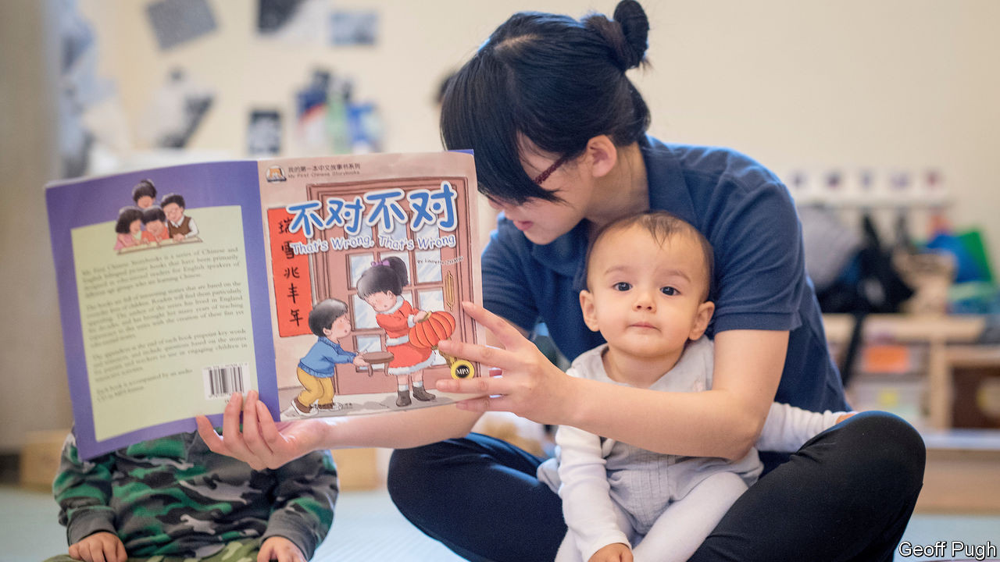

## Learning languages

# Why studying Chinese is in decline

> Mandarin is out of fashion

> Aug 29th 2020

“I  LOVE CHINA,” declared Boris Johnson, then mayor of London, in 2013, exhorting British children, his own included, to study Mandarin. Seven years on, he is a lot less keen on China, and the vogue for studying Mandarin seems to be fading.

When Mr Johnson was declaring his Sinophilia, well-to-do parents saw Mandarin as a good investment in their children’s future. In 2015 Hatching Dragons (pictured), Britain’s first bilingual English-Mandarin nursery, opened its doors to 32 little linguists; it has since taught over 500 children, for around £1,881 a month per child. But Cennydd John, the nursery’s chief executive, laments that there is “almost no option” for children to continue their bilingual education once they leave at the age of five. Fewer than 3% of primary schools in England offer Mandarin.

Many independent schools followed the fashion: 24% of them offer Mandarin, compared with 4.4% in state schools. But finding a school that offers Mandarin is no longer the priority it was for parents three years ago, says Ralph Lucas, editor in chief of The Good Schools Guide. Part of the reason is that “the perception of China as a place where you would want your child to make a career has taken a severe knock”. Learning Mandarin to a useful level is difficult, and China “doesn’t seem like the big golden opportunity it was before”. Recent events, such as the crackdown on democracy in Hong Kong, further “take the gloss off” the idea of investing in a Chinese education.

That shift shows up in exam figures. In 2015, 3,099 students took a Chinese A-level and 3,710 took a GCSE. In 2019 those figures had dropped to 2,272 for A-level and 3,201 for GCSE, according to the Joint Council for Qualifications, an organisation which represents the eight largest national providers of qualifications.

Advocates of learning Mandarin say that a more complex geopolitical situation is exactly why children should be practising their tones. But those who have invested the hours (and the cash) don’t always reap the rewards. “The only real advantage of me speaking Chinese was having a much better understanding of how difficult it was for my Chinese colleagues to operate in English,” says Alex Wilson, who worked in public relations in Beijing and Shanghai. Graduates from the School of Oriental and African Studies can expect to be earning £27,000 five years after graduating if they studied Chinese, or £38,000 if they studied economics. Yun Zhen is studying for a Masters in Education at the University of Reading and hopes to be a Mandarin teacher. But “honestly, I don’t see many opportunities,” she says. Now she’s looking for teaching experience in “any subject”.

The difficulty of learning Mandarin will always attract academic kids and pushy parents. Mr John of Hatching Dragons notes that parents increasingly “see bilingual immersion for its cognitive benefits. For them, Chinese is (almost) secondary to the linguistic input”. The idea that Mandarin itself is a hot ticket is fading. Better to train the children in a computer-programming language. “Compared to how much more employable you can make yourself by learning something like Python, which you can learn in a few months,” according to Mr Wilson, “Mandarin seems like an inefficient use of resources.”■

## URL

https://www.economist.com/britain/2020/08/29/why-studying-chinese-is-in-decline
