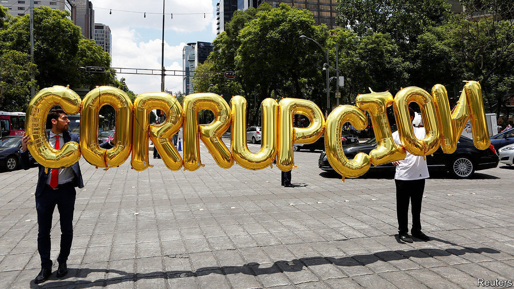
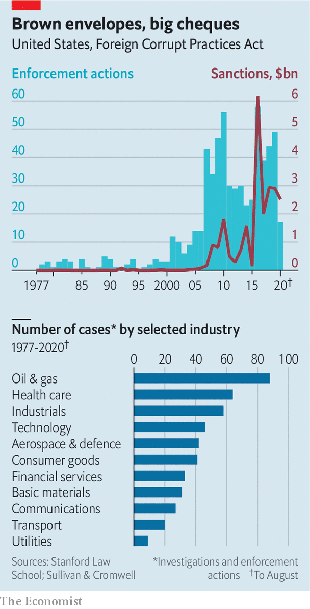

## A closer look at greasy palms

# Bribery pays—if you don’t get caught

> A new report tries to quantify the returns to multinationals from kickbacks they pay

> Aug 29th 2020

MANY BIG companies may be struggling with depressed sales, but these are busy times for bribery-busters. Mexico is abuzz over allegations by an ex-boss of Pemex, the state oil giant, that several senior politicians received bungs from companies including Odebrecht, a Brazilian construction firm (see [article](https://www.economist.com//node/21791232)). The scandal is the latest in a string of graft cases to make headlines this year, starting with Airbus’s record $4bn settlement in January over accusations of corruption for making illegal payments in various countries.

Corporate bribery is hardly new. In surveys, between a third and a half of companies typically claim to have lost business to rivals who won contracts by paying kickbacks. But such perceptions-based research has obvious limitations. A new study takes a more rigorous approach, and draws some striking conclusions.

Raghavendra Rau of Judge Business School at the University of Cambridge, Yan-Leung Cheung of the Education University of Hong Kong and Aris Stouraitis of Hong Kong Baptist University examined nearly 200 prominent bribery cases in 60 countries between 1975 and 2015. For the firms doing the bribing, they found, the short-term gains were juicy: every dollar of bribe translated into a $6-9 increase in excess returns, relative to the overall stockmarket.

That, however, does not take account of the chances of getting caught. These have risen as enforcement of America’s 43-year-old anti-bribery law, the Foreign Corrupt Practices Act (FCPA), has been stepped up and other countries have passed similar laws. The number of FCPA cases is up sharply since the financial crisis of 2007-09, according to Stanford Law School (see chart). It has dipped a bit under President Donald Trump, who has criticised the FCPA for hobbling American firms overseas, but remains well above historic levels. Total fines for FCPA violations were $14bn in 2016-19, 48 times as much as in the four years to 2007.

The authors also tested 11 hypotheses that emerged from past studies of bribery. They found support for some, for instance that firms pay larger bribes when they expect to receive larger benefits, and that the net benefits of bribing are smaller in places with more public disclosure of politicians’ sources of income.

But they punctured other bits of received wisdom. Most striking, they found no link between democracy and graft. This challenges the “Tullock paradox”, which holds that firms can get away with smaller bribes in democracies because politicians and officials have less of a lock on the system than those in autocratic countries, and so cannot extract as much rent. Such findings will doubtless be of interest to corruption investigators and unscrupulous executives alike. ■

## URL

https://www.economist.com/business/2020/08/29/bribery-pays-if-you-dont-get-caught
