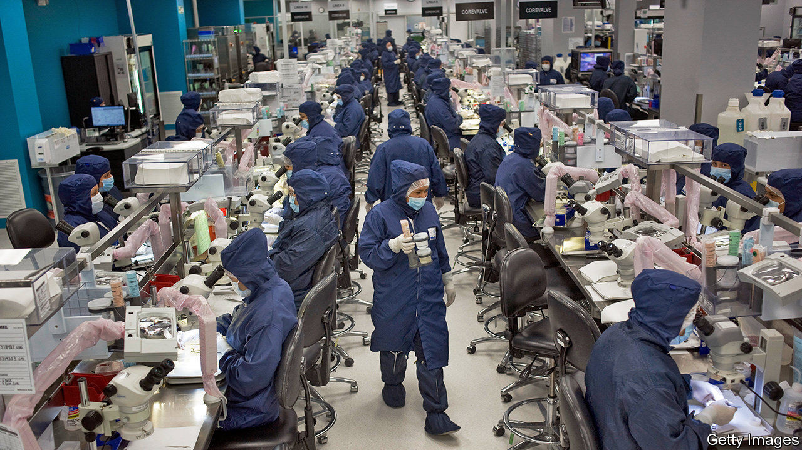
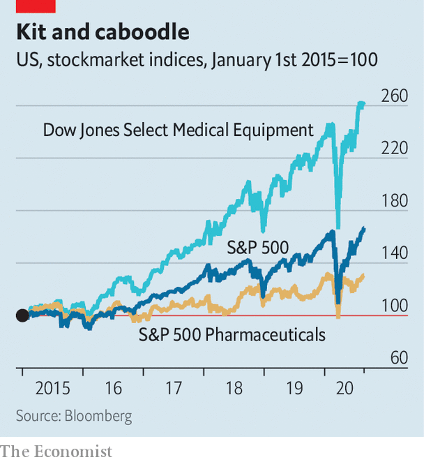

## Left to their own devices

# Covid-19 has been a mixed blessing for makers of medical equipment

> Medtronic, an American medical-device giant, offers an illustration

> Aug 29th 2020NEW YORK

FEW INDUSTRIES have whipsawed in the covid-19 recession as violently as medical-device makers. The pandemic led to a collapse in elective medical procedures requiring their sophisticated kit, dealing a powerful blow to sales. At the same time, the crisis created opportunities for firms making ventilators and testing kit.

For an illustration of how this dynamic has played out, consider Medtronic. On August 25th the American giant, with a market capitalisation of $138bn, reported its financial results for the three months to July. On the face of it, its performance was abysmal. Revenues fell by 17% compared with the same quarter a year ago, to $6.5bn. Net income plunged by nearly half. Citing the pandemic, the firm refused to provide earnings guidance.

And yet investors and analysts cheered. One reason is that they had feared worse: Medtronic handily beat forecasts for both revenues and earnings. Another is that sales of ventilators shot up five-fold, cushioning overall revenues. Geoff Martha, the firm’s boss, now expects a return to “normal growth” within a few quarters.

The revival at Medtronic might augur a broader return to form for medical-device firms. Matt Miksic of Credit Suisse, an investment bank, notes that these companies came into the crisis “with the wind at their backs”. They were propelled by strong growth in global revenues. Last year KPMG, a consultancy, had forecast global sales to rise from to $795bn in 2030, from $371bn in 2015. Tim van Biesen of Bain, a consultancy, points to a pre-pandemic boom in sales of highly profitable devices used in orthopaedics, neurosurgery and cardiovascular procedures. As result, in the past five years share prices have outpaced both Big Pharma and the S&P 500 index of large firms (see chart).

Whether or not this outperformance can last depends in large part on the path of the pandemic. To flog their lucrative devices and associated services, kit-makers rely on an army of highly trained sales representatives to win over doctors and train them. A survey by Bain found that nine in ten medics wanted in-person interactions with device salespeople before covid-19. As Mr van Biesen explains, many surgeons value advice from top-flight reps, who know their company’s cutting-edge technologies better than doctors do, during complex surgeries. Some even depend on those reps to lay out preferred instruments before operations. Now Bain finds that more than 60% of surgeons foresee restrictions on such in-person contacts.

A prolonged period of restricted access could affect the industry in unexpected ways. Big companies may lose business from ambulatory-care centres, reckons Mr van Biesen. These tend to be smaller than hospitals, more cost-conscious—and less wedded to both expensive brands and their sales reps. But Mr Miksic thinks that in specialities like spinal surgery, where a high degree of on-site service is common, the lack of access may entrench incumbents and hobble upstarts. This week Medtronic boasted that it was gaining market share in its largest businesses. If the firm “is finding a new gear”, as Mr Martha crows, it is thanks to old-gear sales. ■

## URL

https://www.economist.com/business/2020/08/29/covid-19-has-been-a-mixed-blessing-for-makers-of-medical-equipment
