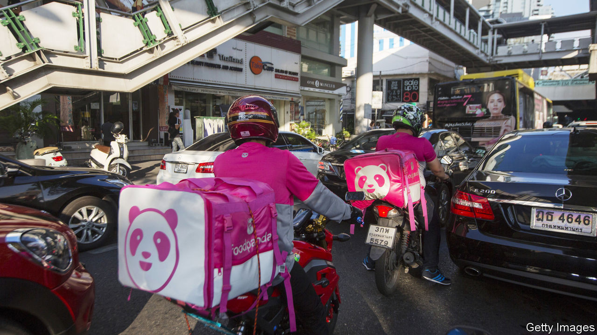

## Ascend and deliver

# Delivery Hero is Germany’s newest blue chip

> The food-delivery firm could last longer in the DAX 30 index than the firm it replaced

> Aug 27th 2020BERLIN

JOINING THE index of Germany’s 30 biggest listed companies is usually a cause of celebration for the joiner rather than of controversy. Yet the arrival of Delivery Hero in the DAX 30 on August 24th ignited a fierce debate. How, critics grumble, can a food-delivery company that has never made money or paid a dividend, and no longer even does business in Germany, sit alongside Siemens, a 173-year-old engineering behemoth, and Volkswagen, Europe’s biggest carmaker, in the elite group of the bluest of German blue chips?

The simple answer is that membership of theDAX is determined mainly by market value and turnover of shares, with no profitability test (unlike America’s S&P 500 index of big firms, which requires four consecutive quarters in the black, among other criteria). And in that respect, Delivery Hero qualifies handily. Niklas Ostberg, its Swedish chief executive, boasts that the firm’s market capitalisation of €18.7bn ($22bn) is higher than that of several DAX members. Its share price has tripled over the past couple of years and it has attracted investments from the world’s richest companies, including Alibaba and Amazon, two global internet giants.

Ironically, a big reason for investors’ enthusiasm is Delivery Hero’s non-German focus. A few years ago it offloaded its German businesses, Foodora, Lieferheld and Pizza.de, to Takeaway, a Dutch competitor. Since then it has eyed expansion in the Middle East and Asia. At the end of last year 50% of the company’s revenue came from the Middle East and north Africa, 30% from Asia and 12% from Europe. “It is today essentially an emerging-markets business,” says Monique Pollard of Citigroup.

Many food-delivery firms do not operate their own fleets of vehicles but instead match consumers with restaurants and riders. That means they must share their cut with both restaurants and riders. “It is very hard to make a profit with the three-way-split model in Europe,” explains Andrew Gwynn of Exane BNP Paribas. But the model works in emerging markets where order sizes are large and delivery workers’ wages low.

Delivery Hero could become a viable business, if it manages to keep its focus on the developing world and stay on top of the next wave of consolidation, which began with the combination of Just Eat and Takeaway, two European firms, earlier this year, and their proposed takeover of America’s Grubhub in June. At the very least it has a decent shot at staying in the DAX longer that firm it replaced. Wirecard, a payments-processor bankrupted earlier this year by a huge accounting fraud, was booted out of the index barely two years after its own ascension. ■

## URL

https://www.economist.com/business/2020/08/27/delivery-hero-is-germanys-newest-blue-chip
