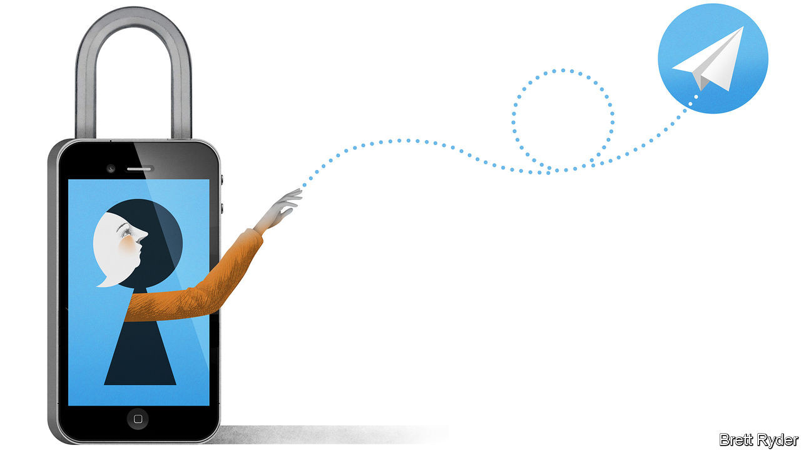

## Schumpeter

# Telegram tries to blend security with usability

> Protests in Belarus have boosted the app’s profile

> Aug 29th 2020

THE OFFICIAL story is that Alexander Lukashenko, Belarus’s president, won a sweeping victory. On August 9th some 4.7m people, 80% of Belarusian voters, cast their ballots for him. Just 10% voted for Svetlana Tikhanovskaya, a former English teacher who replaced her jailed dissident husband on the ballot. But few in the benighted country believe the official account, which is why Belarus has seen nearly three weeks of protests demanding Mr Lukashenko’s resignation.

As has become de rigueur in the 21st century, many of the demonstrations are co-ordinated online. One app in particular, Telegram, has become a vital tool. Users share inspiring videos and plans for marches. One message shows employees of the National Academy of Sciences protesting in defiance of their bosses, and proposes a rally in support. Another reminded readers that August 25th marked the 29th anniversary of Belarus’s independence from the Soviet Union, set out the day’s celebrations, and promised a message from Ms Tikhanovskaya.

It is not just Belarus. Telegram, with more than 400m monthly users, has been used by Black Lives Matter protesters in America, as well as anti-government demonstrators in Hong Kong and Iran. Silicon Valley venture capitalists flaunt it as a symbol of fashionable edginess. Pavel Durov, its creator, makes no secret of his sympathies. A message in his public channel, which has 356,000 subscribers, shows a poster claiming that memes can “topple regimes”. It is a sentiment straight from the internet’s idealistic early days, when the assumption was that freedom and democracy would flow down the wires alongside the bits and bytes. Telegram did not respond to The Economist’s request for comment.

Although Telegram remains behind WhatsApp and WeChat, which boast 2bn and 1.2bn monthly users, respectively, it is booming. In April it said it had added 100m users in the preceding 12 months. It has three selling points. The first is simply that it is a rather good piece of software, slick and easy to use. It was the most-downloaded chat app in Belarus before the protests and recently took the top spot from WhatsApp in Russia, according to SensorTower, an app-analytics firm. As with WeChat, Telegram users can design third-party programs to run on top of its service, letting people while away the time with video games, quizzes and the like. Whereas WhatsApp chats are limited to 256 participants, Telegram’s user-created public channels can host unlimited numbers. One of the most popular is “Hindi HD movies”, which points its 6m subscribers towards pirated copies of popular films.

Telegram’s second virtue is its promise to protect users from governments’ prying eyes. Experts debate exactly how secure Telegram is. Like WhatsApp, it offers “end-to-end encryption”, which prevents third parties, including the app itself, from deciphering messages. But unlike WhatsApp, this is not Telegram’s default setting, and it does not work with many of the app’s features. Messages are still encrypted, but Telegram retains a copy of the key. Authorities that persuade the firm to divulge that key could read a user’s messages. (Telegram says this has never happened and that it would resist if it did.) The app also relies on its own custom cryptography rather than battle-tested code favoured by experts.

Telegram’s third, and perhaps main, attraction is that it is not owned by Facebook (as WhatsApp is) or Tencent (the Chinese giant which controls WeChat). The app trumpets its independence from internet titans, which netizens view with growing suspicion. Its business model is simple: it does not have one. It says that running costs are covered by Mr Durov, who made a fortune with VKontakte, a popular Russian social-media platform he founded in 2006. Profit, the firm declares, “will never be an end-goal”, and “commercial interests will never interfere with our mission.” Such claims are lent credibility by Mr Durov’s background. At VKontakte he refused to hand over details of opposition politicians’ websites. He was fired by the board in 2014 as part of a claimed takeover by allies of Vladimir Putin, Russia’s president. Mr Durov bought citizenship of St Kitts & Nevis, and began work on Telegram.

However, preserving privacy and security is becoming trickier. Encrypted chat apps are viewed with suspicion even in democracies. America and Britain have repeatedly threatened to ban end-to-end encryption, because it frustrates the work of the police and intelligence agencies.

Autocrats, for their part, have learned how to harness chat apps to spread misinformation, as well as genuine news. The Hong Kong protests saw Telegram channels dedicated to posting the personal addresses of prominent dissidents. By seizing demonstrators’ phones and forcing them to reveal passwords the police can get their hands on lists of contacts to be arrested or intimidated. A booming market for private hacking allows governments to buy software that can bypass encryption by breaking into phones and reading information straight off their screens. One knowledgeable observer says it would be foolish to assume that big chat apps are not targeted by national spy agencies. That goes for Telegram, too.

If Telegram persuades users that it is both more fun and safer than WhatsApp and WeChat, it could nibble away at their supremacy. But for that to happen, it must first survive. It is unclear how long Mr Durov’s money will last. Since 2017 Telegram has tried to raise $1.7bn by selling its own cryptocurrency. America’s Securities and Exchange Commission halted the sale on the grounds that Telegram was dealing in unregistered securities and ordered it to return most of the cash to investors. That has put paid to plans for an alternative to bitcoin that may, if boosters are to be believed, one day supplant VISA, Mastercard or WeChat’s e-payments. Telegram thinks it can nevertheless get by even once the Durov largesse runs out, by charging for non-essential upgrades. Prospective regime-topplers are keeping their fingers crossed that it is right. ■

## URL

https://www.economist.com/business/2020/08/29/telegram-tries-to-blend-security-with-usability
