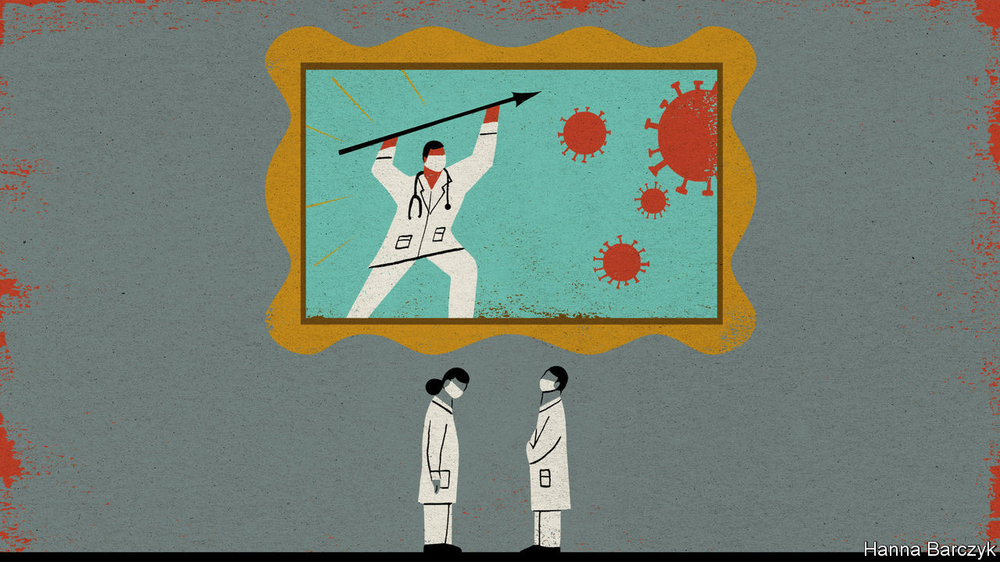

## Chaguan

# China needs to train more doctors

> The Party praises covid-fighting medics, but fails to fix the health system

> Aug 29th 2020

THE CHINESE LANGUAGE is rich in concise, sardonic sayings, many of which reflect universal truths. It also includes lots of phrases steeped in a world view that is distinct to China. One such is yi buguo erdai, meaning “no doctor’s child becomes a doctor”. This may be accompanied by a cynical shrug, perhaps after reading about the latest Chinese hospital boss arrested for bribe-taking or a fresh scandal involving fake medicines. The saying is also used on hearing news outlets describe another stabbing or assault of a doctor at work—for fully two-thirds of doctors told the Chinese Medical Doctor Association in 2017 that they had been attacked or threatened in a hospital, often by their patients’ angry relatives. Small wonder that in one survey after another, few want their children to be doctors.

Elsewhere, doctoring is such a family business that journals of medical ethics devote papers to the subject. One such study found that one in five American medical students has a parent who is a physician. In China the profession is neither very prestigious nor especially well paid: even senior doctors typically earn just over 100,000 yuan ($14,500) a year—hardly a fortune in a big city.

Then came covid-19. Communist Party leaders have declared their handling of the virus a triumph, and are willing to give doctors and nurses a share of the credit. Much of China feels normal now, even celebratory. Case numbers are so low that authorities are easing strict lockdowns and border closures imposed months ago, though they are in no hurry to dismantle digital tracing systems that oblige urbanites to scan QR codes with a smartphone when entering a public building or taking a train or aeroplane.

Early cover-ups, which saw officials in the city of Wuhan conceal the severity of the outbreak for weeks, punishing doctors who sounded the alarm, have no place in official narratives. Medals and honours have, however, been bestowed upon selected, stateapproved doctors and scientists who prodded the central authorities to act. A new art exhibition at the National Museum in Beijing, devoted to covid-fighting medics, opens with a giant portrait of Zhong Nanshan, a celebrated 83-year-old lung doctor who used his seniority to reveal in late January, on national television, that covid-19 was spreading between people. The doctor, depicted against a stormy sky, his eyes brimming with tears, is captioned: “Communist Party member, Zhong Nanshan”. Another artwork depicts young doctors from an elite Beijing hospital taking a break from volunteer service in Wuhan to express their patriotic fervour in a letter to the party chief, Xi Jinping. The show is reserved for Chinese nationals, so Chaguan has seen only photographs of his favourite work, a Tibetan scroll-painting, or tangka, showing three figures in traditional robes prodding leering, cartoon-like coronavirus spheres into a fiery pit, watched by a yak in a face-mask.

Propaganda about heroes in white coats has filled state media for months. It seems to have resonated. Zhang Shuyang, dean of China’s most highly regarded medical school, Xiehe, told state television that applications to her college and its sister academy at Tsinghua University, also in Beijing, are up 30% since last year.

Yet other experts on China’s health system express caution. Praising heroic doctors from well-known, elite hospitals does nothing to solve the big, structural problem with China’s health system, and may even make it worse. Access to good care is shockingly uneven, with a vast gulf of quality between big-city hospitals and the rest. That prompts the public to seek care at a few, overcrowded urban hospitals, sometimes queuing for days to see a doctor for a 90-second consultation. What China really needs is clinics in small towns and villages that people actually want to use.

Distrust of local medicine is well founded. In 2016 just 0.2% of rural doctors in village clinics held at least a bachelor of science degree in medicine. Even in township-level health centres, only just under half of doctors in general practice (known as family medicine in America) are university graduates.

China’s best medical colleges are trying to set eight years of training as a norm. But despite schemes offering tuition-free medical education to those willing to work in rural areas, most graduates want jobs in large cities. “You have got to develop adequate incentives for medical graduates to go back to the countryside and serve the people,” says Tang Shenglan of Duke University in North Carolina. Perhaps a third of medical graduates never practise as doctors. Big-city hospital jobs are hard to land, and county general hospitals struggle to recruit new graduates, who can earn more as pharmaceutical sales reps. In the profession overall, “morale is not high, honestly speaking”, says Professor Tang. Until China reforms the way that hospitals are financed, even doctors with “good hearts” will face pressure to earn revenues for their department (and performance-related pay for themselves and their colleagues) by over-prescribing drugs, tests and surgical operations.

Liu Tingfang, a professor of hospital management at Tsinghua University, worries that relations between anxious patients and harried hospital doctors are “not nice any more”. To repair them, the public needs to believe that hospitals care about more than making money, he says. For doctors to be respected, they must be better paid and allowed to seek more than one legal income source, as in the West. Otherwise, post-covid, “things will go back to where they were,” the professor frets.

Another Chinese saying holds that “seeing a doctor is hard and expensive”. Working patiently to retire that phrase is not as exciting as staging patriotic exhibitions about covid-fighting heroes. But it is the key to reducing cruel inequalities that too often make sickness a financial catastrophe, and poverty a death sentence. For years China’s priority has been shiny high-speed trains, Olympic stadiums and aircraft-carriers to awe the world. A true superpower would build a health system to match.■

Editor’s note: Some of our covid-19 coverage is free for readers of The Economist Today, our daily [newsletter](https://www.economist.com/https://my.economist.com/user#newsletter). For more stories and our pandemic tracker, see our [hub](https://www.economist.com//news/2020/03/11/the-economists-coverage-of-the-coronavirus)

## URL

https://www.economist.com/china/2020/08/29/china-needs-to-train-more-doctors
