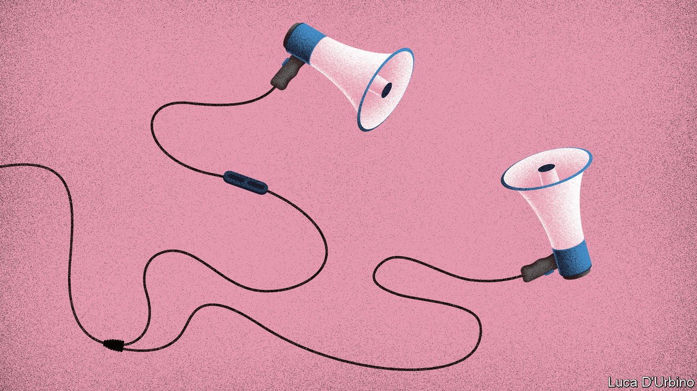

## Listening in

# Podcasting provides a space for free thought in China

> Amid a broader media clampdown, there are still a few corners where discussion is welcome

> Aug 27th 2020

MUXI MAKES cables that charge smartphones in a factory near Shanghai. The work is boring, he says, but at least his boss lets him wear Bluetooth earphones. That way, for six days a week, 11 hours a day, as his hands fly across the assembly line, his mind fills. First, the 24-year-old listened to audiobooks. Then, online classes. Now, he prefers podcasts. As the Communist Party has tightened control over media, and China’s vapid pop culture has become ever more shallow in response, podcasts have become a niche where thinking people can find unexpected, and sometimes controversial, content.

The tone can be gauged from the podcasts’ names, the perennial dark humour of Chinese intellectuals seeping through. “The Weirdo” is one of Muxi’s favourites. Hosted by three former journalists, it strives to cater to those who live up to its title. Recent episodes have discussed the challenges that Chinese men face if they identify as feminists, and the problem of racism in China towards black people, both topics that are considered quite alternative. Muxi (not his real name) also enjoys “The Unemployable”, which tells stories about people who rebel against the pressures of modern life by becoming freelancers, taking gap years and travelling—actions rarely encouraged in a country where bosses extol a “996” working culture (9am to 9pm, six days a week).

China’s internet users have long relied on creativity to produce and consume the content they want. Twitter, Facebook, YouTube and Instagram are blocked, though the inquisitive use virtual private networks (VPNs) to reach them. China’s home-grown social-media giants, Weibo and WeChat, which both allowed relatively free discussion when first launched, are now strictly monitored by censors, as are the country’s other thriving platforms.

The podcasts provide something different, and deeper. A high-school student explains why she became a climate-change activist. A woman recalls being abused as a child by her father in rural China as the neighbours watched. A feminist grapples with her traditional Chinese wedding.

The shows are mostly popular with two different groups of people. The first is young urban intellectuals. More than 85% are graduates, and almost 90% of listeners are under 35, according to a survey conducted by PodFest China. “The hosts genuinely want to have discussions and are not obsessed with sensationalism,” says Eva Lin, a college student in the eastern city of Yantai, who loves the companionship podcasts provide to help her cope with depression. The second group is more diverse, but includes many from the other end of the social spectrum, like Muxi, who first travelled to the coast five years ago from a poor village 2,000km inland. “Sometimes I find the hosts’ views a bit elitist but most of the time I find myself agreeing,” he says.

Podcast content is usually less sensationalist than what is commonly found on Chinese social-media platforms. There are far better options for content creators in search of traffic and money, says Fang Kecheng of the Chinese University of Hong Kong. Most people prefer to watch live-streaming of people eating large bowls of noodles and selling lipstick, or more of the familiar boy-band clickbait. As everywhere else, stories about death, sex and money are popular, says Kou Aizhe, host of Story FM, one of China’s most popular podcasts. In one episode a man describes how his father, who suffered from mental illness, was poisoned to death by fellow villagers. In another, a Chinese documentary-maker tells a tale of featuring in a gay porn film. A third discusses agencies set up specifically to help women break up their husbands’ relationships with their mistresses.

Listeners are especially curious about Chinese people around the world. As more of them work, study and travel abroad, Mr Kou has noticed that episodes about Chinese in far-flung places like Syria and Afghanistan are a hit. Story FM’s most popular show this year was about a Chinese Muslim man who went to Pakistan and within 15 days found and married his wife, before bringing her back to China. In a country of 1.4bn people, Mr Kou estimates his show gets around 700,000 listeners an episode. The fact that censors normally intervene only when content goes viral has given podcasts some space.

The covid-19 pandemic raised some problems, however. It is hard enough for podcasters to know where the political line is in normal times, let alone in a crisis, when it may move. For weeks during the outbreak’s early stages, podcasts shared stories about it. Many shows featured intimate interviews with doctors, journalists and residents of Wuhan after the city went into lockdown. Most of them were eventually deleted as the party recaptured control of the narrative.

Others have been censored, too. When “Loud Murmurs”, a podcast about popular culture, did a show about “One Child Nation”, an American documentary that was banned in China because it dealt with the one-child policy, the podcast went viral on social media. It was eventually censored but not before thousands had heard it. Another episode was censored, the host thinks, for mentioning China’s former president, Jiang Zemin, praising a well-known Canadian comedian’s fluent Chinese. “The thing about censorship in China is that it is a black box,” says Isabelle Niu, one of the presenters. “We didn’t know we weren’t allowed to talk about presidents.”

As a result, podcast hosts admit they self-censor. “I care most about reaching listeners inside China, the vast majority of whom don’t have VPNs. If that means I have to sacrifice some of my freedom of speech, so be it, this is the reality that we live in,” says Zhang Zhiqi, host of “Stochastic Volatility”, a popular podcast which recently had to rename and reinvent itself because of pressure from censors. Many of the messages Ms Zhang receives are from high-school and university students, often from poor regions of China.

All podcasts avoid directly discussing political issues deemed sensitive by the Communist Party, like the mass detention of Muslims in north-west China or the Hong Kong protests. But audio reporting suits intimate storytelling and you do not have to talk directly about politics to have a fascinating political discussion.

“As our industry grows and becomes profitable, we will see more censorship,” predicts Yang Yi, co-founder of JustPod, a podcasting company. “This is what happened to Weibo and WeChat as they grew.” Text and video in China are already carefully scrutinised by censorship algorithms. Podcasters worry about improved technology bringing greater scrutiny of audio output. If that happens, they will have to find new ways to provide their thought-provoking content. ■

## URL

https://www.economist.com/china/2020/08/27/podcasting-provides-a-space-for-free-thought-in-china
