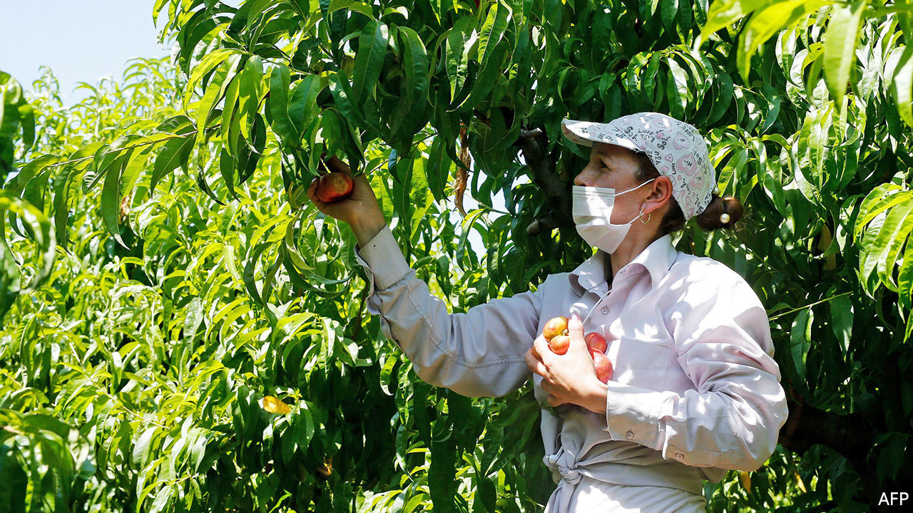

## International plotters

# Bulgarians have been Europe’s gardeners longer than you think

> Doing Europeans’ dirty work ever since the Ottoman Empire

> Aug 29th 2020

IF YOU ARE enjoying a succulent piece of fresh fruit in Europe this summer, the chance is high that you have a Bulgarian to thank for it. Every year tens of thousands of workers from the eastern Balkan country fan out to pick, pluck, dig and water on farms in Britain, Germany, Italy, Spain and elsewhere. When covid-19 shut borders this spring, western European farmers panicked, and governments rapidly surrendered to their demands to let the Bulgarians in.

Most Europeans assume this migration began after the cold war, when Bulgaria freed itself from Soviet domination. In fact, says Marijana Jakimova, a historian, it dates back to the late 17th century. The Ottoman empire, which then ruled the Balkans, employed Bulgarians to accompany its troops and grow vegetables for them. The Ottomans’ invasion of central Europe was beaten back at Vienna in 1683, but their Bulgarian camp-followers began a lasting tie to the region’s agriculture.

In the late 19th century, as Vienna and other Austro-Hungarian cities boomed, Bulgarians set up market gardens on their outskirts. In 1918 Austria-Hungary collapsed but, anxious to keep Vienna fed, the Austrians granted privileges to their Bulgarian gardeners. The interwar years were a golden age for them. They left home in spring to work in Austria, Czechoslovakia and elsewhere, and returned home as the nights grew long.

A gloomier chapter of the story began in 1938, when Adolf Hitler signed an agreement with Bulgaria to send farm workers to the Third Reich. During the war thousands more came to replace Germans sent to the front. After 1945, many of those who returned to newly communist Bulgaria were executed as collaborators. But others settled as refugees in Austria’s Burgenland, establishing farms which supply Viennese markets to this day.

The communist decades were actually a hiatus in this Bulgarian tradition of seasonal work abroad. (It even has a name in Bulgarian: gurbet.) After 1989 Bulgarians resumed the practice, at first illegally in Spain and Italy, later with work permits, and finally without hindrance after their country joined the EU in 2007. These days Bulgaria itself faces labour shortages, and wages are shooting up. Still, picking peppers at home earns only the national minimum wage: €1.87 ($2.21) per hour. The hourly wage for harvesting asparagus in Germany is €9.35. Long live gurbet.

## URL

https://www.economist.com/europe/2020/08/29/bulgarians-have-been-europes-gardeners-longer-than-you-think
