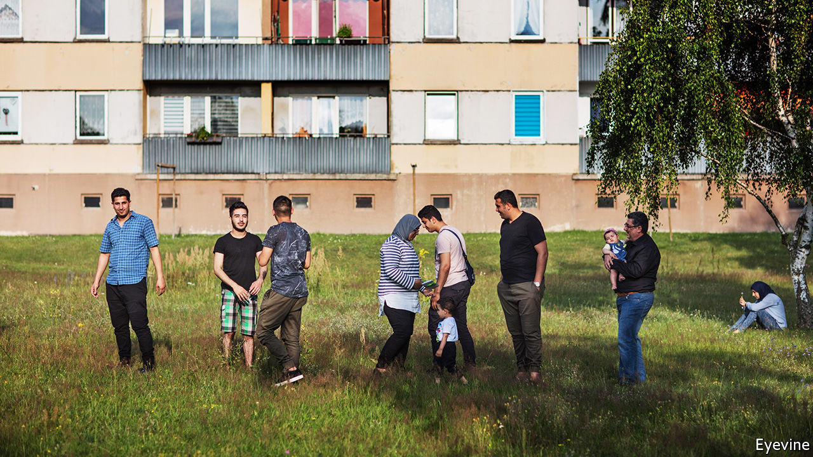
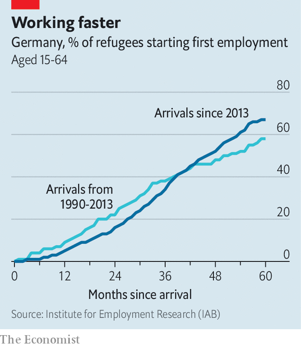
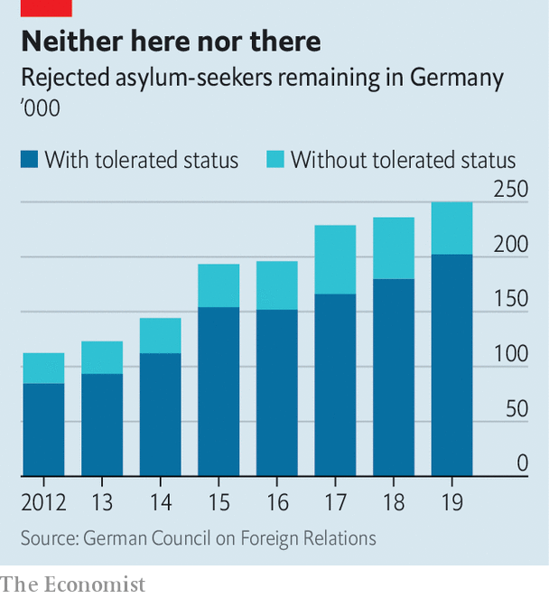

## Did they handle it?

# Five years after arrival, Germany’s refugees are integrating

> But those whose claims are rejected are stuck in legal limbo

> Aug 25th 2020BERLIN AND GÖTTINGEN

ASKED WHAT he makes of his new home, Safwan Daher, a Syrian refugee, chuckles: Duderstadt, a town near Göttingen that few Germans could find on a map, is “boring”. No matter. Mr Daher has an enjoyable computer-programming job that pays for a flat with three bedrooms. He keeps one empty, hoping his parents will leave Syria and join him. In his spare time he hangs out with his brother, a student at Göttingen University. The next step is German citizenship, for which he has just applied.

Karam Kabbani, an activist who fled Aleppo after Bashar al-Assad’s thugs tortured him, has had a rougher time. Nervously chain-smoking, he describes an anguished five years bouncing from one agency to another, forced to take dead-end jobs, with no help offered for his psychological scars. He plans to leave Germany when he can. “Germans are very closed people,” he says. “No one wants to help.”

On August 31st 2015, with a growing number of asylum-seekers reaching Germany, Angela Merkel declared: “Wir schaffen das” (roughly, “We can handle this”). A few days later the chancellor opened the borders to migrants stranded in Budapest, amplifying the wave: perhaps 1.2m reached Germany before Balkan border closures and a deal with Turkey in 2016 stemmed the flow. Initially Germany handled the migrants well. Yet five years on, its experience of integrating them has been mixed.

Start with jobs. In 2015 an influx of mainly young migrants looked a neat fit for German firms facing an ageing labour force. Daimler’s boss foresaw an “economic miracle”. Rules were eased for asylum-seekers looking for jobs, and the government pushed 1.1m through integration and language courses. By 2018 43% of the working-age asylum-seekers who arrived between 2013 and 2016 were in work or training (compared with over 75% for the same age group in Germany as a whole)—better than the wave of refugees from Yugoslavia in the 1990s. (A stronger labour market helped.) Jobs came slowly at first, but accelerated as people emerged from integration courses, which hints at better to come. “These numbers are not perfect, but they are hopeful,” says Marlene Thiele, who runs a project at the German Chamber of Commerce to help firms hire refugees.

The headline figure conceals some awkward details. Barely half the refugees in Germany’s labour force today work in skilled jobs, although over 80% did in their home countries, calculates Herbert Brücker at the Institute for Employment Research, the research arm of the Federal Employment Agency. Many wash dishes in restaurants or make beds in hotels, with few prospects for advancement (and a high chance of covid-related layoffs). Women in particular have struggled, especially those from cultures that think their place is in the home. Many newcomers, especially from countries like Eritrea and Iraq, were functionally illiterate when they arrived and are still years away from entering the job market. Control for age, and average migrant earnings are around two-thirds the native German level.

Migrants were dispersed all over Germany; most live outside cities. That was a test for Germany’s decentralised government, which gives lots of power to local officials. (“In Berlin integration is just an abstract question,” grumbles Rolf-Georg Köhler, Göttingen’s mayor.) A study of 92 municipalities funded by the Robert Bosch Foundation found that many were quite adaptable, for example launching their own language courses while waiting for the bureaucratic wheels to turn in Berlin. Civil society was crucial. Mr Köhler credits the local sport association with speeding integration: the language of football is universal. Over half of Germany’s population has worked in some way with refugees. “We can activate a whole network if we need to,” says Bettina Briesemeister, who runs a refugee housing centre in Göttingen.

The flip side is confusion and inefficiency. Officials are sometimes unclear which layer of government is responsible for a policy, and states and municipalities swap ideas surprisingly rarely. More than 600 under-resourced “foreigners’ offices” are responsible for matters like work permits and deportations. The bureaucratic maze is disconcerting. “Ask any refugee what they fear most, and it’s the letterbox,” says Mr Kabbani: it invariably contains demands, appointments or warnings from official bodies they have never heard of.

Like many European countries Germany has struggled to deport failed asylum-seekers. More than 200,000 people have been granted Duldung (“tolerated”) status, meaning they have no right to be in the country but do not face immediate deportation. Perhaps a further 50,000 have no legal status. To stop them from slipping into idleness or worse, under new rules some may work or take on apprenticeships. But insecurity persists. One such rejected asylum-seeker, Mohammad Walizada, an Afghan who had worked with an American de-mining firm in Kabul, now has a legal job in a phone shop on Sylt, a North Sea island. But he has given up on his goal of getting a doctorate in Germany. “I have no hopes, it’s just survival,” he says.

“There is a huge difference in integration outcomes between people that receive protection and those that are in Duldung or rejected,” says Victoria Rietig of the German Council on Foreign Relations. Just 3% of those with Duldung status can move freely throughout Germany, which is no help when looking for a job. And because Germany has no birthright citizenship rule, their children are usually given the same status, and risk being deported to a country they have never known. “It’s this population we should be worried about,” says Ms Rietig. Germany seems afraid both of enforcing its rules and of making it too easy for failed asylum-seekers to find alternative ways into German society. As the numbers grow, the dilemma worsens.

Yet the country remains paralysed by the political battles of five years ago. The migrant crisis jolted the radical-right Alternative for Germany into third place at the 2017 election. A poll last year found a majority of Germans thought the country should accept no more refugees. These days the borders are quieter and the issue has gone off the boil, but fresh waves of migrants from Europe’s troubled neighbourhood can hardly be ruled out. “Mama” Merkel, as she is known to many refugees, long ago abandoned her “Wir schaffen das” mantra for a more paradoxical claim: that her decision to leave the borders open was correct, and must never be repeated.

Ahmad Denno, a well-integrated Syrian who is completing a degree in Berlin, identifies three types of German: those who treat him normally; racists who want him to leave; and those for whom he is permanently on probation. Asked if he could ever feel at home here, he shrugs. “For some, I could never be German. For others, I already am. I don’t feel like an outsider here. I’m just looking for a normal, safe life.” ■

## URL

https://www.economist.com/europe/2020/08/25/five-years-after-arrival-germanys-refugees-are-integrating
