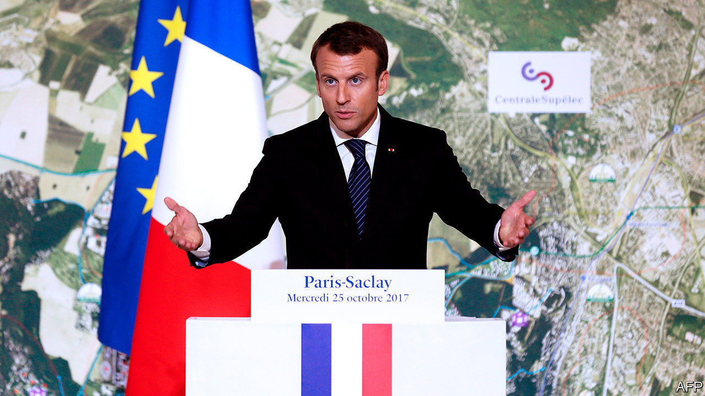

## Saclay sacré

# How France created a university to rival MIT

> After years of pooh-poohing global college rankings

> Aug 29th 2020PARIS

A  HUGE MODERNIST university campus is emerging amid farmland on a plateau south of the French capital. The University of Paris-Saclay, officially launched this year, merges some 20 higher-education and research institutions. It has a teaching and research staff of 9,000, catering to 48,000 students—more than Harvard or Stanford. Specialised in science, it is France’s attempt to create, in President Emmanuel Macron’s words, an “MIT à la française”. Such ambition once seemed fanciful. Yet in August Paris-Saclay stormed into the Shanghai world university ranking, grabbing 14th place overall and 3rd in Europe after Cambridge and Oxford. It took the top international spot in maths.

France’s two-tier higher-education system baffles outsiders. Three-fifths of its 2.7m students are enrolled in universities. These are public. Until recently they did not select undergraduates at entry; they charge no tuition bar a small enrolment fee, and are often sneered at as second-rate. An elite minority, meanwhile, attend selective grandes écoles, for which entrance exams require at least two years of post-secondary-school cramming. To confuse matters further, research is traditionally carried out not in universities or grandes écoles but in specialised public institutes.

Over the years, this unusual structure has led to much French frustration about foreign perceptions. The country has world-class engineering schools, economics departments and mathematicians. After America, France has more Fields medal-winners for maths than any other country. Yet its fragmented system—partly down to the deliberate splitting of big universities after the 1968 student protests—has left it under-performing in world rankings and lacking global star appeal. In 2007 Valérie Pécresse, then the universities minister, began to give them more independence in order to encourage collaboration and scale. An international jury was invited to award big public budgets to promising merger projects. Over a decade later, these new giant rebranded universities, including Paris-Saclay, are the result.

Like all mergers, forming Paris-Saclay entailed years of squabbling. Originally, Polytechnique, France’s top engineering grande école, was to join. But it feared losing its reputation for excellence if engulfed by a much bigger university. Researchers from all member institutions had to agree to publish under the new name in order to achieve scale and renown. As bickering continued, a national audit concluded in early 2017 that the entire merger project was “deadlocked”. Later that year the newly elected Mr Macron stepped in, realising that the new university would have to go ahead without Polytechnique. Its ensuing success, says Laurent Bigorgne, director of the Institut Montaigne, a think-tank, “is almost the revenge of the universities over the grandes écoles.”

Sylvie Retailleau, president of Paris-Saclay, points out that those grandes écoles and niche scientific-research institutes that did join have in fact retained a separate identity, a bit like faculty departments. “Respect for diversity is our strength,” she says, even if it will take time to get used to a new dual identity and gain recognition from the Parisian elite with its powerful alumni networks. In the meantime, Paris-Saclay is enjoying its moment. A decade ago, French educationalists would lecture outsiders on how meaningless world rankings were for their higher education. Now the French have begun to crack the system, and are praising the result.■

## URL

https://www.economist.com/europe/2020/08/29/how-france-created-a-university-to-rival-mit
