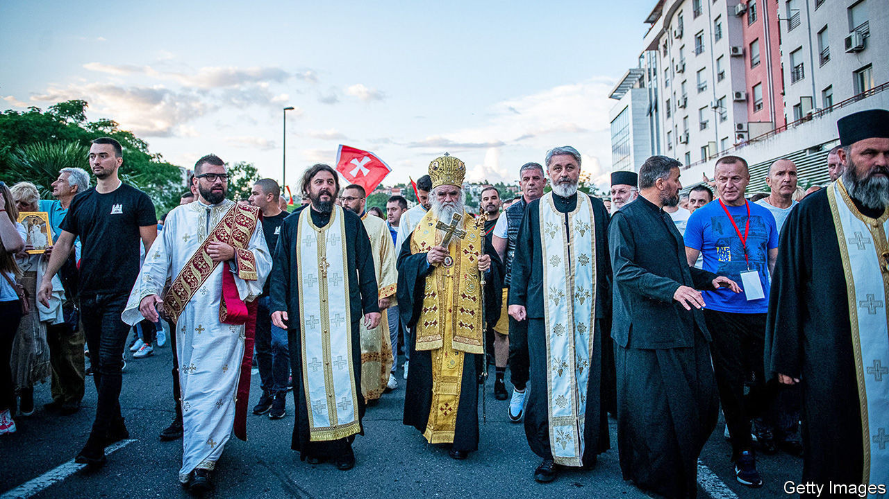

## Not very Christian

# Serbian Orthodox priests say Montenegro's government backs satanists

> This election President Milo Djukanovic’s campaign is more bitter than usual

> Aug 29th 2020

MONTENEGRO IS ONE of those countries whose landscape—glittering mountain peaks, azure seas—is every bit as magnificent as it looks in tourist brochures. The campaign for its general election on August 30th, however, has been ugly. The government’s supporters accuse the main opposition coalition of being “clerical fascists”. The opposition call on voters not to back “unbelievers”. How things came to this pass requires a bit of explanation.

President Milo Djukanovic has ruled Montenegro since 1989, whether as president, prime minister or head of the ruling party. His party will probably win this time too. But things have not been entirely placid. In 2016 the government said it had foiled an election-day coup plot led by opposition leaders and backed by Russia. This year Mr Djukanovic has been rattled by recurrent protests, which draw tens of thousands of people waving Serbian flags and led by priests. You might think Montenegrins would be upset about the economy: tourism generates a fifth of GDP, which may shrink by 9% this year because of covid-19. Indeed, many protesters are fed up with poor government services, corruption, nepotism and other ills. But rather than addressing such concerns, the big parties are arguing about religion.

Last December the government passed a law stipulating that unless religious groups can prove their title to property owned before 1918, when Montenegro became part of the new country of Yugoslavia, it belongs to the state. Priests of the Serbian Orthodox Church, the country’s main denomination, accuse the government of attacking religious freedom and promoting a “satanic cult”, by which they mean the small Montenegrin Orthodox Church, which they say Mr Djukanovic favours. Whether or not the new law is a land grab, says Kenneth Morrison, a historian, the dispute has become a struggle for the country’s political soul.

About 75% of Montenegrins are Serbian Orthodox, and since 1918 the issue of whether they should simply be considered Serbs (and hence whether their state should be part of Serbia) has waxed and waned. Now it has returned in a different form. Serbian nationalists have begun talking of the “Serbian world”, much as Russian nationalists call their area of influence the “Russian world”. This does not necessarily mean that Montenegro and ethnic-Serb parts of Bosnia and Kosovo should be fused with Serbia, but that they should stay firmly in its sphere of influence.

Montenegro’s opposition is divided between those who fly Serbian flags and those who don’t. When protesters chant “Montenegro, Serbia—one family”, they remind Bosniaks (Muslims by heritage), Albanians and Croats, who together are 18% of the population, that as much as they may not like Mr Djukanovic, they dislike Serbian nationalism even more. This, with added vote-buying and fraud, has made a democratic transfer of power in Montenegro rather theoretical. No government has ever changed hands in an election. ■

## URL

https://www.economist.com/europe/2020/08/29/serbian-orthodox-priests-say-montenegros-government-backs-satanists
