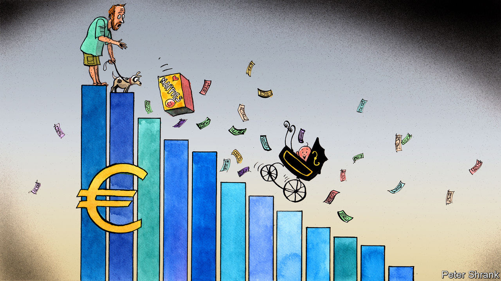

## Charlemagne

# The Pampers index: what nappy prices reveal about Europe

> Huge disparities show the boast of a single market is full of it

> Aug 29th 2020

THE PARENTS of a screaming new-born baby typically have no time to spare. But if they live in Europe, they should spend a few minutes shopping around for nappies. Three enormous boxes of Pampers come to €168 ($198) on Amazon’s Spanish website. By contrast, the same order from Amazon’s British website costs only €74. (Even after an exorbitant delivery fee is added, the saving is still €42.) If sleep-deprived parents are too groggy to work out how much they could save in a year, they could pep themselves up with a new coffee machine. The swankiest Nespresso model will set them back €460 on Amazon’s French website, but can be snapped up for €301 on the German version. They could then boast about their canny shopping on Samsung’s newest phone, which varies in price by up to €300 depending on which domain is used.

The EU may have a single market, but its products do not have single prices. In an integrated market, prices are supposed to come together over time. Yet this process has stalled in the EU. Prices for exactly the same products still diverge, often starkly and even among rich countries. It is a long-term trend: prices stopped moving together in 2008. Big steps of integration such as the introduction of the euro, which drew them closer together, are now rare. Wages in eastern Europe are not growing as rapidly as they were. Services, which are often hard to trade across borders, make up a greater proportion of the EU economy. Mollycoddled companies still dominate some industries. It is common to see someone stocking up on painkillers in the Netherlands, where they can be bought in any supermarket, before hopping on a train to Belgium, where pharmacies enjoy a monopoly and a mark-up.

Some price differences are inevitable. A store in central Paris will charge more for the same goods than one in a hypermarket on the edge of a medium-size town. Sometimes price divergence is necessary in a bloc that contains both Germany (GDP per head of €39,130) and Bulgaria (€8,237). And given that retail is still dominated by brick-and-mortar stores and their websites, markets remain stubbornly national even online. The upshot? One study showed that online prices varied by 20% for items like electronics and up to 40% for clothing between EU countries.

Yet for nappies, a tradeable good which can be bought online anywhere in Europe, the persistence of big price gaps is especially odd. Prices per nappy range from €0.11 to €0.61 within the bloc, according to one survey. The Economist uses the price of a Big Mac to compare currencies around the world. Something similar could work with the single market. Call it the Pampers index: a rough measure that shows which EU citizens are paying over the odds.

Arbitraging these differences away is not simple. Borders matter in trade and they still exist in the EU. Cross a state border in America and not much changes, for most businesses; cross a border in the EU and they face a new legal regime in a foreign language, with a different consumer culture. Nor is it an easy process for consumers. It is one thing to fire up Google Translate to read a news article, quite another to double-check what zur kasse gehen means in the middle of a €1,000 purchase. America is far more integrated, sigh EU officials. As a result, big online retailers like Amazon offer a shopper in Alabama the same price as one in California.

Delivery charges within the EU are often steep, as any discriminating Spanish parent will soon find. Getting products from where they are cheap to where they are expensive is often painfully slow or prohibitively costly, particularly if they are bulky, like nappies. It is worse in small countries. (Your correspondent once lugged the entire discography of the Rolling Stones, on vinyl, from London to Brussels so that a friend from a Baltic state could avoid a €110 charge.) Nor is there much motivation for suppliers to fix the problem. Sellers are unenthusiastic about products from low-price markets leaking into high-price ones.

The EU has taken some action. It is now illegal for websites to block consumers from other countries without good reason. This came after EU officials picked a fight with Disney, when it emerged that Disneyland Paris stopped customers outside France from getting the cheapest deals. And the union has created a database of delivery-company charges, hoping sellers will use it to drive prices down. Such interventions seem to be having an effect. In 2010, barely one in ten EU citizens bought something from a website in a different country; in 2018, 28% did. But the union could do more. Indeed, rather than making it easier for lorries to zip across borders, the EU recently tightened its rules to placate western European countries which complained that national labour rules were being undercut. Eastern European countries cried protectionism.

During a crisis, concerns about lopsided prices can seem petty. The EU is suffering the deepest recession in its history. The pandemic has revealed major flaws in its structure, and fixing them takes priority. But the EU has always been a mix of big things (continental peace) and small things (cheap flights). Lately the union’s geopolitical ambitions seem to take up more of its leaders’ time than the mundane business of cross-border trade. The single market should not become a forgotten child of European integration. Sometimes pricey Pampers are as important as high politics.

Consumers have to do their bit, too. The EU is sometimes criticised for being a top-down institution, confusing voters with grand projects they do not necessarily want. Change can come from other directions. Each country has its own version of the “booze cruise”, a British term for piling into France to buy cheap wine. Luxembourgers head to German supermarkets for better prices. Swedes nip over to Norway to stock up on cheap nappies. Doing so online is much easier, yet most people still do not bother. Online arbitrage could become an unlikely engine of European integration. But it would be up to citizens. As with nappies, some things must start at the bottom. ■

## URL

https://www.economist.com/europe/2020/08/29/the-pampers-index-what-nappy-prices-reveal-about-europe
