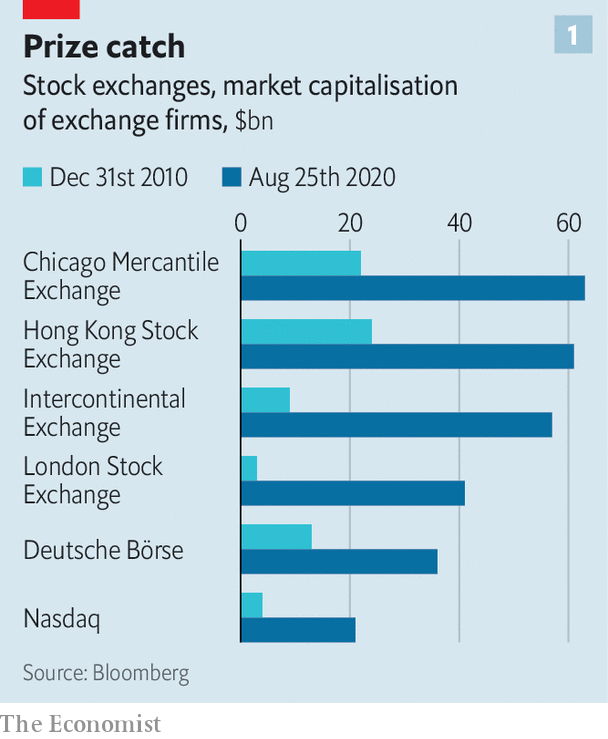
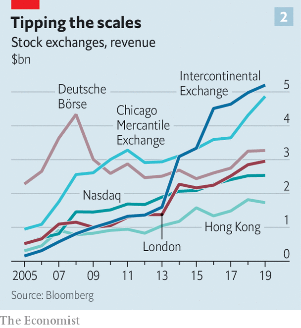

## Big fish

# In twenty years, exchanges have gone from clubby firms to huge conglomerates

> They control everything from the software powering back offices to the data pored over by investors

> Aug 27th 2020

THE HONG KONG Stock Exchange (HKEX) resembles a financial estuary, says Charles Li, its boss. China’s capital flows mix with the open seas of global markets. In 2014 HKEX sought to ride the waves by launching Stock Connect, a conduit allowing offshore and mainland punters to invest in each other’s markets. Later it eased its listing rules for firms with dual share classes. All that has helped make HKEX more hospitable to the tech firms that exchanges covet. It has just landed another big catch. On August 25th Ant Group, the fintech affiliate of Alibaba, a Chinese e-commerce giant, filed for a listing that may raise $30bn in Hong Kong and Shanghai (see [article](https://www.economist.com//node/21791253)). That would make it the largest initial public offering ever.

The news made a splash. But it is easy to forget that, in the two decades or so since they themselves listed, HKEX and other exchanges have become big fish too, by exploiting the benefits of network effects, data and scale that Big Tech is best known for. The London Stock Exchange, which was worth less than $2bn when it went public in 2001, now has a market capitalisation of $41bn. The New York Stock Exchange (NYSE) is now part of Intercontinental Exchange (ICE) which is worth $57bn (see chart 1). HKEX’s market capitalisation has grown nearly sixty-fold, to $61bn. Their revenues similarly boomed.

Once crusty monopolies, exchanges have continually stretched their business models. They still run the match-making infrastructure that allows billions of shares and trillions of dollars to change hands daily. Stacey Cunningham, who helms NYSE, says it received over 300bn messages across its systems on peak days this spring; that is more than 50 times the number of daily Google searches. But after two decades of epic bidding wars and political drama, exchanges are also remarkably powerful financial conglomerates, controlling everything from the software powering banks’ back offices to the data pored over by investors. The race for dominance means that, today, a small group of elite exchanges are far ahead of the rest.

Stock exchanges used to be owned by their members, which were mostly banks and brokers. When the biggest went public in the 2000s, they earned their crust by charging fees on equity issuance and transactions. The exchanges sought to diversify by expanding abroad and becoming trading venues for other assets, like derivatives and currencies. Most moved into clearing and settlement facilities, too.

For much of that period, “eat or be eaten” was the industry’s motto. In 2007 NYSE bought Euronext, a group that included the Amsterdam and Paris exchanges. ICE bought NYSE in 2013 (and spun out Euronext). Yet the strategy soon came up against antitrust and political vetoes. Attempts to marry Toronto’s stock exchange with LSE, LSE with Deutsche Börse, Deutsche Börse with NYSE, have all collapsed. Most recently, in 2019, an opportunistic bid by HKEX for the LSE fell through.

With deals proving tricky the firms have found crafty ways to expand. As passive funds came to prominence, trading venues set their sights on benchmarks tracked by these funds. In 2010 Chicago Mercantile Exchange (CME), a big derivatives market, acquired Dow Jones, which assembles many of America’s most widely followed indices. LSE has a number of benchmarks that cover both sides of the Atlantic. (Updates to such indices—like the ejection of ExxonMobil, an oil firm, from Dow’s flagship index on August 25th—can cause mountains of money to shift).

Now the elite exchanges have turned their attention to data. On August 6th ICE said it had agreed to pay $11bn for Ellie Mae, which tracks the mortgage industry. LSE is awaiting approval of its $27bn bid for Refinitiv, a market-data firm. The hunt, says David Schwimmer, LSE’s boss, is only beginning. Whereas trading volumes are cyclical, indices and data are typically sold via more stable subscriptions. Oliver Wyman, a consultancy, expects trading revenues to stagnate or even decline, but those from crunching data to grow by over 5% annually in coming years.

Twenty years ago the fear was that new entrants would eventually topple the exchanges’ de facto monopolies. But the incumbents have kept the challengers at bay. Customer complaints about their fat fees once enticed startups, such as IEX, an exchange that pledges fairer pricing. The rise of “dark pools”—venues that match buyers and sellers anonymously—also posed a threat. But seven years since it was founded, IEX’s market share is stuck at 1.8%. The share of trading volume accounted for by dark pools in America has stabilised at 12%.

The result is a pyramidal hierarchy, a good gauge of which is an exchange’s revenues. At the base are the minnows, in poor countries or small developed ones, which lack liquidity or scale and are struggling to diversify. Some should merge or close, but governments will keep them alive. “Every nation wants to have a strong airline, a good beer and a stock exchange,” says Nick O’Donnell of Baker McKenzie, a law firm.

The next tier consists of exchanges with regional heft, and revenues exceeding $500m. Their reliance on trading in an era of tensions between America and China means they must team up or play to their strengths as neutral turf in order to thrive. On August 20th Singapore Exchange said it would work with LSE’s benchmark business to develop index derivatives focused on Asian and emerging markets. Euronext has acquired Nord Pool, a power market.

At the top of the food chain, with revenues at or exceeding $3bn, sit the giants: CME, Deutsche Börse, ICE and LSE. These have assured demand for big volumes, and will continue to reap the rewards of diversification. Two candidates are on the verge of promotion into the top league. Nasdaq, once famous only for its tech listings, now makes software that powers more than 130 other exchanges. HKEX enjoys the strongest tailwinds. It stands to win from China’s capital-market liberalisation, its growing tech nous and mainland firms’ desire to be closer to their home market. Geopolitics could also help, as Ant’s decision not to list in America may already show.

In time, Mr Li reckons, “almost all” Chinese companies listed in America will come back to Asia. Stock Connect, which makes up 7-8% of daily trading on HKEX, could end up accounting for a quarter of it. Being at the confluence of China’s rivers of capital and the sea of global funds should be a lucrative business. ■

## URL

https://www.economist.com/finance-and-economics/2020/08/27/in-twenty-years-exchanges-have-gone-from-clubby-firms-to-huge-conglomerates
