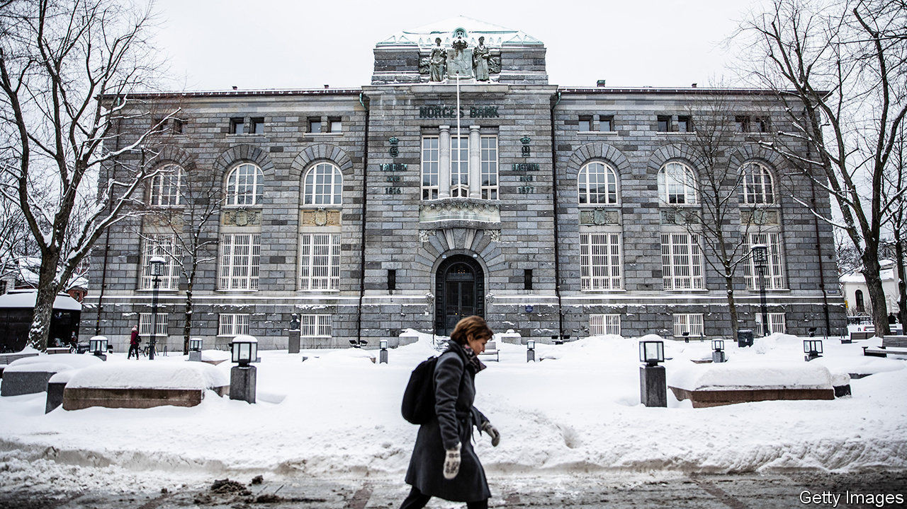

## An expensive dream

# Nicolai Tangen pays a big price for his new gig

> The incoming boss of Norway’s oil fund sells off his sizeable personal investments

> Aug 29th 2020BERLIN

THE BIGGEST crisis in the 24-year history of the world’s biggest sovereign-wealth fund was defused at the very last minute. On August 24th Norges Bank Investment Management (NBIM) announced that Nicolai Tangen, its incoming boss, would liquidate his entire stake in AKO Capital, the $20bn hedge fund he founded. He will transfer it to AKO Foundation, a charity he set up in 2013. He will also sell his personal investments and park the proceeds in a bank account. Although Mr Tangen had previously ruled out selling up, he gave in to mounting political pressure in order to begin what he has called his “dream job” on September 1st.

The controversy, which has lasted months, has probably done most damage to the reputation of the central bank. (NBIM, which has holdings worth around 10trn Norwegian kroner, or $1trn, sits within it.) The bank broke “guidelines, rules and laws” when it selected Mr Tangen, according to the main supervisor of NBIM. His name never appeared on the bank’s official list of candidates for the fund’s top job, though he had been considered a serious contender for months. And the central bank may not have given enough thought to how to resolve potential conflicts of interest; Mr Tangen’s old fund holds shares in some of the same companies as NBIM.

Mr Tangen had planned to mitigate potential conflicts of interest by reducing his stake in AKO from 78% to 43%, appointing a trustee to exercise his vote and give away any dividends that would accrue during his tenure at NBIM. But that was not enough for Norwegian lawmakers. On August 21st the parliamentary finance committee concluded that the sovereign-wealth fund’s boss was not permitted to “have any ownership or interests that create or may appear to create conflicts of interest that [weaken] the trust and reputation of Norges Bank”.

On the same day Jan Tore Sanner, the finance minister, asked Oystein Olsen, the central bank’s governor, to find a solution. The result was Mr Tangen’s parting with stakes worth about 10bn kroner. “I think it’s fair to say that Olsen owes me a beer,” he joked at the press conference announcing the divestment. Many Norwegians had expected Mr Tangen to turn down the job rather than sell his holdings.

Some concerns about Mr Tangen’s appointment relate to his past as a buccaneering fund manager. “I worry that he will introduce more risk into the management of the fund,” says Karin Thorburn of the Norwegian School of Economics. The fund typically gets a mandate from parliament that includes a reference index determining its allocation of bonds and equities and its regional split, as well as a tracking error that fixes how much NBIM can deviate from the reference index. Mr Tangen could push for a bigger tracking error to give him the room for manoeuvre he was used to in his previous job.

None of this makes for a relaxed start to the new job. Mr Tangen will have to restore public trust in the management of the fund, which for most of the 12-year tenure of his predecessor, Yngve Slyngstad, had been well-regarded. Mr Olsen may be in an even less enviable position. He has saved his job for the time being, but many expect him to resign after a face-saving period, before his tenure ends in December 2022. As one dream is realised, another may be coming to an end. ■

## URL

https://www.economist.com/finance-and-economics/2020/08/29/nicolai-tangen-pays-a-big-price-for-his-new-gig
